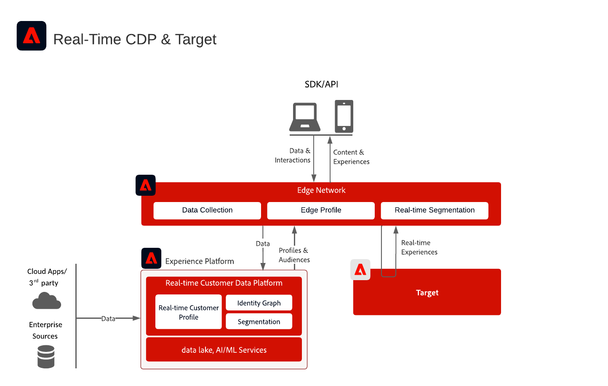

# Integración de Adobe Real-Time CDP y Adobe Target

Esta arquitectura muestra cómo se integran [!DNL Real-Time Customer Data Platform] y [!DNL Adobe Target] a través de Edge Network. Le ayuda a seleccionar entre la evaluación de audiencias en tiempo real en el perímetro de y el uso compartido de audiencias de streaming o por lotes con Target.

## Aplicaciones

* [!DNL Real-Time Customer Data Platform]
* [!DNL Adobe Target]
* [!DNL Experience Platform] Edge Network
* API de servidor de Experience Platform Web SDK o Edge Network

## Elija un enfoque de integración

### Evaluación de audiencias en tiempo real en Edge

Utilice este método cuando [!DNL Adobe Target] necesite audiencias evaluadas por Edge y atributos de perfil para la personalización de la misma página o de la página siguiente. Implemente la API de Web SDK o Edge Network Server y configure un conjunto de datos con los servicios [!DNL Adobe Target] y [!DNL Experience Platform] habilitados.

### Streaming y uso compartido de audiencias por lotes a Target

Utilice este método cuando las audiencias evaluadas en [!DNL Real-Time Customer Data Platform] deban estar disponibles en [!DNL Adobe Target] sin evaluación de Edge en tiempo real. Configure el destino [!DNL Adobe Target] en la zona protegida de producción predeterminada. La implementación de la API de servidor de Edge Network o Web SDK solo es necesaria para la evaluación de Edge en tiempo real o las búsquedas del área de nombres de identidad personalizadas.

## Diagrama de arquitectura

Este diagrama muestra los puntos de integración principales entre la recopilación de datos, Edge Network, [!DNL Real-Time Customer Data Platform] y [!DNL Adobe Target].

{zoomable="yes"}

## Diagrama de flujo de datos

Esta secuencia muestra cómo una solicitud de cliente llega a Edge Network, evalúa las audiencias y el contexto del perfil, envía una solicitud de personalización a [!DNL Adobe Target] y devuelve la experiencia resultante al cliente.

{zoomable="yes"}

## Consideraciones sobre la implementación

* [!DNL Adobe Target] y [!DNL Real-Time Customer Data Platform] deben usar la misma organización de IMS.
* El destino [!DNL Adobe Target] admite la zona protegida de producción predeterminada en [!DNL Real-Time Customer Data Platform].
* Para realizar búsquedas personalizadas de área de nombres de identidad en el perímetro, utilice Web SDK o la API de servidor de Edge Network e incluya cada identidad en el mapa de identidad.
* Si utiliza at.js, la integración de perfiles solo admite el área de nombres de identidad de ECID.

## Documentación relacionada

### Configuración de la integración

* [Adobe Target Connection para Real-time Customer Data Platform](https://experienceleague.adobe.com/docs/experience-platform/destinations/catalog/personalization/adobe-target-connection.html)
* [Configuración de flujo de datos Edge](https://experienceleague.adobe.com/docs/experience-platform/edge/fundamentals/datastreams.html?lang=es)

### Implementación en el perímetro de

* [Documentación de Experience Platform Web SDK](https://experienceleague.adobe.com/docs/experience-platform/edge/home.html?lang=es)
* [Documentación de etiquetas de Experience Platform](https://experienceleague.adobe.com/docs/experience-platform/tags/home.html?lang=es)
* [Documentación del servicio de Experience Cloud ID](https://experienceleague.adobe.com/docs/id-service/using/home.html?lang=es)

### Evaluar públicos

* [Resumen de segmentación de Experience Platform](https://experienceleague.adobe.com/docs/experience-platform/segmentation/home.html?lang=es)
* [Segmentación en tiempo real](https://experienceleague.adobe.com/docs/experience-platform/segmentation/ui/edge-segmentation.html?lang=es)
* [Segmentación de streaming](https://experienceleague.adobe.com/docs/experience-platform/segmentation/api/streaming-segmentation.html?lang=es)
* [Configuración de política de combinación](https://experienceleague.adobe.com/docs/experience-platform/profile/merge-policies/ui-guide.html?lang=es#create-a-merge-policy)
