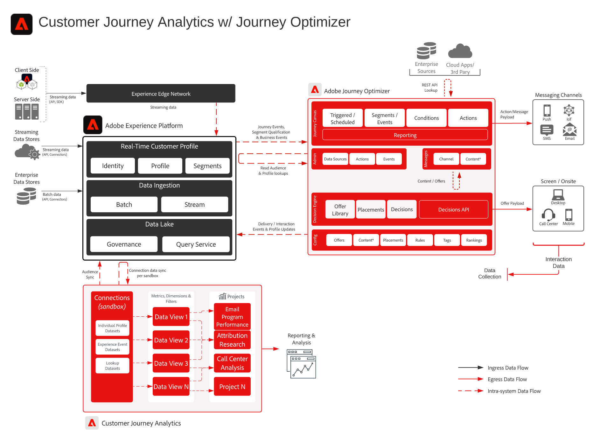

# Integración de Adobe Customer Journey Analytics y Adobe Journey Optimizer

Esta arquitectura muestra cómo los datos de interacción y entrega de Adobe Journey Optimizer fluyen a través de Adobe Experience Platform a Customer Journey Analytics para obtener información de la campaña y el recorrido. Las audiencias creadas en Customer Journey Analytics se pueden publicar mediante Real-Time CDP para su uso en la ejecución de Journey Optimizer.

## Arquitectura de perspectivas de Campaign y recorrido

La arquitectura conecta los datos de entrega e interacción de Journey Optimizer con Experience Platform y Customer Journey Analytics para la creación de informes, análisis y audiencias.

{width="1000" zoomable="yes"}

## Flujos de datos principales y puntos de integración

- Los datos de entrega, interacción y efectividad de Journey Optimizer se comparten con los servicios de datos de Experience Platform.
- Los datos de Experience Platform se incorporan en Customer Journey Analytics a través de una conexión de CJA.
- Las vistas de datos y el análisis de Customer Journey Analytics proporcionan insight de campaña y recorrido.
- Las audiencias creadas en Customer Journey Analytics se publican en Real-Time CDP.
- Las audiencias de Real-Time CDP están disponibles para la ejecución y personalización del recorrido de Journey Optimizer.

## Patrones de casos de uso admitidos

- [Generación de Customer Analytics y insight](/help/blueprints/use-case-patterns/analysis/customer-analytics-insight-generation.md): Analice el comportamiento de la campaña y del recorrido en todos los canales.
- [Mensajería desencadenada por eventos](/help/blueprints/use-case-patterns/campaign-management-orchestration/event-triggered-messaging.md): Use las señales de cliente y recorrido para admitir la mensajería orquestada.

## Lectura adicional

- [Informes de Journey Optimizer](https://experienceleague.adobe.com/es/docs/journey-optimizer/using/reporting/reports/sharing-overview)
- [Información general de Customer Journey Analytics](https://experienceleague.adobe.com/es/docs/analytics-platform/using/cja-overview/cja-overview)
- [Publicación de audiencias de Customer Journey Analytics](https://experienceleague.adobe.com/es/docs/analytics-platform/using/cja-components/audiences/publish)
