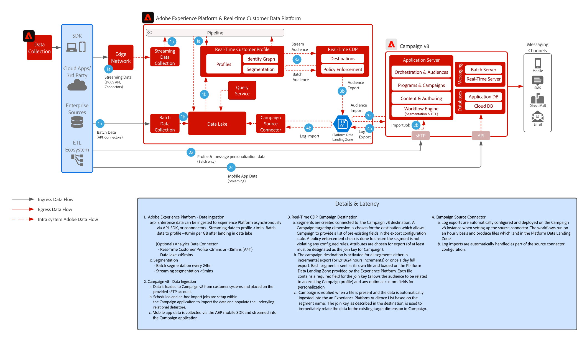

# [!DNL Real-Time CDP] con el patrón de integración de Adobe [!DNL Campaign] v8

Muestra cómo Adobe [!DNL Experience Platform] y su herramienta de segmentación centralizada y el Perfil del cliente en tiempo real se pueden utilizar con Adobe Campaign para ofrecer conversaciones personalizadas.

## Aplicaciones

* Adobe[!DNL Experience Platform Real-Time CDP]
* Adobe [!DNL Campaign] v8

## Arquitectura

{width="1000" zoomable="yes"}

 

## Prerrequisitos

* El cliente debe poder acceder a Experience Cloud con una organización IMS válida
* Se recomienda aprovisionar Adobe Experience Platform y [!DNL Campaign] en la misma organización de IMS para una sola URL de inicio de sesión
* El cliente debe tener la instancia V8 aprovisionada de [!DNL Campaign]
* El cliente debe ser elegible y tener acceso a RTCDP, orígenes y destinos.
* El contexto del producto Adobe [!DNL Campaign] debe existir

 

## Pasos de implementación

Consulte la siguiente documentación sobre la configuración del conector de origen de Campaign v8 en Adobe Experience Platform y el conector de destino de Real-Time Customer Data Platform en Campaign v8.
[Conectores de Campaign y AEP](https://experienceleague.adobe.com/docs/campaign/campaign-v8/connect/ac-aep.html?lang=es)

## Guardas

### Adobe Campaign

* Consulte la documentación del conector de origen de Campaign: [conector de origen de Campaign](https://experienceleague.adobe.com/docs/experience-platform/sources/ui-tutorials/create/adobe-applications/campaign.html?lang=es)
* Solamente compatible con la implementación de entidades organizativas únicas de Adobe Campaign

### Uso compartido de segmentos en Real-Time Customer Data Platform de Experience Platform

* Consulte el conector de destino de RTCDP Campaign: [conexión de RTCDP Campaign](https://experienceleague.adobe.com/docs/experience-platform/destinations/catalog/email-marketing/adobe-campaign-managed-services.html?lang=es)

* Consulte las guardas de ingesta de datos y perfiles para AEP: [vínculo](https://experienceleague.adobe.com/docs/experience-platform/profile/guardrails.html?lang=es)
