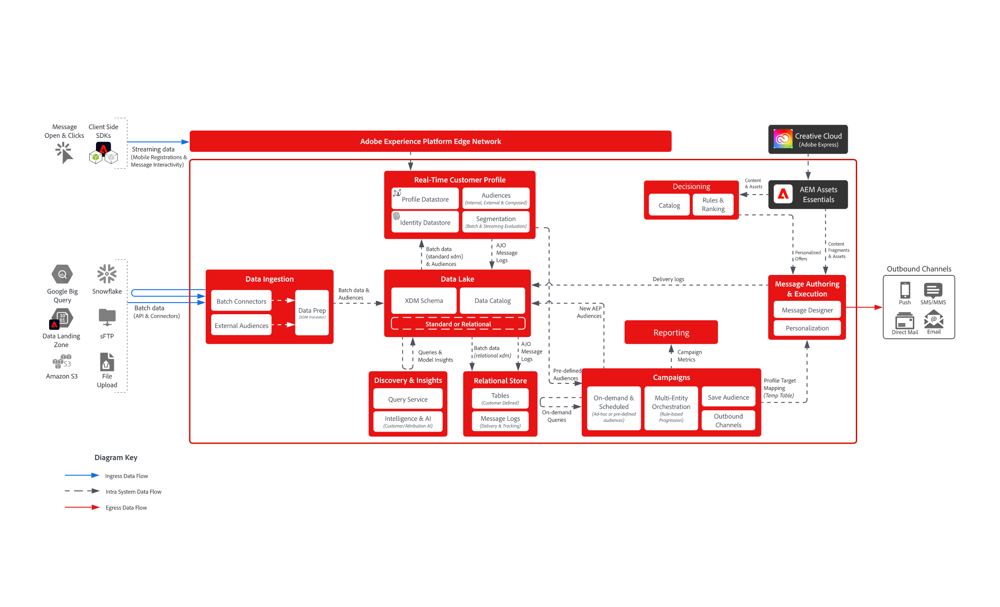
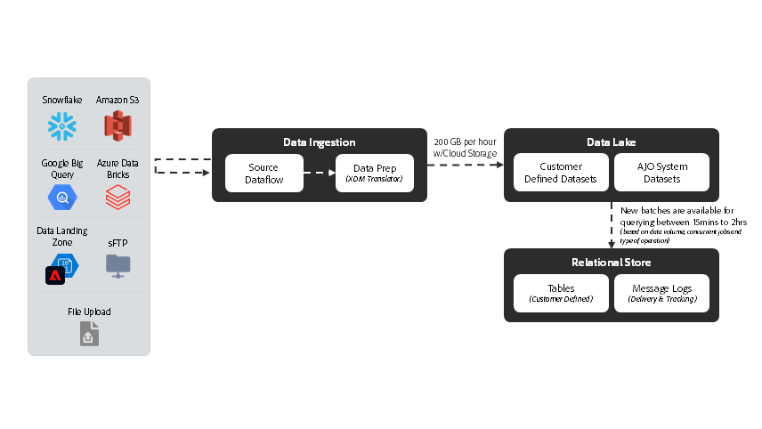

# [!DNL Journey Optimizer] - Orquestación de campaña

>[!TIP]
>Esta arquitectura también está documentada como [patrón de caso de uso](/help/blueprints/use-case-patterns/campaign-management-orchestration/batch-outbound-message-activation.md) en Administración y orquestación de campañas.

AJO Campaign Orchestration permite a los especialistas en marketing diseñar y ejecutar comunicaciones programadas, basadas en audiencias y de varios pasos en canales salientes como correo electrónico, SMS, push y correo directo. A diferencia de los Recorridos de AJO, que reaccionan a los comportamientos individuales de los clientes utilizando datos en tiempo real del Perfil del cliente en tiempo real, las campañas son esfuerzos de marketing coordinados que se dirigen a audiencias a intervalos planificados. En conjunto, las campañas y los recorridos ofrecen enfoques complementarios (€). Las campañas impulsan las estrategias de participación de la marca, mientras que los recorridos ofrecen experiencias personalizadas y adaptables.

 

## Arquitectura

{width="1000" zoomable="yes"}

 

### Arquitectura de ejecución de mensajes

{width="1000" zoomable="yes"}

 

### Almacén relacional: latencia de ingesta de datos

{width="1000" zoomable="yes"}

 

## Consideraciones de arquitectura para campañas

- **Arquitectura de datos**: AJO Campaign Orchestration utiliza una base de datos relacional para la creación y organización de audiencias
- **Integración de Audience Portal**: integrado de forma nativa con Audience Portal dentro del Perfil del cliente en tiempo real para leer audiencias existentes y guardar nuevas audiencias en al crear campañas
- **Creación de audiencias a petición**: cree, evalúe y ejecute una audiencia inmediatamente para casos de uso de marketing urgentes
- **Integración de perfil del cliente en tiempo real:** fuente fiable para el historial de consentimientos y comunicaciones; admite el diseño de &#39;perfil delgado&#39; para la personalización
- **Envío de mensajes de varias entidades:** capacidad para enviar varios mensajes por perfil en una sola entrega (por ejemplo, enviar un mensaje por reserva a la dirección de correo electrónico del cliente)
- **Segmentación de varias entidades**: empiece a crear una audiencia a partir de cualquier entidad del almacén relacional (es decir, producto, inventario, plan, etc.)

 

## Guardas

[Vínculo de producto de campañas organizadas](https://experienceleague.adobe.com/es/docs/journey-optimizer/using/campaigns/orchestrated-campaigns/guardrails)

[Protecciones y guía de latencia de extremo a extremo](https://experienceleague.adobe.com/docs/blueprints-learn/architecture/architecture-overview/deployment/guardrails)

 

## Documentación relacionada

- [[!DNL Journey Optimizer] campañas organizadas](https://experienceleague.adobe.com/en/docs/journey-optimizer/using/campaigns/orchestrated-campaigns/orchestrated-campaigns-landing-page.html)
- [Documentación de [!DNL Experience Platform]](https://experienceleague.adobe.com/docs/experience-platform.html?lang=es)
- [Documentación de etiquetas [!DNL Experience Platform]](https://experienceleague.adobe.com/docs/experience-platform/tags/home.html?lang=es)
- [Documentación de [!DNL Experience Platform Mobile SDK]](https://experienceleague.adobe.com/docs/mobile.html?lang=es)
- [Documentación de [!DNL Journey Optimizer]](https://experienceleague.adobe.com/docs/journey-optimizer/using/ajo-home.html?lang=es)
- [[!DNL Journey Optimizer] descripción del producto](https://helpx.adobe.com/es/legal/product-descriptions/adobe-journey-optimizer.html)
