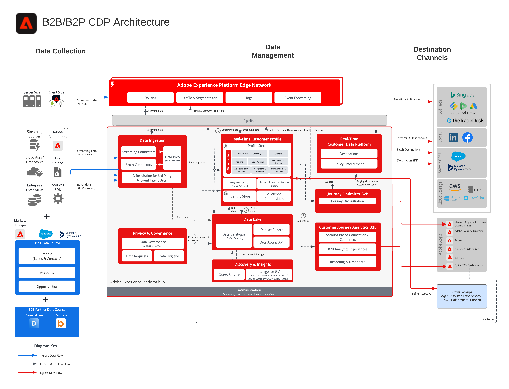

# Diagramas de arquitectura

Los diagramas de arquitectura son referencias técnicas y visuales que muestran cómo encajan Adobe Experience Platform y las aplicaciones: puntos de integración del sistema, flujos de datos y contenido y secuencia de operaciones. Úselos para comprender el diseño de la solución antes de sumergirse en las directrices paso a paso de [patrones de casos de uso](/help/blueprints/use-case-patterns/overview.md).

Los diagramas están organizados en las siguientes categorías. Seleccione una tarjeta para ir a la página de aterrizaje o al diagrama de posibles clientes de esa categoría; utilice la navegación izquierda para examinar todos los diagramas de una categoría.

<table style="table-layout:fixed; width:100%;">
<tr>
  <td style="width:33%; vertical-align:top; padding:10px; box-sizing:border-box;">
    
    

      <a href="architecture-overviews/overview.md">
        <strong>Descripción general de arquitectura</strong>
      </a>
      
Cómo encajan las aplicaciones de Experience Cloud, Experience Platform y los SDK de implementación, además de las protecciones y latencias.

    

  </td>
  <td style="width:33%; vertical-align:top; padding:10px; box-sizing:border-box;">
    
    

      <a href="audience-profile-activation/overview.md">
        <strong>Activación de audiencia y perfil</strong>
      </a>
      
Cómo se crean las audiencias y los perfiles en Adobe Real-Time CDP y se activan en los destinos y las aplicaciones.

    

  </td>
  <td style="width:33%; vertical-align:top; padding:10px; box-sizing:border-box;">
    
    

      <a href="b2b-activation-marketing/overview.md">
        <strong>Activación y marketing B2B</strong>
      </a>
      
Activación de audiencias basada en cuentas y basada en personas con Real-Time Customer Data Platform B2B edition en todos los canales y destinos.

    

  </td>
</tr>
<tr>
  <td style="width:33%; vertical-align:top; padding:10px; box-sizing:border-box;">
    
    

      <a href="customer-insights/overview.md">
        <strong>Datos del cliente</strong>
      </a>
      
Cómo Customer Journey Analytics unifica y analiza los datos de comportamiento en canales múltiples e integra Real-Time CDP y Journey Optimizer.

    

  </td>
  <td style="width:33%; vertical-align:top; padding:10px; box-sizing:border-box;">
    
    

      <a href="customer-journeys/journey-optimizer/journey-optimizer-overview.md">
        <strong>recorridos del cliente</strong>
      </a>
      
Organización de recorridos impulsada por eventos con Journey Optimizer, toma de decisiones en Edge y Hub y orquestación por lotes con Adobe Campaign.

    

  </td>
  <td style="width:33%; vertical-align:top; padding:10px; box-sizing:border-box;"></td>
</tr>
</table>

## Contenido relacionado

* [Patrones de casos de uso](/help/blueprints/use-case-patterns/overview.md): enfoques de implementación repetibles basados en estas arquitecturas
* [Objetivos empresariales clave](/help/blueprints/business-objectives/overview.md): los resultados empresariales que estas arquitecturas le ayudan a lograr
* [Casos de uso del sector](/help/blueprints/industry-use-cases/use-case-catalog.md): aplicaciones verticales específicas de estos patrones
