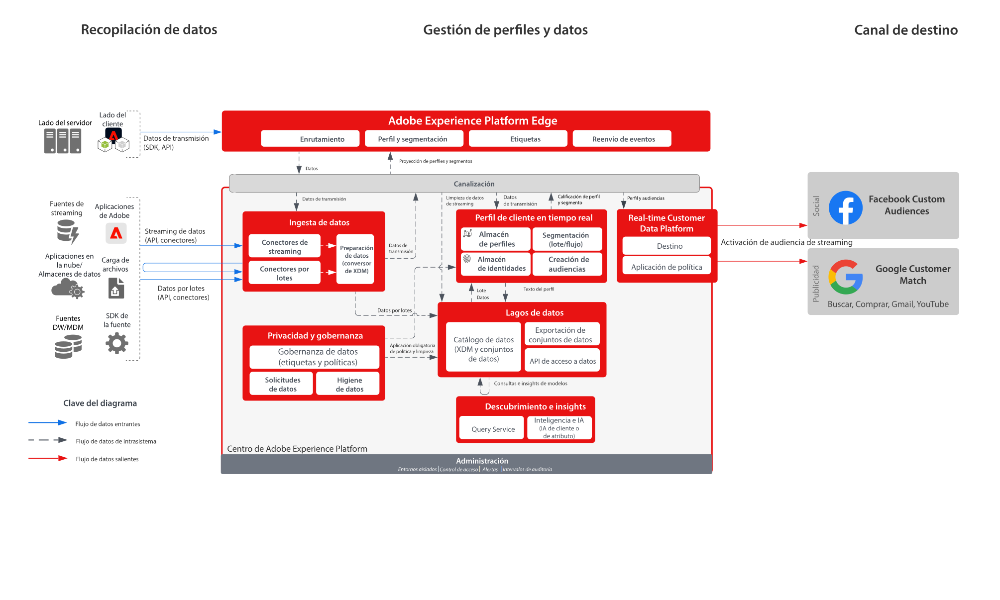

# Destinos de Audience Activation a Social y Advertising

>[!TIP]
>Este modelo también está disponible como [patrón de caso de uso](/help/blueprints/use-case-patterns/audience-building-activation/audience-activation-to-destinations.md) en Generación de audiencias y activación.

Ingeste datos de clientes de varias fuentes para crear una única vista de perfil del cliente. Puede segmentar estos perfiles para crear audiencias de marketing y personalización, y compartir estas audiencias con redes de publicidad como Facebook y Google para dirigir y personalizar campañas contra esas audiencias.

## Casos de uso

* Segmentación de audiencia para audiencias conocidas en destinos sociales y de publicidad.
* Personalización en línea con atributos en línea y sin conexión.

## Aplicaciones

* Real-Time Customer Data Platform

## Arquitectura

## Guardas

[Protecciones de perfil y segmentación](https://experienceleague.adobe.com/docs/experience-platform/profile/guardrails.html?lang=es)

## Documentación relacionada

Activación en Facebook Custom Audiences: [Configuración de destino](https://experienceleague.adobe.com/docs/experience-platform/destinations/catalog/social/facebook.html?lang=es)

Activación en Google Customer Match: [Configuración de destino](https://experienceleague.adobe.com/docs/experience-platform/destinations/catalog/advertising/google-customer-match.html?lang=es)