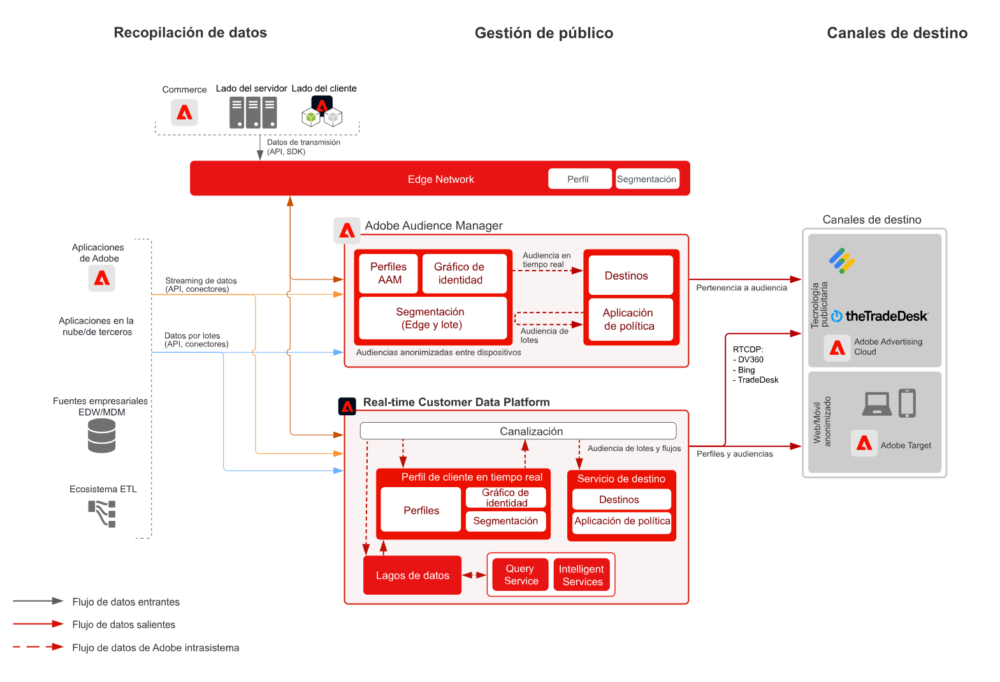

# Modelo de activación de audiencia anónima

Es posible segmentar audiencias de sitios web y otros canales de publicidad basándose en los datos anónimos de comportamiento de los clientes. Con esto, se puede crear una experiencia del cliente coherente y personalizada en diversos dispositivos.

## Casos de uso

* Realizar una personalización y segmentación de audiencia anónima digital.
* Generar audiencias para la segmentación en redes de publicidad compatibles.

## Aplicaciones

* Adobe Audience Manager

## Arquitectura

## Pasos de implementación

<!-- These steps should link to help. -->

1. [Implementar Audience Manager](https://experienceleague.adobe.com/docs/audience-manager/user-guide/implementation-integration-guides/implement-audience-manager.html?lang=es#implementation-integration-guides).
1. Recopilar datos para Audience Manager.
1. Configurar señales y rasgos para usar en las definiciones de segmento.
1. Crear segmentos en Audience Manager.
1. Configurar destinos en Audience Manager para compartir audiencias.

## Documentación relacionada

* [Audience Manager](https://experienceleague.adobe.com/docs/audience-manager.html?lang=es)
* [[!UICONTROL Audiencias] de Experience Cloud](https://experienceleague.adobe.com/docs/core-services/interface/audiences/audience-library.html?lang=es)
* [Integrar Audience Manager con Target](https://experienceleague.adobe.com/docs/audience-manager/user-guide/implementation-integration-guides/integration-other-solutions/aam-target-integration.html?lang=es)
* [Compartir segmentos de Adobe Analytics a través de Audience Manager](https://experienceleague.adobe.com/docs/analytics/components/segmentation/segmentation-workflow/seg-publish.html?lang=es)
