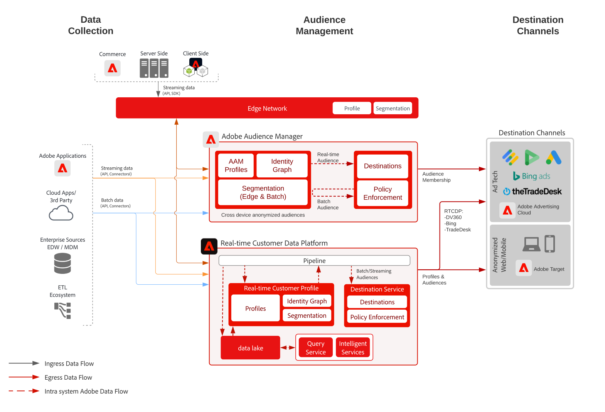

# Basado en dispositivo: segmentación de audiencias anónimas con Audience Manager

>[!TIP]
>Este modelo también está disponible como [patrón de caso de uso](/help/blueprints/use-case-patterns/personalization/anonymous-visitor-web-personalization.md) en Personalization.

La activación de audiencias anónimas permite dirigirse a audiencias y personalizarlas a través de canales web, móviles y publicitarios en función de datos de comportamiento y dispositivos anónimos.

## Casos de uso

* Realice la segmentación y personalización de audiencias digitales anónimas en el sitio web, la aplicación móvil o canales publicitarios admitidos.
* Optimice las experiencias de página de aterrizaje y de autenticación previa en función de las características conocidas del dispositivo y el comportamiento.
* Aproveche la red de datos de terceros de Audience Manager para refinar y expandir aún más las audiencias para motivos de direccionamiento.

## Aplicaciones

* Audience Manager
* Real-Time Customer Data Platform

Tanto Audience Manager como Real-Time Customer Data Platform se pueden aprovechar para usar las capacidades de activación de audiencias de forma anónima para destinos en el sitio y publicitarios. Tenga en cuenta que Real-Time Customer Data Platform solo admite un subconjunto de destinos publicitarios con identificadores de dispositivo anónimos, tal como se catalogan en la [documentación de destinos](https://experienceleague.adobe.com/docs/experience-platform/destinations/catalog/advertising/overview.html?lang=es).

## Arquitectura

 

## Pasos de implementación de Audience Manager

* Para obtener más información sobre la implementación de Audience Manager, consulte la siguiente [documentación](https://experienceleague.adobe.com/docs/audience-manager/user-guide/implementation-integration-guides/implement-audience-manager.html?lang=es).