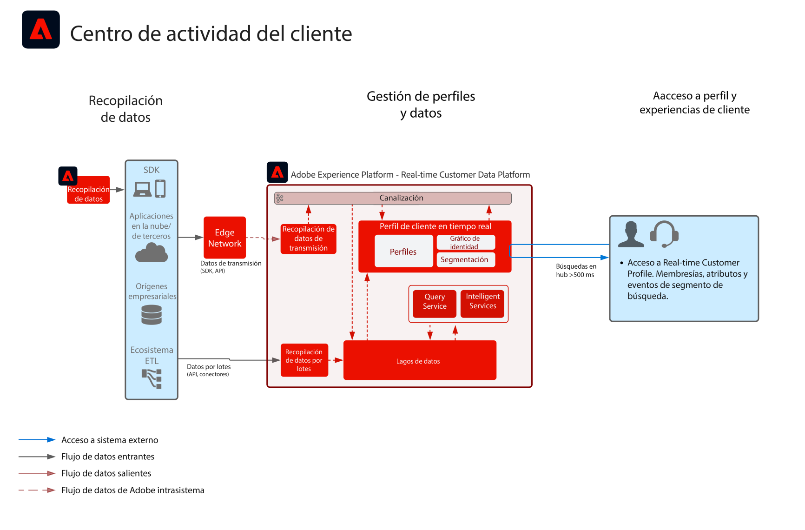

# Modelo de centro de actividad del cliente

El modelo de centro de actividad del cliente muestra cómo ciertas aplicaciones externas pueden acceder a [!UICONTROL Real-Time Customer Profile] de Adobe Experience Platform.

Las aplicaciones externas pueden acceder a los perfiles con una solicitud API GET. Los atributos, los eventos, las pertenencias a segmento y todos los recursos por modelo almacenados en el perfil se podrán utilizar posteriormente en las aplicaciones externas que no pertenezcan a Adobe.

Con esta capacidad, es posible hacer aflorar contenido de interés cuando el cliente contacta con el centro de llamadas. El agente de asistencia podrá visualizar el valor de duración del cliente y su tendencia a cancelar o exponerse a campañas de marketing, por ejemplo. Los agentes de ventas también pueden beneficiarse del contexto extra que brinda la información sobre el cliente.

>[!NOTE]
>
>La latencia actual admitida por la API de búsqueda de perfiles es de aproximadamente 500 milisegundos, lo que hace que este enfoque no sea adecuado para la integración del perfil con motores de decisión en tiempo real, como la personalización móvil o web en la misma página.

## Casos de uso

* Ofrecer un contexto más rico sobre el cliente a las interacciones realizadas por agentes, como las experiencias de asistencia y ventas. Utilizando la búsqueda de perfil en Experience Platform, los agentes pueden recibir más contexto sobre el cliente, tal como compras recientes, interacciones con campañas, tendencias, pertenencia a audiencia y otros atributos y datos que se almacenan en Real-Time Customer Profile.

## Arquitectura

## Guardas

* [Guardas de los datos de [!UICONTROL Real-Time Customer Profile]](https://experienceleague.adobe.com/docs/experience-platform/profile/guardrails.html?lang=es)

## Pasos de implementación

1. [Crear esquemas](https://experienceleague.adobe.com/?recommended=ExperiencePlatform-D-1-2021.1.xdm&amp;lang=es) para la ingesta de datos.
1. [Crear conjuntos de datos](https://experienceleague.adobe.com/docs/platform-learn/tutorials/data-ingestion/create-datasets-and-ingest-data.html?lang=es) para la ingesta de datos.
1. [Configurar las identidades e identidad de áreas de nombres correctas](https://experienceleague.adobe.com/docs/platform-learn/tutorials/identities/label-ingest-and-verify-identity-data.html?lang=es) en el esquema para asegurar que los datos ingestados se puedan combinar en un perfil unificado.
1. [Activar los esquemas y los conjuntos de datos del perfil](https://experienceleague.adobe.com/docs/platform-learn/tutorials/profiles/bring-data-into-the-real-time-customer-profile.html?lang=es).
1. [Ingesta de datos](https://experienceleague.adobe.com/?recommended=ExperiencePlatform-D-1-2020.1.dataingestion&amp;lang=es) a Experience Platform.
1. [Configurar políticas de fusión](https://experienceleague.adobe.com/docs/platform-learn/tutorials/profiles/create-merge-policies.html?lang=es).
1. Utilizar la [API de las entidades para buscar un atributo de perfil](https://experienceleague.adobe.com/docs/experience-platform/profile/api/entities.html?lang=es), tanto de la entidad de registro como de la de evento de experiencia.

## Documentación relacionada

* [Descripción del producto Adobe Experience Platform Activation](https://helpx.adobe.com/es/legal/product-descriptions/adobe-experience-platform0.html)
* Documentación de [[!UICONTROL Real-Time Customer Profile]](https://experienceleague.adobe.com/docs/experience-platform/profile/home.html?lang=es)
* [Guardas de perfil](https://experienceleague.adobe.com/docs/experience-platform/profile/guardrails.html?lang=es)
* [API de búsqueda de perfiles](https://www.adobe.io/apis/experienceplatform/home/api-reference.html)
