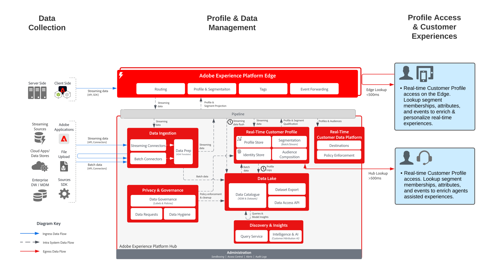

# Acceso a perfiles en tiempo real para escenarios de soporte y ventas

>[!TIP]
>Este modelo también está disponible como [patrón de caso de uso](/help/blueprints/use-case-patterns/audience-building-activation/real-time-profile-lookup.md) en Generación de audiencias y activación.

El modelo de acceso a perfiles en tiempo real para escenarios de soporte y ventas muestra cómo las aplicaciones externas pueden acceder al [!UICONTROL Perfil del cliente en tiempo real] de Adobe Experience Platform.

Las aplicaciones externas pueden acceder a los perfiles con una solicitud API GET. Los atributos, los eventos, las pertenencias a segmento y todos los recursos por modelo almacenados en el perfil se podrán utilizar posteriormente en las aplicaciones externas que no pertenezcan a Adobe.

Con esta capacidad, es posible hacer aflorar contenido de interés cuando el cliente contacta con el centro de llamadas. El agente de asistencia podrá visualizar el valor de duración del cliente y su tendencia a cancelar o exponerse a campañas de marketing, por ejemplo. Los agentes de ventas también pueden beneficiarse del contexto extra que brinda la información sobre el cliente.

>[!NOTE]
>
>La búsqueda de perfiles en el concentrador no está diseñada para casos de uso de alto rendimiento y baja latencia, como la personalización de entrada web/móvil. La búsqueda de perfiles en el concentrador está diseñada para escenarios de latencia más baja, como soporte asistido por agentes o interacciones de ventas. Para escenarios de baja latencia y alto rendimiento, como personalización web/móvil o Offer Decisioning en tiempo real, se debe aprovechar el perfil de Edge. El perfil de Edge habilita el acceso en tiempo real mediante la [conexión personalizada de Personalization](https://experienceleague.adobe.com/es/docs/experience-platform/destinations/catalog/personalization/custom-personalization) de Real-time Customer Data Platform.

## Casos de uso

* Ofrecer un contexto más rico sobre el cliente a las interacciones realizadas por agentes, como las experiencias de asistencia y ventas. Utilizando la búsqueda de perfil en Experience Platform, los agentes pueden recibir más contexto sobre el cliente, tal como compras recientes, interacciones con campañas, tendencias, pertenencia a audiencia y otros atributos y datos que se almacenan en Real-Time Customer Profile.

## Arquitectura

## Guardas

* [Protecciones para [!UICONTROL datos del perfil del cliente en tiempo real]](https://experienceleague.adobe.com/docs/experience-platform/profile/guardrails.html?lang=es)

## Documentación relacionada

* [Descripción del producto de Adobe Experience Platform Activation](https://helpx.adobe.com/es/legal/product-descriptions/adobe-experience-platform0.html)
* [Documentación de [!UICONTROL Perfil del cliente en tiempo real]](https://experienceleague.adobe.com/docs/experience-platform/profile/home.html?lang=es)
* [Protecciones de perfil](https://experienceleague.adobe.com/docs/experience-platform/profile/guardrails.html?lang=es)
* [API de búsqueda de perfil](https://www.adobe.io/apis/experienceplatform/home/api-reference.html)
