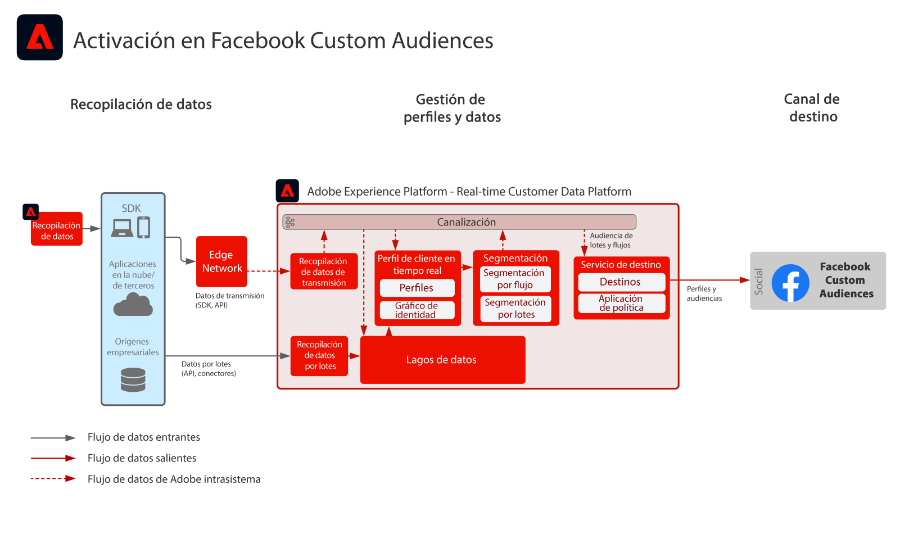

# Activación en Facebook Custom Audiences

Incorpore datos de clientes de varias fuentes para crear una única vista de perfil del cliente, segmente estos perfiles para crear audiencias para marketing y personalización, y comparta estas audiencias en redes de publicidad sociales como Facebook para dirigir y personalizar campañas contra esas audiencias.

## Casos de uso

* Segmentación de audiencia para audiencias conocidas en destinos sociales y de publicidad.
* Personalización en línea con atributos en línea y sin conexión.

## Aplicaciones

* Real-time Customer Data Platform

## Arquitectura

## Pasos de implementación

1. Configure áreas de nombres de identidad para utilizarlas en los orígenes de datos de perfil.
   * Utilice áreas de nombres predeterminadas como Correo electrónico, Hash SHA256 de correo electrónico, si están disponibles.
   * Facebook tiene una lista de identidades admitidas. Para poder activarse en Facebook Custom Audiences, debe haber una de las identidades admitidas en los perfiles que se van a activar.
   * Facebook admite actualmente las siguientes identidades: GAID, IDFA, phone_sha256, email_lc_sha256 y extern_id.
   * Para obtener más información, consulte la [Guía de destino de Facebook](https://experienceleague.adobe.com/docs/experience-platform/destinations/catalog/social/facebook.html?lang=es).
   * Cree áreas de nombres personalizadas en las que las áreas de nombres predeterminadas no estén disponibles para las identidades aplicables.
1. Configure esquemas y conjuntos de datos de fuentes de datos de perfil.
   * Cree esquemas de registro de perfil para todos los datos de origen de registros de perfil.
      * Especifique la identidad principal y las identidades secundarias para cada esquema.
      * Habilite el esquema para la ingesta de perfiles.
   * Cree conjuntos de datos de registro de perfil para todos los datos de origen de registros de perfil y asigne el esquema asociado.
      * Habilite el conjunto de datos para la ingesta de perfiles.
   * Cree esquemas de eventos de experiencia de perfil para todos los datos de origen basados en series temporales de perfiles.
      * Especifique la identidad principal y las identidades secundarias para el esquema.
   * Habilite el esquema para la ingesta de perfiles.
   * Cree conjuntos de datos de eventos de experiencia de perfil para todos los datos de origen de evento de experiencia de perfil y asigne el esquema asociado.
      * Habilite el conjunto de datos para la ingesta de perfiles.
1. Incorpore los datos de origen utilizando un conector de origen en el conjunto de datos asociado configurado anteriormente.
   * Configure la cuenta del conector de origen con credenciales.
   * Configure un flujo de datos para incorporar los datos del archivo de origen o de la ubicación de la carpeta en una programación especificada al conjunto de datos especificado.
   * Asigne cualquier campo de los datos de origen al esquema de destino.
   * Transforme cualquier campo al formato correcto para su ingesta en Experience Platform.
      * Transformaciones de fechas
      * Transforme a minúsculas cuando corresponda, como direcciones de correo electrónico
      * Transformaciones de patrones (por ejemplo, el número de teléfono)
      * Agregue ID de registros únicos para registros de eventos de experiencias si no están presentes en los datos de origen.
      * Transforme matrices y campos de tipo mapa para garantizar la asignación y el modelado correctos de matrices y mapas para la segmentación en Experience Platform.
1. Configure la directiva de combinación de perfiles para garantizar la configuración correcta del gráfico de identidad y qué conjuntos de datos deben incluirse en la combinación de perfiles.
1. Una vez ejecutados los flujos de datos, asegúrese de que la incorporación de datos de perfil se haya realizado correctamente sin errores.
   * Inspeccione el gráfico de identidad de varios perfiles para garantizar el procesamiento correcto de las relaciones de identidad.
   * Inspeccione los atributos y eventos de varios perfiles para garantizar la correcta incorporación de atributos y eventos a los perfiles.
1. Cree segmentos para crear audiencias de perfil
   * Genere segmentos en el generador de segmentos usando reglas contra atributos y eventos.
   * Guarde el segmento para su evaluación. Los segmentos se evaluarán en la programación especificada una vez al día.
      * Si las reglas de los segmentos cumplen los requisitos para la segmentación de flujo continuo, el segmento se evaluará a medida que se incorporen nuevos datos de flujo continuo para los perfiles. Los segmentos de transmisión también se evaluarán una vez al día durante la segmentación por lotes programada.
1. Asegúrese de que los resultados del segmento se ajusten a lo esperado.
   * Revise el recuento de resultados del segmento para los segmentos dados.
   * Investigue el perfil que debe incluirse en el segmento para verificar que la pertenencia al segmento se incluye en la parte de pertenencia al segmento del perfil.
1. Configure la entrega de la audiencia al destino en la configuración de destino.
   * Consulte la [Guía de destino de Facebook](https://experienceleague.adobe.com/docs/experience-platform/destinations/catalog/social/facebook.html?lang=es) para obtener más información sobre la configuración del destino de Facebook.
   * Al configurar un destino, seleccione qué audiencia desea activar en el destino.
   * Determine la fecha de inicio programada en la que desea que el flujo de datos de destino comience a enviar la audiencia al destino.
   * Cada destino tiene atributos opcionales y requeridos que se envían.
      * Para Facebook, se debe incluir una de las identidades necesarias y se debe utilizar para hacer coincidir los perfiles de las audiencias dentro de Experience Platform con un perfil que pueda ser identificado por Facebook.
   * Cada destino también tiene un tipo de envío especificado, ya sea flujo continuo o por lotes, basado en archivos o carga útil JSON.
      * Para Facebook, las pertenencias a audiencias se entregan de forma de flujo continuo a un extremo de Facebook en formato JSON.
      * Las pertenencias a audiencias se entregarán en forma de flujo continuo después de la evaluación de la segmentación por flujo continuo o por lotes en Experience Platform.
1. Asegúrese de que el flujo de destino haya entregado la audiencia al destino según lo esperado.
   * Compruebe la interfaz de monitorización para confirmar que la audiencia se ha enviado con el número de perfiles esperados. El tamaño de la audiencia debe reflejar el número esperado de perfiles activados, teniendo en cuenta que un destino específico como Facebook requerirá ciertos campos, como una identidad hash de correo electrónico, y si no está presente en el perfil que pertenece a la audiencia, no se activará en el destino.
   * Compruebe si faltan perfiles omitidos para identidades de perfil o si faltan atributos que fueran obligatorios.
   * Compruebe si hay otros errores que puedan tener que resolverse.
1. Compruebe que la audiencia se activó en el destino final con el número esperado de pertenencias a audiencias.
   * Inicie sesión en el portal Facebook Custom Audience para comprobar que la audiencia de Real-time Customer Data Platform se ha entregado y que la tasa de coincidencia de perfiles de audiencia en Facebook coincide razonablemente con el número de perfiles de audiencia de Real-time Customer Data Platform.

## Guardas

[Guardas de perfil y segmentación](https://experienceleague.adobe.com/docs/experience-platform/profile/guardrails.html?lang=es)

## Documentación relacionada

Activación en Facebook Custom Audiences: [Configuración de destino](https://experienceleague.adobe.com/docs/experience-platform/destinations/catalog/social/facebook.html?lang=es)