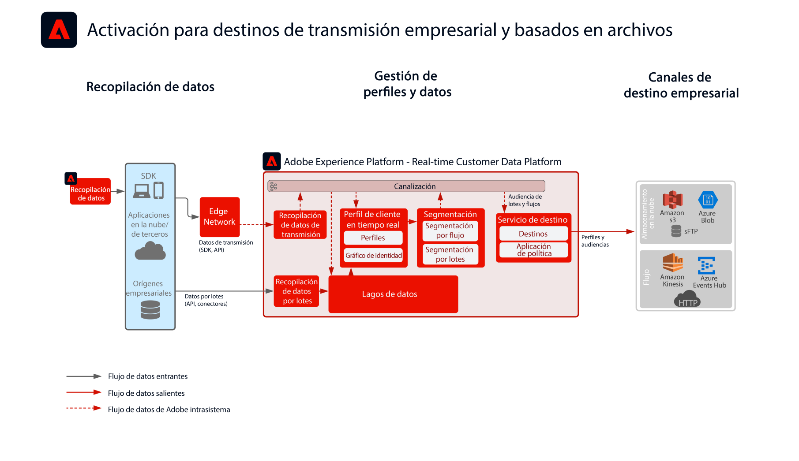

# Activación de audiencias y perfiles en el modelo de Destinos de flujo empresarial y de archivos

Compartir cambios y eventos de perfil y audiencia en flujo continuo o por lotes desde [!UICONTROL Real-time Customer Data Platform] a almacenes de datos y aplicaciones empresariales. Estos eventos de perfil y audiencia pueden utilizarse para iniciar una acción de ventas o asistencia al cliente, como realizar un seguimiento de un proceso de aplicación abandonado o un registro de seminario web, o actualizar aplicaciones empresariales con los atributos de cliente e inteligencia más recientes de [!UICONTROL Real-time Customer Data Platform].

## Casos de uso

* Activación de perfiles y audiencias a destinos de almacenamiento en la nube o destinos de streaming para el seguimiento, almacenamiento, análisis y activación de datos del cliente por parte de la empresa.

## Aplicaciones

* Adobe Experience Platform   Activation

## Arquitectura

## Guardas

[Consulte los guardas definidos en la página de información general sobre la activación de audiencias y perfiles.](overview.md)

## Pasos de implementación

1. [Crear esquemas](https://experienceleague.adobe.com/?recommended=ExperiencePlatform-D-1-2021.1.xdm&amp;lang=es) para la ingesta de datos.
1. [Crear conjuntos de datos](https://experienceleague.adobe.com/docs/platform-learn/tutorials/data-ingestion/create-datasets-and-ingest-data.html?lang=es) para la ingesta de datos.
1. [Configurar las identidades e identidad de áreas de nombres correctas](https://experienceleague.adobe.com/docs/platform-learn/tutorials/identities/label-ingest-and-verify-identity-data.html?lang=es) en el esquema para asegurar que los datos ingestados se puedan combinar en un perfil unificado.
1. [Activar los esquemas y los conjuntos de datos del perfil](https://experienceleague.adobe.com/docs/platform-learn/tutorials/profiles/bring-data-into-the-real-time-customer-profile.html?lang=es).
1. [Ingesta de datos](https://experienceleague.adobe.com/?recommended=ExperiencePlatform-D-1-2020.1.dataingestion&amp;lang=es) a Experience Platform.
1. [Aprovisionar [!UICONTROL Real-time Customer Data Platform] uso compartido de segmentos](https://www.adobe.com/go/audiences) entre Experience Platform y Audience Manager para audiencias definidas en Experience Platform que se compartirán con Audience Manager.
1. [Crear segmentos](https://experienceleague.adobe.com/docs/platform-learn/tutorials/segments/create-segments.html?lang=es) en Experience Platform. El sistema determina automáticamente si el segmento debe ser evaluado por lotes o streaming.
1. [Configurar destinos](https://experienceleague.adobe.com/docs/platform-learn/tutorials/destinations/create-destinations-and-activate-data.html?lang=es) para compartir atributos de perfil y pertenencias a audiencia a los destinos deseados.

## Documentación relacionada

* [Documentación de los destinos](https://experienceleague.adobe.com/docs/experience-platform/destinations/catalog/overview.html?lang=es)
* [Información general sobre los destinos de almacenamiento en la nube](https://experienceleague.adobe.com/docs/experience-platform/destinations/catalog/cloud-storage/overview.html?lang=es#catalog)
* [Destino HTTP](https://experienceleague.adobe.com/docs/experience-platform/destinations/catalog/http-destination.html?lang=es#overview)
* [[!UICONTROL Real-time Customer Data Platform] Descripción del producto](https://helpx.adobe.com/es/legal/product-descriptions/real-time-customer-data-platform.html)
* [Directrices de perfil y segmentación](https://experienceleague.adobe.com/docs/experience-platform/profile/guardrails.html?lang=es)
* [Documentación de la segmentación](https://experienceleague.adobe.com/docs/experience-platform/segmentation/api/streaming-segmentation.html?lang=es)

## Vídeos y tutoriales relacionados

* [[!UICONTROL Real-time Customer Data Platform] información general](https://experienceleague.adobe.com/docs/platform-learn/tutorials/application-services/rtcdp/understanding-the-real-time-customer-data-platform.html?lang=es)
* [Demostración de [!UICONTROL Real-time Customer Data Platform]](https://experienceleague.adobe.com/docs/platform-learn/tutorials/application-services/rtcdp/demo.html?lang=es)
* [Crear segmentos](https://experienceleague.adobe.com/docs/platform-learn/tutorials/segments/create-segments.html?lang=es)
