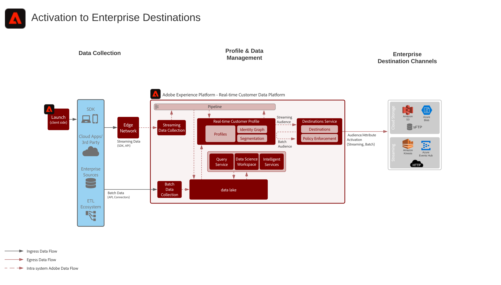

# Modelo de activación de audiencias y perfiles en destinos empresariales

Comparta los cambios y eventos de perfil y audiencia en streaming o por lotes de [!UICONTROL Plataforma de datos del cliente en tiempo real] a aplicaciones y almacenes de datos empresariales. Estos eventos de perfil y audiencia pueden utilizarse para iniciar una acción de ventas o asistencia al cliente, como realizar un seguimiento de un proceso de aplicación abandonado o un registro de seminario web, o actualizar aplicaciones empresariales con los atributos de cliente e inteligencia más recientes de [!UICONTROL Plataforma de datos del cliente en tiempo real].

## Casos de uso

* Activación de perfiles y audiencias en destinos de almacenamiento en la nube o destinos de flujo continuo para el seguimiento, almacenamiento, análisis y activación de datos y perspectivas de clientes por parte de la empresa.

## Aplicaciones

* Adobe Experience Platform Activation

## Arquitectura

## Guardas

[Directrices de perfil y segmentación](https://experienceleague.adobe.com/docs/experience-platform/profile/guardrails.html?lang=es)

### Protecciones para la evaluación y activación de segmentos

| Tipo de segmentación | Frecuencia | Rendimiento | Latencia (Evaluación de segmentos) | Latencia (Activación de segmentos) | Carga útil de activación |
|---|---|---|---|---|---|
| Segmentación de Edge | La segmentación de Edge está actualmente en fase beta y permite evaluar una segmentación válida en tiempo real en la red perimetral del Experience Platform para la toma de decisiones en la misma página en tiempo real mediante Adobe Target y Journey Optimizer de Adobe. |  | ~100 ms | Disponible inmediatamente para su personalización en Adobe Target, para búsquedas de perfiles en el perfil de Edge y para su activación mediante destinos basados en cookies. | Pertenencia a audiencias disponibles en Edge para búsquedas de perfiles y destinos basados en cookies. Los atributos Pertenencia a audiencias y Perfil están disponibles para Adobe Target y Journey Optimizer. |
| Segmentación por flujo | Cada vez que se incorpora un nuevo evento o registro de flujo continuo en el perfil del cliente en tiempo real y la definición del segmento es un segmento de flujo continuo válido.  Consulte la documentación de  [segmentación ](https://experienceleague.adobe.com/docs/experience-platform/segmentation/api/streaming-segmentation.html?lang=es) para obtener instrucciones sobre los criterios de los segmentos de flujo continuo | Hasta 1500 eventos por segundo. | ~ p95 &lt;5 min | Destinos de transmisión: Las pertenencias a audiencias de transmisión se activan en aproximadamente 10 minutos o se agrupan por lotes en función de los requisitos del destino. Destinos programados: Las pertenencias a audiencias de flujo continuo se activan en lote según la hora de envío de destino programada. | Destinos de transmisión: Cambios en la pertenencia a audiencias, valores de identidad y atributos de perfil. Destinos programados: Cambios en la pertenencia a audiencias, valores de identidad y atributos de perfil. |
| Segmentación incremental | Una vez por hora para los nuevos datos que se han incorporado en el perfil del cliente en tiempo real desde la última evaluación de segmentos por lotes o incrementales. |  |  | Destinos de transmisión: Las suscripciones de audiencia incrementales se activan en aproximadamente 10 minutos o por lotes según los requisitos del destino. Destinos programados: Las suscripciones de audiencia incrementales se activan en lote según la hora de entrega de destino programada. | Destinos de transmisión: Los cambios en la pertenencia a la audiencia y solo los valores de identidad. Destinos programados: Cambios en la pertenencia a audiencias, valores de identidad y atributos de perfil. |
| Segmentación por lotes | Una vez al día en función de una programación predeterminada del sistema o iniciada manualmente mediante API. |  | Aproximadamente una hora por trabajo para un tamaño de almacén de perfiles de hasta 10 TB, 2 horas por trabajo para un tamaño de almacén de perfiles de entre 10 TB y 100 TB. El rendimiento del trabajo del segmento por lotes depende del número de perfiles, el tamaño de los perfiles y el número de segmentos que se evalúen. | Destinos de transmisión: Las pertenencias a audiencias por lotes se activan aproximadamente dentro de los 10 días posteriores a la finalización de la evaluación de segmentación o del microagrupamiento, según los requisitos del destino. Destinos programados: Las suscripciones a audiencias por lotes se activan según la hora de envío de destino programada. | Destinos de transmisión: Los cambios en la pertenencia a la audiencia y solo los valores de identidad. Destinos programados: Cambios en la pertenencia a audiencias, valores de identidad y atributos de perfil. |

## Pasos de implementación

1. Cree esquemas para introducir los datos.
1. Cree conjuntos de datos para incorporar datos.
1. Configurar las identidades e identidad de áreas de nombres correctas en el esquema para asegurar que los datos ingeridos se puedan combinar en un perfil unificado.
1. Habilite los esquemas y conjuntos de datos para el procesamiento de perfiles.
1. Configure cualquier fuente para el consumo de datos.
1. Segmentos de autor en Experience Platform, que se evaluarán en lote o flujo continuo. El sistema determina automáticamente si el segmento debe ser evaluado por lotes o flujo.
1. Configurar destinos para compartir atributos de perfil y pertenencias a audiencia a los destinos deseados.

## Consideraciones sobre la implementación

Activación de atributos e identidades

* [!UICONTROL La ] plataforma de datos del cliente en tiempo real puede activar las suscripciones de audiencia, así como los cambios de atributos e identidad que se producen en los perfiles que son miembros de segmentos seleccionados para la activación. Si su objetivo es activar atributos o identidades, debe definir un segmento global que incluya todos los perfiles a los que se envían las actualizaciones de atributos e identidades. En este punto, puede seleccionar el segmento y los atributos deseados para activarlos como parte de la configuración de destino.
* Tenga en cuenta que los destinos de lote no admiten la activación de eventos de cambio de solo atributo. Se pueden enviar suscripciones de audiencia completas o incrementales junto con los atributos seleccionados para la activación, pero no se pueden activar eventos de cambio de solo atributos mediante destinos por lotes.

Activación de segmentos por lotes en destinos de flujo continuo

* Se admite la activación de segmentos por lotes a destinos de flujo continuo. Los trabajos de segmentos por lotes colocan mensajes en la canalización una vez que se haya completado el trabajo del segmento para la activación de flujo continuo

Activación de segmentos de flujo continuo en destinos por lotes

* Se admite la activación de segmentos de transmisión a destino por lotes. La programación de destino de lote exporta las suscripciones a segmentos de perfil en función de la programación de destino de lote. Esto incluye tanto las suscripciones a segmentos determinadas mediante métodos de flujo continuo como por lotes.

Activación de eventos de experiencia

* No se admite la activación de eventos de experiencia sin procesar. Para activarse con eventos de experiencia, se debe crear un segmento con las reglas necesarias que incluyan o excluyan la lógica de eventos de experiencia. Esto crea un segmento que se define para los eventos de experiencia y la pertenencia a un segmento se puede activar como proxy para activar los eventos de experiencia sin procesar. Considere también la posibilidad de utilizar [!UICONTROL Launch Server Side] para activar eventos de experiencia sin procesar recopilados mediante SDK.

## Documentación relacionada

* [Documentación de los destinos](https://experienceleague.adobe.com/docs/experience-platform/destinations/catalog/overview.html?lang=es)
* [Información general sobre los destinos de almacenamiento en la nube](https://experienceleague.adobe.com/docs/experience-platform/destinations/catalog/cloud-storage/overview.html?lang=en#catalog)
* [Destino HTTP](https://experienceleague.adobe.com/docs/experience-platform/destinations/catalog/http-destination.html?lang=en#overview)
* [Descripción del producto Real-time Customer Data Platform](https://helpx.adobe.com/es/legal/product-descriptions/real-time-customer-data-platform.html)
* [Directrices de perfil y segmentación](https://experienceleague.adobe.com/docs/experience-platform/profile/guardrails.html?lang=en)
* [Documentación de la segmentación](https://experienceleague.adobe.com/docs/experience-platform/segmentation/api/streaming-segmentation.html)

## Vídeos y tutoriales relacionados

* [Información general de Real-time Customer Data Platform](https://experienceleague.adobe.com/docs/platform-learn/tutorials/application-services/rtcdp/understanding-the-real-time-customer-data-platform.html?lang=es)
* [[!UICONTROL Versión de prueba de Real-time Customer Data Platform]](https://experienceleague.adobe.com/docs/platform-learn/tutorials/application-services/rtcdp/demo.html?lang=es)
* [Crear segmentos](https://experienceleague.adobe.com/docs/platform-learn/tutorials/segments/create-segments.html?lang=es)
