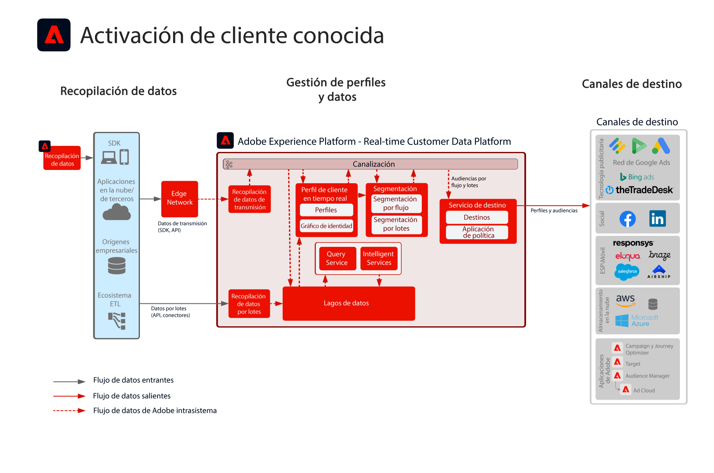

# Activación de públicos y perfiles en destinos empresariales

>[!TIP]
>Este modelo también está disponible como [patrón de caso de uso](/help/blueprints/use-case-patterns/audience-building-activation/audience-activation-to-destinations.md) en Generación de audiencias y activación.

Comparta cambios y eventos de perfil y audiencia por streaming o lotes de [!UICONTROL Real-Time Customer Data Platform] a aplicaciones y almacenes de datos empresariales. Estos eventos de perfil y audiencia se pueden utilizar para iniciar una acción de ventas o asistencia al cliente, como realizar el seguimiento de un proceso abandono de aplicación, un registro en un seminario web o actualizar aplicaciones empresariales con los últimos atributos de cliente e inteligencia de [!UICONTROL Real-Time Customer Data Platform].

## Casos de uso

* Activación de perfiles y audiencias a destinos de almacenamiento en la nube o destinos de streaming para el seguimiento, almacenamiento, análisis y activación de datos del cliente por parte de la empresa.

## Aplicaciones

* Real-Time Customer Data Platform

## Arquitectura

## Documentación relacionada

Encontrará más información sobre la configuración del almacenamiento en la nube y los destinos empresariales en la [Documentación de destinos](https://experienceleague.adobe.com/en/docs/experience-platform/destinations/catalog/cloud-storage/overview).

## Guardas

[Consulte las protecciones tal como se describe en la página protecciones.](../experience-platform/guardrails.md)