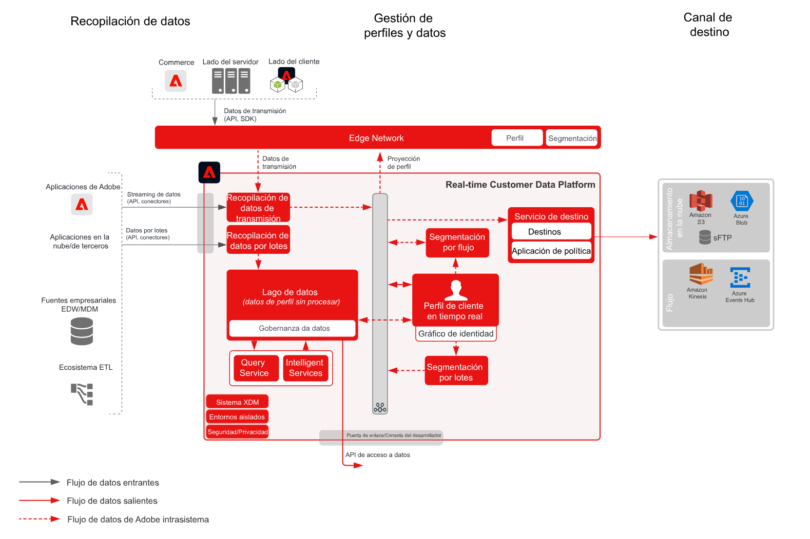

# Modelo de activación de audiencias y perfiles en destinos empresariales

Comparta los cambios y eventos de perfil y audiencia en streaming o por lotes de [!UICONTROL Plataforma de datos del cliente en tiempo real] a aplicaciones y almacenes de datos empresariales. Estos eventos de perfil y audiencia pueden utilizarse para iniciar una acción de ventas o asistencia al cliente, como realizar un seguimiento de un proceso de aplicación abandonado o un registro de seminario web, o actualizar aplicaciones empresariales con los atributos de cliente e inteligencia más recientes de [!UICONTROL Plataforma de datos del cliente en tiempo real].

## Casos de uso

* Activación de perfiles y audiencias en destinos de almacenamiento en la nube o destinos de flujo continuo para el seguimiento, almacenamiento, análisis y activación de datos y perspectivas de clientes por parte de la empresa.

## Aplicaciones

* Adobe Experience Platform Activation

## Arquitectura

## Guardas

Consulte las protecciones como se describe en la página Información general sobre la activación de perfiles y audiencias: [LINK](overview.md)

## Pasos de implementación

1. [Cree ](https://experienceleague.adobe.com/docs/platform-learn/tutorials/schemas/create-a-schema.html) esquemas para introducir los datos.
1. [Cree ](https://experienceleague.adobe.com/docs/platform-learn/tutorials/data-ingestion/create-datasets-and-ingest-data.html) conjuntos de datos para incorporar los datos.
1. [Configurar las identidades e identidad de áreas de nombres correctas en el esquema para asegurar que los datos ingeridos se puedan combinar en un perfil unificado.](https://experienceleague.adobe.com/docs/platform-learn/tutorials/identities/label-ingest-and-verify-identity-data.html)
1. [Habilite los esquemas y conjuntos de datos para el perfil](https://experienceleague.adobe.com/docs/platform-learn/tutorials/profiles/bring-data-into-the-real-time-customer-profile.html).
1. [Ingerir datos a Experience Platform.](https://experienceleague.adobe.com/?recommended=ExperiencePlatform-D-1-2020.1.dataingestion)
1. [Disponer el intercambio de segmentos de Real-time Customer Data Platform entre Experience Platform y Audience Manager para que las audiencias definidas en Experience Platform se compartan con Audience Manager.](https://www.adobe.com/go/audiences)
1. [Cree ](https://experienceleague.adobe.com/docs/platform-learn/tutorials/segments/create-segments.html?lang=es) segmentos en el Experience Platform. El sistema determina automáticamente si el segmento debe ser evaluado por lotes o flujo.
1. [Configurar destinos para compartir atributos de perfil y pertenencias a audiencia a los destinos deseados.](https://experienceleague.adobe.com/docs/platform-learn/tutorials/destinations/create-destinations-and-activate-data.html)

## Documentación relacionada

* [Documentación de los destinos](https://experienceleague.adobe.com/docs/experience-platform/destinations/catalog/overview.html?lang=es)
* [Información general sobre los destinos de almacenamiento en la nube](https://experienceleague.adobe.com/docs/experience-platform/destinations/catalog/cloud-storage/overview.html?lang=en#catalog)
* [Destino HTTP](https://experienceleague.adobe.com/docs/experience-platform/destinations/catalog/http-destination.html?lang=en#overview)
* [Descripción del producto Real-time Customer Data Platform](https://helpx.adobe.com/es/legal/product-descriptions/real-time-customer-data-platform.html)
* [Directrices de perfil y segmentación](https://experienceleague.adobe.com/docs/experience-platform/profile/guardrails.html?lang=es)
* [Documentación de la segmentación](https://experienceleague.adobe.com/docs/experience-platform/segmentation/api/streaming-segmentation.html?lang=es)

## Vídeos y tutoriales relacionados

* [Información general de Real-time Customer Data Platform](https://experienceleague.adobe.com/docs/platform-learn/tutorials/application-services/rtcdp/understanding-the-real-time-customer-data-platform.html?lang=es)
* [[!UICONTROL Versión de prueba de Real-time Customer Data Platform]](https://experienceleague.adobe.com/docs/platform-learn/tutorials/application-services/rtcdp/demo.html?lang=es)
* [Crear segmentos](https://experienceleague.adobe.com/docs/platform-learn/tutorials/segments/create-segments.html)
