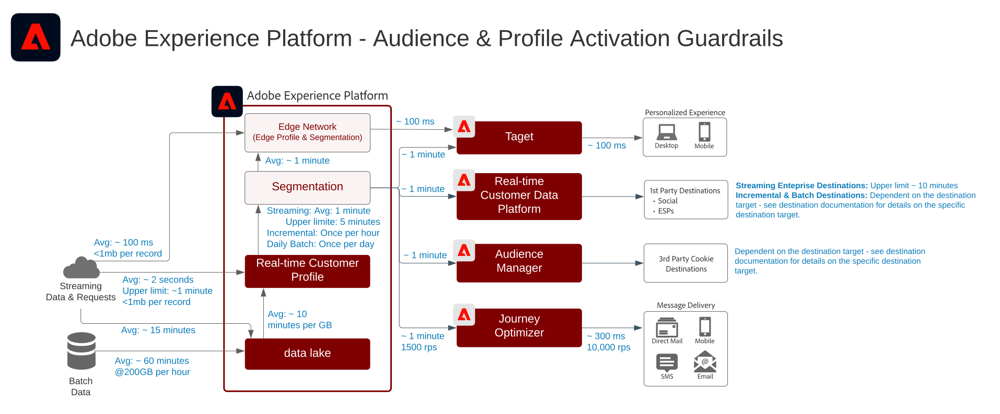

# Activación de audiencia y perfil

La activación de audiencias y perfiles es la clave del éxito en un mundo de marketing basado en datos. Sin embargo, muchas marcas aún centran sus esfuerzos en la activación por canal en primer lugar, lo que suele producir un alcance y una personalización incoherentes.

Abordando el canal en primer lugar, cada canal actúa como un depósito donde los esfuerzos de personalización se dirigen solo a los clientes que interactúan con la marca en ese preciso canal. Este enfoque no refleja la realidad de la interacción del cliente con las marcas por diferentes puntos de contacto. La activación de audiencias y perfiles permite a las marcas conectar las interacciones de los clientes en varios canales, para ofrecer un perfil y una audiencia centralizados que se pueden activar en todos los canales.

| Modelo | Descripción | Aplicaciones de Experience Cloud |
|---|---|---|
| **[Audience Activation anónima](anonymous.md)** | <ul><li>Segmentación de la audiencia a través del sitio web y otros canales de publicidad para conseguir datos anónimos de comportamiento del cliente.</li><li>Integración con datos de audiencia de terceros para una personalización mejorada.</li></ul> | <ul><li>Adobe Audience Manager</li></ul> |
| **[Audience Activation en línea / sin conexión](online-offline.md)** | <ul><li>Active en destinos conocidos basados en perfiles, como proveedores de correo electrónico, redes sociales y destinos publicitarios. </li><li>Utilice atributos y eventos sin conexión, como pedidos sin conexión, transacciones, CRM o datos de fidelidad, junto con el comportamiento en línea para la segmentación y personalización en línea.</li></ul> | <ul><li>Adobe Experience Platform</li><li> [!UICONTROL Real-time Customer Data Platform]</li><li>Adobe Audience Manager (opcional)</li></ul> |
| **[Activación de audiencias y perfiles en destinos empresariales](enterprise-destinations.md)** | <ul><li>Replicación y actualización de los cambios de perfil y audiencia en los almacenes de datos empresariales para casos de uso de activación y generación de informes. </li></ul><ul><li>Inicie una acción de ventas o asistencia al cliente mediante la notificación de una acción del cliente desde la [!UICONTROL Plataforma de datos del cliente en tiempo real] a sistemas y aplicaciones empresariales.</li></ul> | <ul><li>Adobe Experience Platform</li><li>[!UICONTROL Plataforma de datos de clientes en tiempo real]</li><li>Activación del Experience Platform</li><li>Adobe Audience Manager (opcional)</li></ul> |
| **[Centro de actividad del cliente](customer-activity.md)** | <ul><li>Ofrecer un contexto más rico sobre el cliente a las interacciones realizadas por agentes, como las experiencias de asistencia y ventas. Con la búsqueda de perfiles en Experience Platform, los agentes pueden recibir información más contextual sobre el consumidor, como compras recientes, interacciones de campañas, tendencias, pertenencia a audiencias y otros atributos y perspectivas que se almacenan en el perfil del cliente en tiempo real.</li></ul> | <ul><li>Adobe Experience Platform</li></ul> |

## Protecciones para los esquemas de activación de audiencias y perfiles

* [Directrices de perfil y segmentación](https://experienceleague.adobe.com/docs/experience-platform/profile/guardrails.html?lang=es)

### Diagrama de seguridad

### Protecciones para la evaluación y activación de segmentos

| Tipo de segmentación | Casos de uso | Frecuencia | Rendimiento | Latencia (Evaluación de segmentos) | Latencia (Activación de segmentos) | Carga útil de activación |
|--------------------------|------------------------------------------------------------|------------------------------------------------------------------------------------------------------------------------------------------------------------------------------------------------------------------------------------------------------------------------------------------------------------------------------------------------------------------------------|-------------------------------|------------------------------------------------------------------------------------------------------------------------------------------------------------------------------------------------------------------------------|------------------------------------------------------------------------------------------------------------------------------------------------------------------------------------------------------------------------------------------------------------------------------------------------------------------|-----------------------------------------------------------------------------------------------------------------------------------------------------------------------------------------------------|
| Segmentación de Edge | Personalización web/móvil (misma página/siguiente página) | La segmentación de Edge está actualmente en fase beta y aún no está disponible de forma general. | - | Aproximadamente 100 milisegundos | Target y Journey Optimizer:<ul><li>Disponible inmediatamente en la misma solicitud de personalización.</li></ul> Destinos basados en cookies:<ul><li>Disponible para las decisiones de página siguientes.</li></ul> | Búsqueda de perfiles de Edge (Target y Journey Optimizer):<ul><li>Pertenencia a la audiencia</li><li>Atributos de perfil</li></ul> Destinos basados en cookies:<ul><li>Pertenencia a la audiencia</li></ul> |
| Segmentación por flujo | Marketing basado en déclencheur (transmisión) | Cada vez que se incorpora un nuevo evento o registro de flujo continuo en el perfil del cliente en tiempo real y la definición del segmento es un segmento de flujo continuo válido.  Consulte la documentación de segmentación para obtener instrucciones sobre la documentación de  [segmentación de criterios de segmentación de flujo continuo](https://experienceleague.adobe.com/docs/experience-platform/segmentation/api/streaming-segmentation.html?lang=es) | Hasta 1500 eventos por segundo. | Aproximadamente 5 minutos, p95 | Destinos de transmisión:<ul><li>Aproximadamente 1 minuto para el Audience Manager y Target</li><li>Aproximadamente 10 minutos a destinos externos o microlotes dependen del destino.</li></ul> Destinos programados:<ul><li>Se activa en destinos externos en lote según la hora de envío de destino programada.</li></ul> | Destinos de transmisión: <ul><li>Cambios en la pertenencia a la audiencia</li><li>Valores de identidad</li><li>Atributos de perfil</li></ul> Destinos programados:<ul><li>Cambios en la pertenencia a la audiencia</li><li>Valores de identidad</li><li>Atributos de perfil</li></ul> |
| Segmentación incremental | <li>Mensajería por lotes<li>Campañas y experiencias de segmentación | Una vez por hora para los nuevos datos que se han incorporado en el perfil del cliente en tiempo real desde la última evaluación de segmentos por lotes o incrementales. | No aplicable | Depende del número de perfiles, el tamaño de los perfiles y el número de segmentos que se evalúen. | Destinos de transmisión:<ul><li>Aproximadamente 1 minuto para el Audience Manager y Target</li><li>Aproximadamente 10 minutos a destinos externos o microlotes dependen del destino.</li></ul> Destinos programados:<ul><li>Se activa en destinos externos en lote según la hora de envío de destino programada.</li></ul> | Destinos de transmisión: <ul><li>Cambios en la pertenencia a la audiencia</li><li>Valores de identidad</li></ul> Destinos programados:<ul><li>Cambios en la pertenencia a la audiencia</li><li>Valores de identidad</li><li>Atributos de perfil</li></ul> |
| Segmentación por lotes | <ul><li>Mensajería por lotes</li><li>Campañas y experiencias de segmentación</li></ul> | Una vez al día en función de una programación predeterminada del sistema o iniciada manualmente mediante API. | No aplicable | Depende del número de perfiles, el tamaño de los perfiles y el número de segmentos que se evalúen.<ul><li>Aproximadamente una hora por trabajo para un tamaño de almacén de perfiles de hasta 10 TB</li><li>2 horas por trabajo para un tamaño de almacén de perfiles de 10 TB a 100 TB.</li></ul> | Destinos de transmisión:<ul><li>Aproximadamente 1 minuto para el Audience Manager y Target</li><li>Aproximadamente 10 minutos a destinos externos o microlotes dependen del destino.</li></ul> Destinos programados:<ul><li>Se activa en destinos externos en lote según la hora de envío de destino programada.</li></ul> | Destinos de transmisión: <ul><li>Cambios en la pertenencia a la audiencia</li><li>Valores de identidad</li></ul> Destinos programados:<ul><li>Cambios en la pertenencia a la audiencia</li><li>Valores de identidad</li><li>Atributos de perfil</li></ul> |

### Protecciones para el uso compartido de audiencias entre aplicaciones

| Integraciones de aplicaciones de audiencia | Casos de uso | Frecuencia | Rendimiento/volumen | Latencia (Evaluación de segmentos) | Latencia (Activación de segmentos) |
|-|-|-|-|-|-|-|
| Plataforma de datos del cliente en tiempo real para el Audience Manager | Enriquecer la publicidad de terceros con audiencias de perfil conocidas | Depende del tipo de segmentación : consulte la tabla de protecciones de segmentación anterior. | Depende del tipo de segmentación : consulte la tabla de protecciones de segmentación anterior. | Depende del tipo de segmentación : consulte la tabla de protecciones de segmentación anterior. | <ul><li>Minutos después de la finalización de la evaluación del segmento.</li><li>La sincronización inicial de la configuración de audiencia entre RTCDP y AAM tarda aproximadamente 4 horas.</li><li>Cualquier pertenencia a audiencia realizada durante el periodo de 4 horas se escribirá en AAM en el trabajo de segmentación por lotes subsiguiente como pertenencia a audiencia &quot;existente&quot;.</li></ul> |
| Adobe Analytics para Audience Manager | Enriquecer la publicidad de terceros con audiencias basadas en comportamientos granulares |  | De forma predeterminada, se puede compartir un máximo de 75 audiencias para cada grupo de informes de Adobe Analytics. Si se utiliza una licencia de Audience Manager, no hay límite. |  |  |
| Adobe Analytics a la plataforma de datos del cliente en tiempo real | Actualmente no está disponible. | No disponible actualmente | No disponible actualmente | No disponible actualmente | No disponible actualmente |

### Activación de atributos e identidades

* [!UICONTROL La ] plataforma de datos del cliente en tiempo real puede activar las suscripciones de audiencia, así como los cambios de atributos e identidad que se producen en los perfiles que son miembros de segmentos seleccionados para la activación. Si su objetivo es activar atributos o identidades, debe definir un segmento global que incluya todos los perfiles a los que se envían las actualizaciones de atributos e identidades. En este punto, puede seleccionar el segmento y los atributos deseados para activarlos como parte de la configuración de destino.
* Tenga en cuenta que los destinos de lote no admiten la activación de eventos de cambio de solo atributo. Se pueden enviar suscripciones de audiencia completas o incrementales junto con los atributos seleccionados para la activación, pero no se pueden activar eventos de cambio de solo atributos mediante destinos por lotes.

### Activación de segmentos por lotes en destinos de flujo continuo

* Se admite la activación de segmentos por lotes a destinos de flujo continuo. Los trabajos de segmentos por lotes colocan mensajes en la canalización una vez que se haya completado el trabajo del segmento para la activación de flujo continuo

### Activación de segmentos de flujo continuo en destinos por lotes

* Se admite la activación de segmentos de transmisión a destinos por lotes. La programación de destino de lote exporta las suscripciones a segmentos de perfil en función de la programación de destino de lote. Esto incluye tanto las suscripciones a segmentos determinadas mediante métodos de flujo continuo como por lotes.

### Activación de eventos de experiencia

* No se admite la activación de eventos de experiencia sin procesar. Para activarse con eventos de experiencia, se debe crear un segmento con las reglas necesarias que incluyan o excluyan la lógica de eventos de experiencia. Esto crea un segmento que se define para los eventos de experiencia y la pertenencia a un segmento se puede activar como proxy para activar los eventos de experiencia sin procesar. Considere también la posibilidad de utilizar [!UICONTROL Launch Server Side] para activar eventos de experiencia sin procesar recopilados mediante SDK.

## Entradas relacionadas en el blog

* [[!DNL Blueprints for Audience Activation in Adobe Experience Platform]](https://medium.com/adobetech/a-blueprint-for-audience-activation-in-adobe-experience-platform-b2b30fae90fd)
* [[!DNL How Adobe Experience Platform Predictive Audiences improves Personalized Experiences]](https://medium.com/adobetech/how-adobe-experience-platform-predictive-audiences-improves-personalized-experiences-1f75a60cb7a3)
* [[!DNL Adobe Experience Platform Web SDK for Audience Management]](https://medium.com/adobetech/adobe-experience-platform-web-sdk-for-audience-management-751fa6d063bc)
