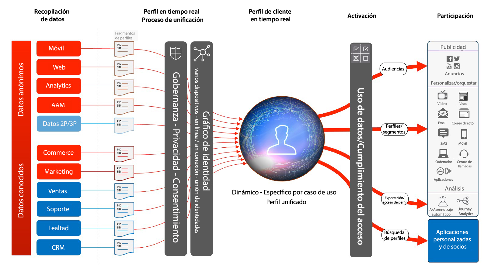
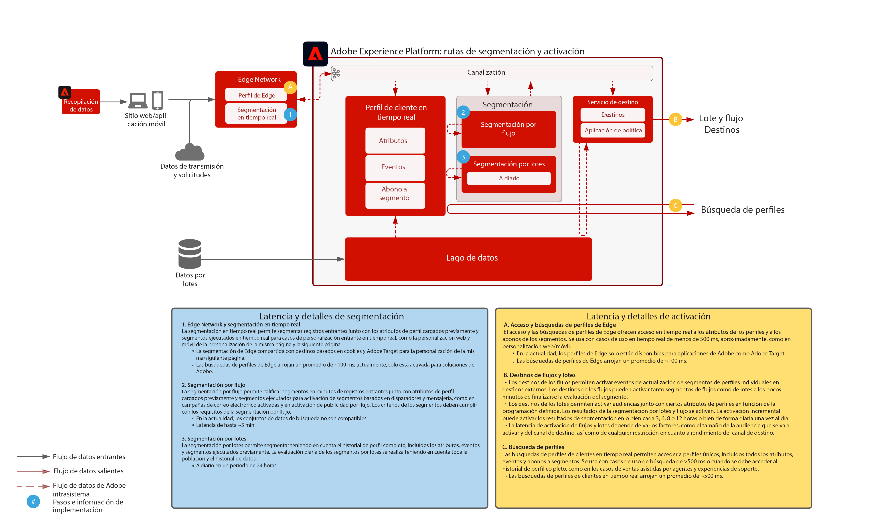

# Modelos de activación de audiencias y perfiles

La activación de audiencias y perfiles es la clave del éxito en el mundo del marketing basado en datos. Sin embargo, muchas marcas aún centran sus esfuerzos en la activación por canal en primer lugar, lo que suele producir un alcance y una personalización incoherentes.

Abordando el canal en primer lugar, cada canal actúa como un depósito donde los esfuerzos de personalización se dirigen solo a los clientes que interactúan con la marca en ese preciso canal. Este enfoque no refleja la realidad de la interacción del cliente con las marcas por diferentes puntos de contacto. La activación de audiencias y perfiles permite que las marcas conecten la interacción del cliente a través de los diferentes canales, con el fin de conseguir una audiencia centralizada que se puede activar en todos los canales.

| Modelo | Descripción | Aplicaciones de Experience Cloud |
|---|---|---|
| **[Activación de audiencia anónima](anonymous.md)** | <ul><li>Segmentación de la audiencia a través del sitio web y otros canales de publicidad para conseguir datos anónimos de comportamiento del cliente.</li><li>Integración con datos de audiencia de terceros para una personalización mejorada.</li></ul> | <ul><li>Adobe Audience Manager</li></ul> |
| **[Activación de cliente conocida](known.md)** | <ul><li>Activación de destinos conocidos basados en perfiles, tales como proveedores de email, redes sociales y destinos de publicidad. </li><li>Utilización de atributos y eventos sin conexión, tales como pedidos sin conexión, transacciones, CRM o datos de fidelidad y comportamiento en línea para la segmentación y personalización en línea.</li></ul> | <ul><li>Adobe Experience Platform</li><li> [!UICONTROL Real-Time Customer Data Platform]</li><li>Adobe Audience Manager (opcional)</li></ul> |
| **[Activación de audiencias y perfiles con las aplicaciones de Experience Cloud](platform-and-applications.md)** | <ul><li>Administrar perfiles y audiencias en Experience Platform y compartirlas con las aplicaciones de Experience Cloud.</li><li>Generar y compartir segmentos ricos y datos de clientes en Experience Platform y compartirlos con las aplicaciones de Experience Cloud.</li></ul> | <ul><li>Adobe Experience Platform   </li><li>[!UICONTROL Real-Time Customer Data Platform]</li><li>Experience Platform Activation</li><li>Aplicaciones de Experience Cloud</li></ul> |
| **[Coincidencia de segmentos](segment-match.md)** | <ul><li>Con un mejor gobierno, permisos y sistemas de administración de preferencias, los especialistas en marketing pueden hacer que sus audiencias propias autenticadas con los socios clave sean de más calidad.</li></ul> | <ul><li>Adobe Experience Platform </li></ul> |

## Arquitectura de Real-Time Customer Profile

La siguiente ilustración describe los componentes principales de Real-Time Customer Profile de Experience Platform.

Las primeras fuentes de datos se ingieren en Experience Platform. Si la fuente de datos está configurada para el procesamiento de perfiles, se incluirá en Real-Time Customer Profile. Se crea un único fragmento o documento de perfil para cada fuente de datos y para cada registro de ID principal configurado para cada fuente de datos. Además, a medida que los datos se ingieren en el perfil, también los procesa el servicio de identidad. Cualquier registro de la fuente de datos que tenga más de una identidad marcada en el esquema y con los valores correspondientes rellenados en el registro se procesará como una relación de identidad dentro del servicio de identidad.

El servicio de identidad no procesa los registros que solo tienen una identidad, ya que no tienen vínculos de identidad para rellenar el gráfico con más detalle. Tenga en cuenta, asimismo, que el servicio de identidad no distingue entre identidades principales y secundarias. Simplemente procesa las relaciones de identidad entre las propias identidades.

La fusión de fragmentos de perfil se produce cuando el gráfico de identidad proporciona las relaciones entre los distintos fragmentos de perfil de origen que se han relacionado. La política de fusión determina qué fragmentos de origen y qué gráfico de identidad se utilizarán cuando se combinen los fragmentos. Cada vez que se accede al perfil, se produce la fusión de los fragmentos de perfil para garantizar la vista combinada más actualizada del mismo. Las reglas de política y gobernanza garantizan que solo se puedan activar los segmentos y los atributos autorizados en los destinos especificados.

## Información general sobre segmentación y destino

La siguiente ilustración describe los distintos métodos de segmentación y los distintos patrones de activación de audiencias y perfiles.

## Guardas para los modelos de activación de audiencias y perfiles

* Para obtener más información sobre las guardas y las latencias de extremo a extremo, consulte el [documento de guardas de implementación](../experience-platform/deployment/guardrails.md) y las [Guardas de perfil y segmentación](https://experienceleague.adobe.com/docs/experience-platform/profile/guardrails.html?lang=es)

### Activación de atributos e identidades

* [!UICONTROL Real-Time Customer Data Platform] puede activar las pertenencias a audiencia, así como los cambios de atributos e identidad que se producen en los perfiles que pertenecen a los segmentos seleccionados para la activación. Si su objetivo es activar atributos o identidades, debe definir un segmento global que incluya todos los perfiles a los que se envían las actualizaciones de atributos e identidades. En ese momento, puede seleccionar el segmento y los atributos deseados para activarlos como parte de la configuración de destino.
* Tenga en cuenta que los destinos por lotes no son compatibles con la activación de eventos de cambio solo por atributo. Se pueden enviar suscripciones de audiencia completas o incrementales junto con los atributos seleccionados para la activación.

### Activación de segmentos por lotes en destinos de streaming

* Es posible activar segmentos por lotes en destinos de streaming. Como los perfiles cumplen los requisitos para pertenecer a la audiencia de trabajos de segmentos por lotes, esas realizaciones se pueden activar mediante la activación de flujo continuo.

### Activación de segmentos por streaming en destinos por lotes

* Es posible activar segmentos por streaming en destinos por lotes. La programación del destino por lotes exporta las pertenencias a segmentos de perfil en función de la programación de destino por lotes. Esto incluye tanto las pertenencias a segmentos determinadas tanto por métodos de streaming como por lotes.

### Activación de eventos de experiencia

* No es compatible con la activación de eventos brutos de experiencia. Para la activación con eventos de experiencia, se debe crear un segmento con las reglas necesarias que incluyan o excluyan la lógica de eventos de experiencia. Esto crea un segmento que se define para los eventos de experiencia, y la pertenencia a segmento se puede activar como proxy para activar los eventos brutos de experiencia. Considere también la posibilidad de utilizar [!UICONTROL Launch Server Side] para activar eventos brutos de experiencia recopilados mediante SDK.

## Entradas relacionadas en el blog

* [[!DNL Blueprints for Audience Activation in Adobe Experience Platform]](https://medium.com/adobetech/a-blueprint-for-audience-activation-in-adobe-experience-platform-b2b30fae90fd)
* [[!DNL Adobe Experience Platform Web SDK for Audience Management]](https://medium.com/adobetech/adobe-experience-platform-web-sdk-for-audience-management-751fa6d063bc)
