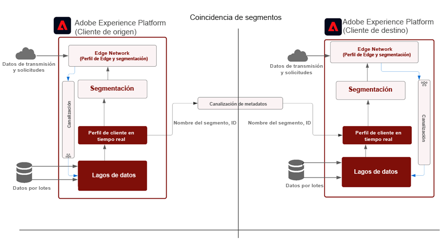
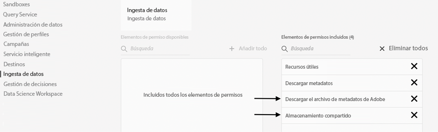
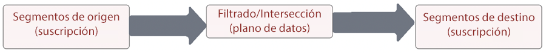
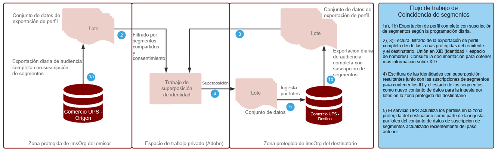

# Modelo de coincidencia de segmentos

La coincidencia de segmentos permite a las marcas de socios compartir audiencias en sus respectivos entornos de Experience Platform. Para las marcas, la clave reside en establecer contacto con sus clientes basándose en los datos recopilados de sus relaciones directas con los consumidores. Con un mejor gobierno, permisos y sistemas de administración de preferencias, los especialistas en marketing pueden hacer que sus audiencias propias autenticadas con los socios clave sean de más calidad.

La [!UICONTROL Coincidencia de segmentos] es un servicio de colaboración de datos que permite a los clientes de Experience Platform (AEP) (a los que se hace referencia como _clientes_) intercambiar datos de segmentos basados en identificadores sectoriales comunes de una forma segura, regulada y compatible con la privacidad.

El servicio permite a los clientes identificar de forma segura los ID coincidentes de una manera protegida y neutra, sin tener que revelar toda su base de datos. Los socios solo reciben atributos designados (nombre del segmento) para los ID con superposición, lo cual permite un uso compartido de forma más rápida y sencilla, controlada por el consentimiento.

La [!UICONTROL Coincidencia de segmentos] utiliza el marco de consentimiento y control de datos de AEP como eje central. Está disponible para todos los clientes B2C y B2P de Real-time Customer Data Platform. Entre las características principales de la [!UICONTROL [!UICONTROL Coincidencia de segmentos]] se incluye lo siguiente:

* Uso compartido de segmentos para clientes con consentimiento de superposición
* Informes de superposición previos al uso compartido para obtener información sobre el volumen de coincidencia estimado
* Directiva DULE totalmente integrada y aplicación de permisos
* Eje central del marco de consentimiento para el uso compartido de datos
* Fuentes de datos para organizar segmentos y socios

## Aplicaciones

Marca a editor:

El &quot;caso práctico del editor&quot; es el que se ve más afectado por la retirada de las cookies de terceros y los datos de ID de publicidad móvil. Este caso práctico tiene un gran impacto en el sector de los medios de comunicación y el entretenimiento, que se centra en la venta de publicidad como modelo de negocio. La [!UICONTROL Coincidencia de segmentos] es una vía para los editores con grandes audiencias propias que buscan colaborar directamente con sus anunciantes. Los anunciantes pueden trabajar directamente con los editores para dirigir la publicidad a las audiencias coincidentes en las propiedades del editor de cara a realizar unas campañas de prospección o segmentación más personalizadas.

### Marca a marca

Los recorridos de los consumidores nunca son lineales. Por ejemplo, un cliente puede ser leal a una aerolínea y a su compañía de tarjetas de crédito. Con el uso de la [!UICONTROL Coincidencia de segmentos], la aerolínea y la empresa de tarjetas de crédito pueden crear una asociación de datos para conocer mejor las audiencias con superposición y posteriormente adaptar las ofertas de cara a personalizar las experiencias para los consumidores fieles de cada una de las compañías.

### Unidad de negocio a unidad de negocio

Las grandes multinacionales tienen dificultades con la colaboración de datos entre sus unidades de negocio que operan de manera independiente. Puede que no sea posible combinar datos en una sola zona protegida debido a diferencias en directivas de privacidad, adquisiciones o permisos de administración entre las distintas unidades de negocio.

La [!UICONTROL Coincidencia de segmentos] ayuda a los equipos de marketing dispares de las organizaciones masivas a colaborar de forma más eficiente, a la vez que siguen funcionando de forma independiente.

## Arquitectura

{zoomable=&quot;yes&quot;}

La [!UICONTROL Coincidencia de segmentos] no es un marketplace en el que se puedan adquirir datos. Es más bien una función de AEP que funciona con datos propios con socios seleccionados, utilizando controles de privacidad y consentimiento para ayudar a colaborar. La [!UICONTROL Coincidencia de segmentos] ayuda a centrar los esfuerzos en mejorar las relaciones con los clientes y en hacer crecer la marca. Resulta beneficiosa cuando hay marcas o relaciones con socios ya existentes. La experiencia de la [!UICONTROL Coincidencia de segmentos] es fácil de administrar, es escalable y permite a los administradores compartir segmentos de forma opcionalmente inclusiva y controlable.

Esta son algunas de las ventajas que aporta la [!UICONTROL Coincidencia de segmentos]:

* Los datos de suscripción de segmentos se portarán de forma segura entre todas las organizaciones mediante identificadores estándar de nivel personal, como correo electrónico con hash o número de teléfono
* Una interfaz de usuario y flujos de trabajo de uso compartido de audiencias con notificaciones
* Estimaciones de superposición precompartidas
* Configuración de socios de autoservicio
* Superposiciones en espacios de nombres estandarizados seleccionados (correo electrónico con hash, teléfono con hash, ECID, IDFA, GAID)
* Aplicación del consentimiento para el uso compartido de datos
* Administración del ciclo de vida de la audiencia compartida
* Aplicación de DULE en el flujo de trabajo de uso compartido
* Actualizaciones diarias por lotes

La [!UICONTROL Coincidencia de segmentos] permite crear experiencias de cliente interconectadas. Los identificadores duraderos admitidos son correos electrónicos con hash, números de teléfono con hash e identificadores como ECID, IDFA y GAID. Los clientes pueden crear fuentes que coincidan con los datos de audiencia y los muevan entre las zonas protegidas de una marca, con un gobierno sólido, transparencia y capacidades de revocación para su uso en activaciones de publicidad y marketing

## Requisitos previos

Estos son los requisitos previos para la [!UICONTROL Coincidencia de segmentos]:

* Licencia activa de RT-CDP
* Los identificadores con hash estándar admitidos son correo electrónico con hash SHA256, teléfono con hash, ECID, Apple IDFA y GAID
* Marco de privacidad y estrategia de consentimiento
* Acuerdos de uso compartido de datos vigentes entre los clientes

## Seguridad

### RBAC

El flujo de la [!UICONTROL Coincidencia de segmentos] para administrar socios está protegido mediante RBAC. Solo las personas con el permiso adecuado pueden iniciar, aceptar o administrar socios. Estas acciones se pueden llevar a cabo en la sección de ingesta de datos del perfil de producto. Se requieren los siguientes permisos:

{zoomable=&quot;yes&quot;}

| Permiso | Descripción |
|---|---|
| **Administrar conexiones de uso compartido de audiencias** | Este permiso permite completar el proceso de protocolo de enlace con el socio, que conecta dos organizaciones de IMS para habilitar los flujos de [!UICONTROL Coincidencia de segmentos]. |
| **Administrar usos compartidos de audiencias** | Este permiso le permite crear, editar y publicar fuentes (el paquete de datos utilizado para la [!UICONTROL Coincidencia de segmentos]) con socios activos (socios que el usuario administrador ha conectado con acceso de **Conexiones de uso compartido de audiencias**). |

Consulte la [documentación oficial](https://experienceleague.adobe.com/docs/experience-platform/segmentation/ui/segment-match/overview.html?lang=es#understanding-segment-match-permissions) para obtener más información sobre los permisos.

### ID de conexión

El proceso de conexión del socio se administra mediante la variable **[!UICONTROL ID de conexión],** que es un identificador generado aleatoriamente que se asigna a una zona protegida de AEP específica. Este ID de conexión es necesario para iniciar y administrar zonas protegidas de socios. También existe la posibilidad de volver a generar el ID de conexión para reconfigurar una conexión de socio, si es necesario.

### Gobierno

Cualquier conjunto de datos o atributos de datos con la etiqueta de contrato *C11* está restringida para el servicio de [!UICONTROL Coincidencia de segmentos]. Los segmentos que utilizan esos atributos no se pueden usar para la [!UICONTROL Coincidencia de segmentos]. Esto proporciona el control sobre qué segmentos pueden utilizarse o no para la [!UICONTROL Coincidencia de segmentos]. Además, también se aplican las acciones de marketing y las directivas personalizadas creadas. De forma predeterminada, las directivas están deshabilitadas y deben habilitarse para la aplicación. Las restricciones como el marketing por correo electrónico y la publicidad en el sitio que se eligen al compartir segmentos también se propagan y se comparten con los socios.

### Consentimiento

La configuración de consentimiento para la [!UICONTROL Coincidencia de segmentos] se puede administrar de las siguientes formas:

* En el nivel de organización, durante la incorporación, se utiliza la configuración de exclusión o inclusión para las comprobaciones de consentimiento.

  Este ajuste determina si los datos del usuario se pueden compartir o no. El valor predeterminado es la exclusión, que indica que los datos de usuario se pueden compartir con la suposición de que el cliente de AEP ya tiene el acuerdo de consentimiento necesario para el uso compartido de datos. Este ajuste se puede cambiar a inclusión poniéndose en contacto con el administrador de cuentas de Adobe, para aplicar una comprobación adicional que obligue a los clientes de AEP a realizar un seguimiento explícito del consentimiento.

* Configuración del atributo de uso compartido específico de identidades (idSpecific) mediante el uso del [grupo de campos de consentimientos y preferencias](https://experienceleague.adobe.com/docs/experience-platform/xdm/field-groups/profile/consents.html?lang=es).

  Este grupo de campos proporciona un único campo de tipo objeto, consentimientos, para capturar información de consentimiento y preferencias. La [!UICONTROL Coincidencia de segmentos], de forma predeterminada, incluye todas las identidades que no se hayan excluido explícitamente, por ejemplo:

  ```
  "share": {
  `                `"val": "n"
  `     `}
  ```

  Este ajuste se puede cambiar poniéndose en contacto con el administrador de cuentas de Adobe para que solo incorpore las identidades con una inclusión explícita, como por ejemplo:

  ```
  "share": {
  `                `"val": "y"
  `     `}
  ```

### Alertas

Las alertas se generan cuando se inicia una conexión de socio o cuando las fuentes de segmentos se comparten con socios.

## Flujo de trabajo de configuración

El flujo de trabajo para configurar la conexión de socio se administra mediante RBAC, como se ha mencionado anteriormente. Con el establecimiento de los permisos adecuados, la conexión a la zona protegida de un socio requiere que se comparta el ID de conexión de la zona protegida o la instancia dentro de la organización del socio.

Una vez que se solicita una conexión desde el socio remitente, debe aprobarse en el lado del destinatario para garantizar una configuración segura del socio. El protocolo de enlace de la conexión con el socio garantiza que el acuerdo existe entre las dos organizaciones y permite a Adobe facilitar el proceso de [!UICONTROL Coincidencia de segmentos] en nombre de la organización. Con la conexión aprobada y en estado activo, el proceso de uso compartido de segmentos se puede iniciar desde cualquiera de las partes.

### Uso compartido de segmentos

El uso compartido de segmentos con un socio solo se produce cuando existe una coincidencia en el identificador seleccionado. Puede haber una relación de socios de uno a varios, lo cual significa que los segmentos se pueden compartir con varios socios.

Para iniciar el uso compartido de segmentos después de configurar la conexión de los socios, el socio remitente debe crear una fuente. A continuación, deben seleccionarse los casos prácticos de marketing o las acciones de las que deben excluirse los datos del segmento junto con los identificadores duraderos. De este modo, ya se pueden agregar segmentos relevantes a la fuente para compartirlos.

Como parte de este flujo de trabajo de uso compartido de segmentos, el socio remitente puede descubrir posibles segmentos de alto valor mediante superposiciones estimadas antes de mover datos.

El flujo general de proceso es el siguiente:

{zoomable=&quot;yes&quot;}

Estas estimaciones de superposición ofrecen información clave, descubrimiento de socios y datos para impulsar posibles acuerdos de colaboración de datos. No se mueve ningún dato de cliente o segmento entre zonas protegidas para obtener estas métricas de estimación de superposición. Las identidades aplicables con hash previo y seleccionadas por el cliente en cualquier zona protegida determinada se añaden a una estructura de datos probabilística que permite a Adobe realizar operaciones de unión e intersección entre ellas. Estas operaciones ayudan a la [!UICONTROL Coincidencia de segmentos] a obtener la intersección estimada de dos estructuras de datos compuestas de identidades de dos zonas protegidas diferentes sin tener que comparar los valores reales.

El proceso de superposición de identidades depende del conjunto de datos de **exportación diaria de perfil completo** de las zonas protegidas del remitente y el destinatario, para identificar perfiles comunes que pertenezcan a los segmentos compartidos. A continuación se muestra el flujo de proceso detallado para el proceso de superposición:

{zoomable=&quot;yes&quot;}

Una vez que el socio remitente ha completado el uso compartido de segmentos, el destinatario recibe una notificación sobre la fuente de segmentos compartida. Esta fuente de segmentos debe estar habilitada para que el perfil del destinatario inicie el flujo de datos de suscripción de segmentos. La suscripción de segmentos solo se ingiere en los fragmentos de perfil de superposición de la organización de IMS del destinatario, y no se transfiere ninguna identidad adicional del remitente al destinatario.

El segmento compartido está disponible en la sección `AEPSegmentMatch` de la pestaña **[!UICONTROL Audiencias]** en el **[!UICONTROL Generador de segmentos]** y se puede usar para la inclusión o supresión de audiencias mientras se generan segmentos en la zona protegida del destinatario.

El proceso de superposición diaria mantiene la suscripción de segmentos sincronizada entre el remitente y el destinatario. El destinatario puede desactivar el perfil de la fuente de segmentos recibida para detener temporalmente el proceso de uso compartido de segmentos.

#### Salida/entrada de segmentos

Como parte de la exportación de perfil completo, el estado de los ID de segmento compartidos en la suscripción de segmentos para los perfiles tiene uno de los valores correspondientes: _realizado_, _abandonado_ o _existente_ para reflejar el estado actual.

Durante el proceso diario de superposición de identidades, si existe la identidad correspondiente en la zona protegida del destinatario, estos estados de suscripción a segmentos para los segmentos compartidos se envían al destinatario para su ingesta.

#### Revocación de segmentos

La revocación/eliminación de segmentos del remitente es un proceso bajo demanda en el que la lista de todos los perfiles con los ID de segmento revocados se obtiene del destinatario. Los ID de segmento se eliminan de la suscripción de segmentos de esas identidades y el destinatario vuelve a ingerirlos. Esta acción sobrescribe el fragmento de suscripción de segmentos existente, lo cual elimina la suscripción para dicho segmento.

## Uso de la coincidencia de segmentos en ofertas programáticas

Con las crecientes restricciones en torno a las cookies de terceros y los identificadores de dispositivos, la publicidad programática busca nuevas formas de crear y segmentar audiencias. Se ha propuesto un número cada vez mayor de soluciones de &quot;ID universal&quot;, pero el sector sigue en constante cambio sin una forma acordada y escalable de lograr el mismo nivel de segmentación, al tiempo que se equilibran las preocupaciones de privacidad aplicables.

Puede utilizar Coincidencia de segmentos de Adobe Experience Platform para colaborar en audiencias centradas en la privacidad y mejorar las ofertas privadas programáticas entre anunciantes y editores. Con Coincidencia de segmentos, puede:

* Split **Tráfico publicitario** y **Audiencia** flujos de trabajo.
* Permita que las marcas asociadas compartan metadatos de audiencia para identidades mutuamente compartidas y consentidas mediante identificadores duraderos, como correo electrónico con hash y número de teléfono con hash, dentro de un proceso impuesto por el consentimiento.

### Casos de uso

* Segmentación de audiencias de origen mediante acuerdos privados programáticos.
* Supresión de la audiencia propia mediante acuerdos programáticos privados.
* Segmentación de audiencias de similitud de audiencias de origen predefinidas mediante ofertas privadas programáticas.

>[!BEGINSHADEBOX]

**Consideremos el siguiente ejemplo de flujo de trabajo entre una marca (Luma) y una red de medios (ACME):**

1. Una marca (Luma) lleva a cabo una coincidencia de audiencia con una red de medios (ACME) mediante Coincidencia de segmentos.
2. ACME envía la audiencia al servidor de publicidad o al SSP programático a través de los destinos de Adobe Real-Time CDP.
3. ACME configura un acuerdo de inventario privado (ID) con los criterios de objetivo aplicables, incluida la audiencia establecida en el paso anterior. DSP A continuación, el ID de acuerdo de inventario privado se inserta en la cuenta de usuario de.
4. Luma configura un acuerdo de inventario privado y una campaña de tráfico/publicidad creativa.
5. A continuación, la campaña se realiza mediante un acuerdo programático de inventario privado.
6. A continuación, el servidor de publicidad o SSP ofrece impresiones de publicidad que cumplen con los criterios de segmentación establecidos. DSP (Los criterios de segmentación adicionales, como el límite de frecuencia, están disponibles a través del servidor de publicidad o de la red de distribución, en función de si se ha establecido una operación Garantizada o Preferida en el acuerdo).
7. El tráfico se dirige a las propiedades de marca de Luma.
8. A continuación, ACME vuelve a compartir las perspectivas o audiencias posteriores a la campaña a través de Coincidencia de segmentos para su redireccionamiento.

>[!ENDSHADEBOX]


>[!IMPORTANT]
>
> Aunque la solución descrita anteriormente proporciona una forma sencilla de dirigirse a datos de origen a través de acuerdos privados programáticos, puede haber algunas consideraciones antes de la ejecución, incluidos, entre otros, los siguientes ejemplos:
>
>* Consentimiento: recopilación de consentimiento aplicable por parte de la marca, el editor o la red de medios minoristas para aprovechar los datos de esta manera.
>
>* Políticas y acuerdos de licencia: cumplimiento de cualquier política aplicable (incluidas las políticas de privacidad y los acuerdos con proveedores externos) por parte de la marca, el editor o la red de medios minoristas para aprovechar y activar los datos de esta manera.


## Más información

* [Coincidencia de segmentos](https://experienceleague.adobe.com/docs/experience-platform/segmentation/ui/segment-match/overview.html?lang=es#)
* [Permisos](https://experienceleague.adobe.com/docs/experience-platform/access-control/home.html?lang=es)
* [Solución de problemas](https://experienceleague.adobe.com/docs/experience-platform/segmentation/ui/segment-match/troubleshooting.html?lang=es)
* [XID](https://experienceleague.adobe.com/docs/experience-platform/identity/api/list-native-id.html?lang=es)
