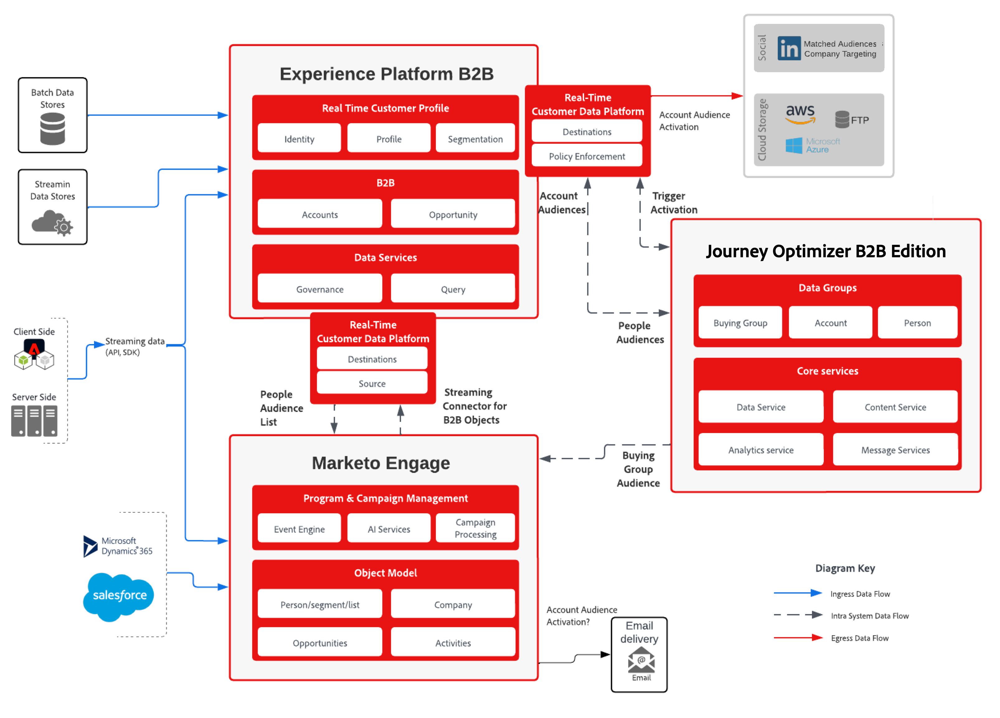

# Modelo de compra de gestión de Recorridos y marketing basado en grupos

En la actualidad, los equipos de marketing se enfrentan a muchos desafíos a la hora de ofrecer oportunidades de venta con clientes potenciales cualificados. Uno de estos desafíos es trabajar con las personas adecuadas en la organización y por lo general es evidente en esfuerzo y precisión. Con _puntuación de posibles clientes_, el grupo es demasiado estrecho y es posible que los equipos no vean a las personas adecuadas. Con la _puntuación de cuenta_, se requiere un mayor esfuerzo para identificar a la persona correcta con una vista tan amplia de una cuenta.

En este desafío es donde se presenta el concepto de **_comprar grupo_**. Un grupo de compra permite a los especialistas en marketing encontrar el grupo correcto de personas en la cuenta y trabajar con estas personas a través de la lente de calificar a los posibles clientes e identificar su función en el grupo.

## Cómo se utilizan los grupos de compra para calificar los posibles clientes y las cuentas

Crear y esforzarse por completar un grupo de compra aumenta la eficacia de la actividad de marketing en calificar conduce a oportunidades de ventas. Los grupos de compra dependen de la coincidencia de posibles clientes con plantillas de función vinculadas a la intención de la solución.

Un ejemplo de grupo de compra podría ser _Acme Corp Seeds Buying Group_, que tiene el interés de _AI Driven Seeds_.

Los grupos de compra representan a un grupo de personas en la empresa interesadas en una solución a través de una intención de solución. Y un grupo comprador podría ser identificado para más de un interés de solución y los individuos aparecen en más de un grupo comprador.

Como resultado de las capacidades mejoradas de B2B proporcionadas por Journey Optimizer B2B edition, ahora puede solucionar estos desafíos:

* Falta de _campañas de marketing que dan prioridad a los clientes_.
* Conversión incoherente de cliente potencial cualificado de marketing (MQL) en cliente potencial cualificado de ventas (SQL), lo que requiere la alineación de las iniciativas con las ventas para fomentar el MQL
* Falta de un mecanismo vendible para identificar y segmentar _competir_ cuentas.
* Riesgo de concentración en ingresos y canalizaciones.

Los siguientes KPI se alinean bien con la medición del éxito de los casos de uso:

* **Conocimiento**: ¿Los clientes de Target están viendo sus anuncios y los lleva a su sitio web a una tasa más alta que antes?
* **Participación**: ¿Los clientes de Target llegan a su sitio web y se relacionan con el contenido?
* **Tiempo**: ¿Cuánto tiempo tarda el equipo de ventas en encontrar y agregar contactos de varias herramientas a la oportunidad?
* **Costo**: ¿Cuánto dinero cuesta cada posible cliente en cada plataforma?

## Marketing basado en cuentas

Un caso de uso común y el centro de atención de este modelo es una iniciativa de marketing basada en cuentas. Este caso de uso explora el punto en el que el grupo de compra creado se rellena con un posible cliente cuando se asocian a un rol y a un interés de solución.

A medida que conduce a un individuo a través del recorrido, recopila más información sobre el posible cliente (flujo de trabajo del grupo de compra), a través de formularios, sincronización de CRM y activación de LinkedIn.

Cuando un posible cliente demuestra claramente el interés de la solución, indica un evento empresarial definido por una perspectiva empresarial. En este punto, la empresa está segura de que este posible cliente está realmente interesado en un producto. En Journey Optimizer B2B edition, el posible cliente está asociado a un grupo de compra para esa solución en una plantilla de funciones (como influencers, decisores, campeones y patrocinadores).

Como se ilustra en el diagrama siguiente, puede recopilar detalles en formularios o a través de la activación de LinkedIn y calificar una intención de solución cuando se produce una interacción con un bot de chat.

{zoomable="yes"}

Cuando el porcentaje de finalización del grupo de compra es lo suficientemente alto, se comparte el grupo con el equipo de ventas a través de SQL o una SOL para convertir los posibles clientes de la cuenta en una venta finalizada.

## Solución centrada en las cuentas

La gestión de posibles clientes B2B se centra en las cuentas y sus posibles clientes. La capa técnica está configurada para admitir los datos que representan estas características, lo que es un requisito para la segmentación de cuentas y la administración de recorridos con éxito.

### Requisitos

La solución centrada en las cuentas requiere las siguientes aplicaciones y servicios:

* Adobe Journey Optimizer B2B edition
* Adobe Real-time Customer Data Platform (RTCDP) B2B edition
* Adobe Marketo Engage

>[!NOTE]
>
>Las licencias de Journey Optimizer B2B edition deben incluir los siguientes elementos:
><ul><li>Instancia de Journey Optimizer B2B edition conectada al Experience Platform B2B</li><li>Instancia de Marketo Engage sincronizada con RTCDP</li></ul>
&gt; 
&gt;Para los clientes de Marketo Engage existentes, el método recomendado es una conexión con la instancia existente.
&gt;  
&gt;Hay extensiones adicionales disponibles para la solución para mejorar la riqueza de perfiles:
&gt;<ul><li>Fuentes adicionales de RTCDP para enriquecer el perfil</li><li>Destino de RTCDP a Marketo Engage</li></ul>

La implementación de esta solución también requiere una comprensión clara del concepto de _cuenta_ y _grupo comprador_, así como de cómo amplifican y aceleran su calificación de posibles clientes. Con esta comprensión, también debe identificar la puntuación de integridad del grupo de compra deseado.

### Arquitectura

{zoomable="yes"}

### Esquema de datos

Con cualquier implementación de automatización de marketing basada en datos, el diseño de esquemas es crucial para el éxito de la implementación. Antes de diseñar el esquema, revise las [áreas de nombres y esquemas B2B](https://experienceleague.adobe.com/en/docs/experience-platform/sources/connectors/adobe-applications/marketo/marketo-namespaces) y asegúrese de comprender la utilidad de generación automática que está disponible para generar un nuevo esquema en un nuevo escenario de implementación.

Los esquemas están enriquecidos específicamente con elementos de datos B2B para admitir la relación enriquecida en perfiles e incluir la perspectiva de cuenta a través de `sourceKey` para vincular eventos y perfiles al esquema de cuenta. Los esquemas representan los requisitos de la organización y los datos recopilados y perfilados. Para satisfacer estas necesidades, los esquemas B2B son flexibles y son una extensión de los elementos B2B necesarios.

Al diseñar el esquema de datos para su organización, se recomienda representar y etiquetar las entidades principales de su ERD con las entidades de alto nivel. (Consulte el primer diagrama en la [documentación del esquema B2B de RTCDP](https://experienceleague.adobe.com/en/docs/experience-platform/xdm/tutorials/relationship-b2b)). Este proceso es muy útil para comprender los elementos de datos necesarios que debe definir en cada esquema.

En esta fase, los eventos de experiencia aún no pueden influir en los recorridos. Además de los esquemas de Evento de experiencia, se recomienda agregar a la cuenta propiedades que representen decisiones importantes basadas en actividades de usuario. Estas propiedades se utilizan para elementos de ruta de acceso dividida en el diseñador de recorridos.

>[!NOTE]
>
>Actualmente, la única relación admitida por Journey Optimizer B2B edition son las relaciones directas a través del atributo `personComponents[0].sourceAccountKey.sourceKey` en la entidad `Person`. La expansión futura está planificada para dar cabida al objeto de relación cuenta-persona en el esquema B2b.

### Conector de origen del Marketo Engage

Para enriquecer los elementos de datos de cuenta, puede utilizar Marketo Engage y sus datos B2B para enriquecer la vista de cuenta de RTCDP y Journey Optimizer B2B edition. La configuración del conector Source del Marketo Engage y la asignación de datos del Marketo Engage a los atributos de esquema RTCDP permiten que los datos fluyan de Marketo Engage a RTCDP y, si se designan, al perfil.

Para obtener información detallada sobre la configuración del conector y la asignación de campo requerida al esquema, consulte la [documentación del conector del Marketo Engage](https://experienceleague.adobe.com/en/docs/experience-platform/sources/connectors/adobe-applications/marketo/marketo).

### Guardas

Las protecciones de Journey Optimizer B2B edition se detallan en la [página de descripción del producto](https://helpx.adobe.com/legal/product-descriptions/adobe-journey-optimizer-b2b.html).

Protecciones relacionadas con la implementación

* Todas las protecciones de audiencia B2B se describen en el [modelo de activación de audiencia y perfil B2B](https://experienceleague.adobe.com/en/docs/blueprints-learn/architecture/architecture-overview/deployment/guardrails) y se transponen directamente al éxito de Journey Optimizer B2B edition.
* Si la activación es necesaria a través de canales de Marketo Engage en el recorrido de la cuenta o si se utiliza la sincronización de CRM para enriquecer la cuenta, las [protecciones relacionadas con el Marketo Engage](https://helpx.adobe.com/legal/product-descriptions/adobe-marketo-engage---product-description.html#performance-guardrails) son relevantes.

Revise la [documentación de protecciones de Real-Time CDP](https://experienceleague.adobe.com/en/docs/experience-platform/rtcdp/guardrails/overview) para obtener más detalles sobre las protecciones RTCDP.

### Aprovisionamiento

* Todas las instancias deben estar en la misma organización de IMS.
* Solo se puede vincular una instancia de Journey Optimizer B2B edition a una zona protegida de Experience Platform.
* Se recomienda encarecidamente implementar [Marketo Source Connector en Real-time Customer Data Platform](https://experienceleague.adobe.com/en/docs/experience-platform/sources/connectors/adobe-applications/marketo/marketo).

## Implementación

Los siguientes pasos proporcionan directrices para habilitar grupos de compras en la instancia de Journey Optimizer B2B edition, incluida la activación de audiencias para admitir la expansión de la base de cuentas, centrándose en las plantillas de funciones de grupo de compras que faltan.

### Pasos previos a los requisitos

1. Defina el esquema XDM que representará la vista empresarial de cuentas y posibles clientes.

   Como primer paso, defina y cree un esquema de experiencia diseñado para adaptarse a las necesidades del caso de uso B2B y que cubra las fuentes de datos, tanto por lotes como en tiempo real. Este diseño debe representar la forma en que la empresa piensa en las entidades de cuenta y persona y los casos de uso que desea admitir. Para que el esquema sea un esquema B2B, el esquema debe seguir las estructuras disponibles en la [documentación del esquema B2B de RTCDP](https://experienceleague.adobe.com/en/docs/experience-platform/xdm/tutorials/relationship-b2b).

   Una práctica útil es tomar los nombres de entidad del diagrama e identificar esas entidades en el esquema etiquetándolas del mismo modo. Tenga en cuenta que algunos esquemas requieren claves específicas, como `sourceKey`, para funcionar en RTCDP B2B. A corto plazo, la relación _Varios a varios_ entre la cuenta y la persona a través de la relación de persona de la cuenta no es compatible con Journey Optimizer B2B. Utilice los scripts del acelerador para obtener el mejor punto de partida:

   * Use [RTCDP script de creación de esquema B2B](https://github.com/adobe/experience-platform-postman-samples/tree/master/Postman%20Collections/CDP%20Namespaces%20and%20Schemas%20Utility) para generar el esquema inicial
   * Añada campos específicos de casos de uso a los esquemas generados para completar el esquema y ajustarlo a las necesidades de la organización.

   En este momento, tiene la conexión entre Marketo Engage y RTCDP y la estructura de esquema para aceptar los datos de cuenta y persona para rellenar los conjuntos de datos para la definición de Segmentos de cuenta. El siguiente paso es conectar RTCDP con Marketo Engage y Journey Optimizer B2B edition.

1. Configure el conector del Marketo Engage, incluida la asignación del Marketo Engage a la estructura XDM.

   Con la estructura y los campos XDM en su sitio, continúe con la conexión de Marketo Engage a RTCDP mediante el conector, que alimenta los conjuntos de datos con datos de Marketo Engage y Journey Optimizer B2B. Comience por organizar la asignación de los campos de Marketo Engage a clases RTCDP. Use la información de la [documentación del conector](https://experienceleague.adobe.com/en/docs/experience-platform/sources/connectors/adobe-applications/marketo/marketo#field-mapping-from-marketo-engage-to-xdm) para identificar los campos que desea incluir en la implementación de Marketo Engage.

### Configuración del grupo de compra

1. Cree audiencias de Cuenta en Journey Optimizer B2B edition o RTCDP.

   Active la opción Programar todas las audiencias en la página Audiencias de → del cliente → Examinar para habilitar Audiencias de cuenta. (En los casos en que esto no funcione, debe crear un segmento de Perfil del cliente para poder crear Audiencias de cuenta).

   Para crear un segmento, siga los pasos de la [documentación de audiencias de cuenta](https://experienceleague.adobe.com/en/docs/journey-optimizer-b2b/user/account-audiences/account-audience-overview). El uso del Generador de segmentos con los campos de datos que ha identificado como clave para la audiencia de su cuenta sería la actividad clave a la hora de definir la audiencia.

   En esta etapa, usted sabe que la Cuenta lleva a centrarse en a través de RTCDP y a utilizar para los componentes básicos del grupo de compra.

1. Defina la plantilla de funciones.

   En cada grupo de compra, identifique las funciones que representan la función que desempeñan los individuos en el grupo al que desea dirigirse. Por ejemplo, podrías usar _decisionista_, _influencer_ y _campeón_. Defina también el peso y las condiciones de este rol en el grupo comprador.

   La [documentación de plantillas de funciones](https://experienceleague.adobe.com/en/docs/journey-optimizer-b2b/user/buying-groups/buying-groups-role-templates) describe este proceso y cómo definir condiciones especiales.

1. Defina el interés de la solución.

   Un interés de solución es una forma de indicar el enfoque de los grupos de compra para sus actividades y estrategia de marketing.

   Para definir un interés de solución, siga los pasos de la [documentación de intereses de solución](https://experienceleague.adobe.com/en/docs/journey-optimizer-b2b/user/buying-groups/solution-interests). Tenga en cuenta que lo utiliza para hacer coincidir el grupo de compra con una iniciativa de ventas de la organización.

1. Configure el grupo de compra.

   Con los componentes básicos del grupo de compra listos, configure el grupo de compra para el interés de la solución y la audiencia de la cuenta con un destinatario para completar la plantilla de funciones con los miembros adecuados de la cuenta. Con esta configuración, asigne un interés de solución a la plantilla de funciones que identificó y asigne a cada función un peso en el éxito de ventas de ese producto específico.

   Para crear el grupo de compras, siga los pasos de la [documentación de grupos de compras](https://experienceleague.adobe.com/en/docs/journey-optimizer-b2b/user/buying-groups/buying-groups-create).

   En este momento, está listo para [crear un recorrido](https://experienceleague.adobe.com/en/docs/journey-optimizer-b2b/user/account-journeys/journey-overview#get-started-with-a-journey) y comenzar a trabajar con la audiencia de la cuenta para crear el grupo de compras y calificarlos para el interés de la solución.

### Activación de audiencia

Aumente la integridad del grupo de compra mediante la activación de audiencia.

1. Defina una Audiencia de cuenta coincidente con anuncio de LinkedIn.

   Además de las actividades de correo electrónico y rellenado de formulario, Journey Optimizer B2B edition ofrece la capacidad de LinkedIn Ad para aumentar la amplitud de su cuenta y apoyar el esfuerzo por completar un grupo de compra mediante la expansión de la extensión de los posibles clientes de la cuenta y el aumento del alcance de sus actividades de marketing.

   Para usar medios de pago de LinkedIn para comunicarse con cuentas en las que los grupos de compra no se hayan completado o no hayan participado lo suficiente, expanda o involucre a la audiencia de la cuenta, use la [función Audiencias coincidentes con la cuenta de LinkedIn](https://experienceleague.adobe.com/en/docs/journey-optimizer-b2b/user/account-audiences/linkedin-account-matched-audiences) para generar audiencias de LinkedIn Ad a través de Audiencias coincidentes con la cuenta.

1. Active la audiencia para comprar grupos.

>[!TIP]
>
>Un par de sugerencias para campañas exitosas:
>
>* Una campaña debe tener filtros de función para adaptarse a los grupos de compra a los que les faltan funciones para aumentar el ROI.
>* Para recopilar posibles clientes, dirija los posibles clientes a rellenar formularios (formularios de LinkedIn o de Marketo Engage) y redireccione los errores de los formularios.
