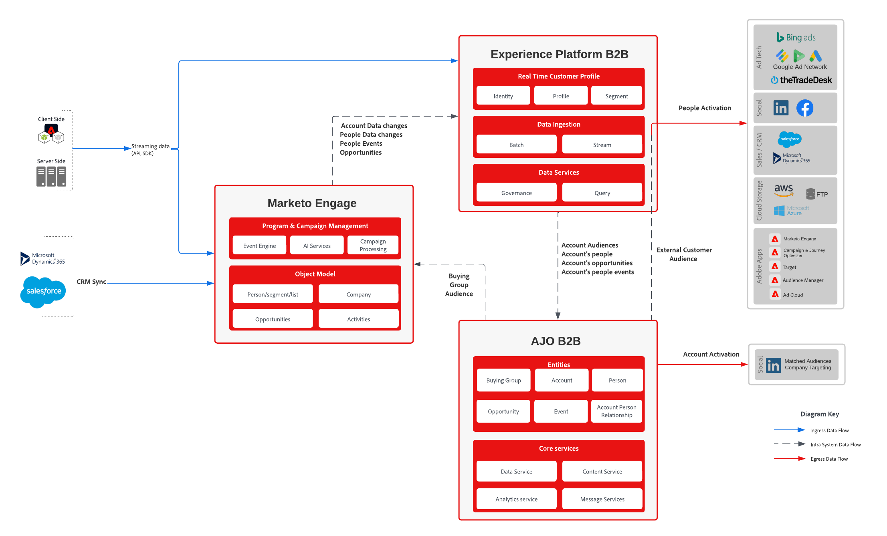

# Recorridos B2B con el modelo de datos de Marketo

Esta guía completa describe el proceso de integración de Marketo Engage con Adobe Journey Optimizer B2B edition. Abarca la configuración del esquema personalizado, la ingesta de perfiles y cuentas y la organización de recorridos personalizados para grupos de compra. Al utilizar los datos de Marketo Engage, este modelo garantiza una segmentación y participación precisas en varios canales, lo que impulsa una demanda más cualificada y mejora las experiencias de los clientes.

## Casos de uso

* **Crear y administrar grupos de compra**: utilice IA generativa para ensamblar y administrar grupos de compra dentro de cuentas de destino, lo que garantiza una cobertura completa de las partes interesadas clave
* **Automatizar asignación de miembros**: asigne automáticamente miembros a roles de grupo de compra en función de criterios definidos, como consumo de contenido y datos CRM
* **Recorridos personalizados**: diseñe y visualice recorridos de varios pasos adaptados a cada grupo comprador y miembro en función de su rol, cuenta, interés del producto y etapa del ciclo de vida
* **Automatización en tiempo real**: Automatice la progresión de cuentas y grupos de compra a través de recorridos con déclencheur de participación en tiempo real y puntuación de calificación
* **Cross-Channel Engagement**: involucre a grupos de compradores en varios canales, incluidos correo electrónico, SMS, anuncios, chat, eventos y seminarios web, para optimizar la generación y calificación de la demanda
* **Perspectivas impulsadas por IA**: utilice perspectivas impulsadas por IA para optimizar las estrategias de participación y entrega de contenido para compradores individuales y grupos de compra completos
* **Activación de datos unificada**: active las listas de cuentas unificadas de Adobe Real-Time Customer Data Platform para proporcionar los datos más recientes y completos para comprar la creación y administración de grupos
* **Collaboration mejorado**: coordine los esfuerzos de marketing y ventas para crear oportunidades de venta más precisas y acelerar la creación de canalizaciones

## Aplicaciones

* Journey Optimizer B2B Edition
* Real-Time Customer Data Platform edición B2B
* Marketo Engage

## Patrones de integración

| Integración | Descripción |
| :-- | :--- |
| [Conector de Marketo Engage](https://experienceleague.adobe.com/es/docs/experience-platform/sources/connectors/adobe-applications/marketo/marketo) | Adobe Experience Platform facilita la ingesta de datos desde Marketo y proporciona funciones para estructurar, etiquetar y mejorar los datos mediante sus servicios. |
| [Journey Optimizer B2B edition - Acción de Marketo Engage](https://experienceleague.adobe.com/es/docs/journey-optimizer-b2b/user/account-journeys/journey-nodes/action-nodes#marketo-engage-actions) | Sincronice Account-Based Marketing en Journey Optimizer B2B edition con esfuerzos basados en posibles clientes en Marketo Engage mediante acciones basadas en personas para administrar suscripciones a listas, particiones de personas y campañas de solicitud. |
| [Journey Optimizer B2B edition - Marketo Engage assets](https://experienceleague.adobe.com/es/docs/journey-optimizer-b2b/user/content-management/assets/marketo-engage-dam/marketo-engage-design-studio) | Marketo Engage Design Studio es la fuente de recursos predeterminada para Journey Optimizer B2B edition, lo que facilita la administración de recursos para los recorridos de cuenta. |

## Arquitectura

{zoomable="yes"}

## Pasos de implementación

* Instale esquemas B2B y áreas de nombres con cualquiera de las siguientes opciones
   * Usando [colección de Postman](https://github.com/adobe/experience-platform-postman-samples/tree/master/Postman%20Collections/CDP%20Namespaces%20and%20Schemas%20Utility)
   * Usando [plantillas](https://experienceleague.adobe.com/es/docs/experience-platform/sources/ui-tutorials/templates) en la interfaz de usuario de Platform
* Cree un diccionario de datos que defina la asignación entre los campos de Marketo y el esquema XDM de Experience Platform
   * Usar los [metadatos de objeto de Marketo](https://experienceleague.adobe.com/es/docs/marketo/using/product-docs/administration/field-management/export-all-object-metadata) como punto de partida
   * [Personalice el esquema XDM](https://experienceleague.adobe.com/es/docs/experience-platform/xdm/ui/fields/overview) para incluir sus campos personalizados
   * Revise los [campos XDM](https://experienceleague.adobe.com/es/docs/journey-optimizer-b2b/user/accounts/field-mapping) estándar que admite Journey Optimizer B2B edition. Si necesita campos adicionales, abra un ticket de asistencia para configurarlos
      * Se requiere **workEmail.address** en el conjunto de datos de persona
      * Se requiere **accountName** en el conjunto de datos de la cuenta
   * Añada una nueva columna de campo XDM a la hoja de cálculo de metadatos de Marketo exportada para registrar la asignación deseada
* Configurar el [conector de origen de Marketo Engage](https://experienceleague.adobe.com/es/docs/experience-platform/sources/connectors/adobe-applications/marketo/marketo)
   * Use el diccionario de datos definido anteriormente para definir [Import mapping](https://experienceleague.adobe.com/es/docs/experience-platform/data-prep/ui/mapping#import-mapping) para el conector de origen
   * Se recomienda no habilitar el perfil antes de tener en cuenta las [consideraciones de implementación](#implementation-considerations)
   * Recomendación de ingerir Personas, Compañías, Oportunidades y Actividades como mínimo, ya que estos objetos son los más útiles al crear audiencias de Cuenta
* Implementar [reglas de vinculación de gráficos de identidad](https://experienceleague.adobe.com/es/docs/experience-platform/identity/features/identity-graph-linking-rules/overview) para Personas:
   * Defina cómo se vinculan los registros de persona mediante áreas de nombres de identidad.
   * Configure áreas de nombres de identidad y reglas de vinculación de identidad en AEP.
   * Valide la vinculación con datos de persona y herramientas de vista previa de ejemplo.
* Habilite los conjuntos de datos de persona, compañías, oportunidades y actividades para [perfil](https://experienceleague.adobe.com/es/docs/experience-platform/catalog/datasets/user-guide#enable-profile)
* Defina su primera [audiencia de la cuenta](https://experienceleague.adobe.com/es/docs/journey-optimizer-b2b/user/accounts/account-audience-overview)
* [Los grupos de compra](https://experienceleague.adobe.com/es/docs/journey-optimizer-b2b/user/accounts/buying-groups/buying-groups-overview) o un [recorrido de cuenta](https://experienceleague.adobe.com/es/docs/journey-optimizer-b2b/user/account-journeys/journey-overview) se pueden definir mediante una audiencia de cuenta
   * Cuando una cuenta cumple los requisitos de la Audiencia de cuenta, el trabajo del grupo de compra se ejecuta diariamente para crear grupos de compra y asignar funciones a personas asociadas en cuanto la audiencia se actualiza.
   * Además, la compra de mantenimiento de grupo se ejecuta todos los viernes a medianoche CT. Este proceso semanal gestiona actualizaciones, como la eliminación de miembros que ya no cumplen los requisitos o la adición de miembros recién cualificados que no se capturaron durante la actualización inicial de la audiencia.

## Configuración recomendada

Para optimizar la implementación y garantizar la compatibilidad con Adobe Journey Optimizer B2B edition, se recomienda la siguiente configuración:

* **Usar los campos de identidad predeterminados:**
   * _email_ y _b2b_person_ deben conservarse como campos de identidad en el esquema Person para admitir la vinculación de identidad y la activación de audiencia.
* **Use las asignaciones predeterminadas para el conector de Source de Marketo:**
   * Aproveche las asignaciones de campo listas para usarse proporcionadas por Adobe para simplificar la ingesta de datos y reducir la sobrecarga de configuración.
* **Usar asignaciones predeterminadas para AJO B2B:**
   * Adopte las [asignaciones de campos estándar](https://experienceleague.adobe.com/es/docs/journey-optimizer-b2b/user/accounts/field-mapping) para Journey Optimizer B2B edition a fin de garantizar la compatibilidad con la lógica de grupo de compra y la orquestación de recorrido.
* **Bloquear actualizaciones de campo en todos los campos excepto en el correo electrónico:**
   * En Marketo Engage, configure la administración de campos para [bloquear actualizaciones](https://experienceleague.adobe.com/es/docs/marketo/using/product-docs/administration/field-management/block-updates-to-a-field) de Adobe Experience Platform en todos los campos excepto en _correo electrónico_. Esto ayuda a mantener la integridad de los datos y a permitir la resolución de identidades.
* **Implementar reglas de vinculación de identidad usando el correo electrónico como área de nombres de identidad única**
   * Configure [reglas de vinculación de gráficos de identidad](https://experienceleague.adobe.com/es/docs/experience-platform/identity/features/identity-graph-linking-rules/overview) en Adobe Experience Platform para usar _correo electrónico_ explícitamente como un área de nombres de identidad única. Estas reglas garantizan que los perfiles se vinculen con precisión en las fuentes de datos donde está presente _correo electrónico_, lo que permite una resolución de identidad sólida. Siguiendo las prácticas recomendadas de Adobe, defina reglas de vinculación que den prioridad al correo electrónico como identificador único estable y global para mantener un gráfico de identidades coherente y compatible con la privacidad.
Esta configuración proporciona un equilibrio entre la facilidad de implementación y el control de datos, lo que garantiza una base fiable para organizar los recorridos B2B.

## Consideraciones sobre la implementación

Al implementar Adobe Journey Optimizer B2B edition, es crucial comprender las capacidades de vinculación de identidad que proporciona Real-time Customer Data Platform. Esta plataforma realiza la vinculación de identidad en los niveles de persona y cuenta, lo que garantiza una vista unificada de los datos del cliente.

### Puntos clave

* **Configuración de identidad**: La plataforma vincula identidades usando identificadores predeterminados como Marketo ID, CRM ID y correo electrónico. Esto ayuda a crear un perfil completo mediante la combinación de datos de diferentes fuentes.
* **Riesgos potenciales**: El uso del correo electrónico como identificador para la vinculación puede provocar el colapso involuntario de la identidad. Esto significa que diferentes personas que comparten la misma dirección de correo electrónico podrían combinarse incorrectamente en un solo perfil. Este colapso de identidad puede afectar negativamente a la precisión de los datos CRM y comprometer su integridad.
* **Estrategia de combinación**: B2B CDP emplea una estrategia de combinación basada en el tiempo, en la que se utiliza la última lastUpdatedDate más reciente para un atributo de perfil determinado. Esta estrategia garantiza que los datos más recientes se reflejen en el perfil.
* **Consideraciones para el correo electrónico**: es esencial evaluar a fondo el uso del correo electrónico como identificador para combinar fragmentos de perfil. Si bien puede ser beneficioso, el riesgo de colapso de la identidad debe considerarse cuidadosamente en contra de las ventajas. Un inconveniente es que, sin el correo electrónico como identificador, la pertenencia a audiencias externas creada por AJO B2B no se integra en el perfil existente.
* **Integración de personas de Marketo**: AJO B2B usa la persona de Marketo con el ID de posible cliente más bajo cuando varios registros de Marketo se combinan en un solo perfil.

Con estos puntos en mente, puede tomar decisiones informadas sobre cómo configurar la vinculación de identidad en Adobe Journey Optimizer B2B edition, lo que garantiza perfiles de cliente precisos y fiables.

### Evaluación de resultados de vinculación de identidad

El servicio de consultas se puede utilizar para ver el impacto de la vinculación de identidad en un conjunto de datos que no tiene perfil habilitado. La siguiente consulta se puede utilizar para realizar la evaluación

#### Número de registros ingeridos

Esta consulta devuelve el número total de registros introducidos en el conjunto de datos del perfil de persona

```sql
select
    count(distinct b2b.personKey.sourceKey)
from
    marketo_person_ajo_b2b
```

#### Duplicar correos electrónicos

Esta consulta devuelve el número de registros de persona que se combinarán como parte de la vinculación de identidad de la plataforma

>[!NOTE]
>
>La tabla de conjuntos de datos marketo_person_ajo_b2b se utiliza para proporcionar un ejemplo completo de cómo trabajar con el conjunto de datos de persona de Marketo.
>&#x200B;>Puede encontrar el conjunto de datos de su zona protegida en el área de trabajo [Conjuntos de datos](https://experienceleague.adobe.com/es/docs/experience-platform/catalog/datasets/user-guide).

```sql
select
    SUM(personCount)
from
    (
        select
            emailAddress,
            count(*) as personCount
        from
            (
                select
                    MAX(workemail.address) as emailAddress
                from
                    marketo_person_ajo_b2b
                where
                    workemail.address IS NOT NULL
                group by
                    b2b.personKey.sourceKey
            )
        group by
            emailAddress
        having
            count(*) > 1
    )
```

#### Direcciones de correo electrónico con registros duplicados

Esta consulta devuelve los correos electrónicos con la mayor cantidad de registros duplicados en el conjunto de datos.  Esta lista se puede utilizar para comprobar algunos de estos registros y comprender mejor cómo puede afectar la vinculación de las identidades a Marketo y CRM.  Consulte la [descripción general del servicio de identidad](https://experienceleague.adobe.com/es/docs/experience-platform/identity/home) para obtener más información sobre cómo funciona la vinculación de identidad.

```sql
select
    *
from
    (
        select
            emailAddress,
            MAX(personId) as personId,
            count(*) as personCount
        from
            (
                select
                    b2b.personKey.sourceKey,
                    MAX(workemail.address) as emailAddress,
                    MAX(b2b.personKey.sourceId) as personId
                from
                    marketo_person_ajo_b2b
                where
                    workemail.address IS NOT NULL
                group by
                    b2b.personKey.sourceKey
            )
        group by
            emailAddress
        having
            count(*) > 1
    )
order by
    personCount desc
```

### Opciones

#### Eliminando correo electrónico como identidad

Después del análisis, si determina que el correo electrónico no es un campo válido para utilizarlo como campo de identidad, el esquema Persona se puede modificar para [eliminar el correo electrónico como campo de identidad](https://experienceleague.adobe.com/es/docs/experience-platform/xdm/ui/fields/identity)

#### Bloquear actualizaciones de Adobe Experience Platform

Si es mejor mantener el correo electrónico como campo de identidad para sus casos de uso, existe la opción de [bloquear las actualizaciones de los campos](https://experienceleague.adobe.com/es/docs/marketo/using/product-docs/administration/field-management/block-updates-to-a-field) que provienen de AJO B2B y permite que AJO B2B se ejecute principalmente en los datos de Marketo.

## Guardas

Para obtener una comprensión completa de las protecciones aplicables a los Recorridos B2B con Marketo Engage, consulte la siguiente documentación oficial:

* [Adobe Journey Optimizer B2B edition - Descripción del producto](https://helpx.adobe.com/es/legal/product-descriptions/adobe-journey-optimizer-b2b.html)
Incluye protecciones y parámetros de uso específicos para Journey Optimizer B2B edition.
* [Protecciones de implementación de Adobe Experience Platform](https://experienceleague.adobe.com/es/docs/blueprints-learn/architecture/architecture-overview/deployment/guardrails?lang=en)
Abarca las protecciones generales de arquitectura e implementación en todas las soluciones de Adobe Experience Platform.
* [Adobe Marketo Engage - Descripción del producto](https://helpx.adobe.com/es/legal/product-descriptions/adobe-marketo-engage---product-description.html#performance-guardrails)
Detalla las protecciones de rendimiento y uso para Marketo Engage, incluidas las consideraciones de sincronización de activación y CRM.
* [Protecciones de Real-Time CDP](https://experienceleague.adobe.com/es/docs/experience-platform/rtcdp/guardrails/overview?lang=en)
Proporciona instrucciones sobre los límites de ingesta, segmentación y activación de datos dentro de Real-Time Customer Data Platform.

## Documentación relacionada

* [Edición B2B de Real-Time Customer Data Platform](https://experienceleague.adobe.com/es/docs/experience-platform/rtcdp/intro/rtcdpb2b-intro/b2b-overview)
* [Introducción a Real-time Customer Data Platform B2B edition](https://experienceleague.adobe.com/es/docs/experience-platform/rtcdp/intro/rtcdpb2b-intro/b2b-tutorial)
* [Protecciones para Real-time Customer Data Platform B2B edition](https://experienceleague.adobe.com/es/docs/experience-platform/rtcdp/intro/rtcdpb2b-intro/b2b-guardrails)
* [Adobe Experience Platform](https://experienceleague.adobe.com/es/docs/experience-platform)
* [Servicio de identidad de Adobe Experience Platform](https://experienceleague.adobe.com/es/docs/experience-platform/identity/home)
* [Marketo Engage](https://experienceleague.adobe.com/es/docs/marketo/using/home)
* [Adobe Experience Platform: Conector de origen de Marketo](https://experienceleague.adobe.com/es/docs/experience-platform/sources/connectors/adobe-applications/marketo/marketo)
* [Documentación de Adobe Journey Optimizer B2B edition](https://experienceleague.adobe.com/es/docs/journey-optimizer-b2b/user/guide-overview)
