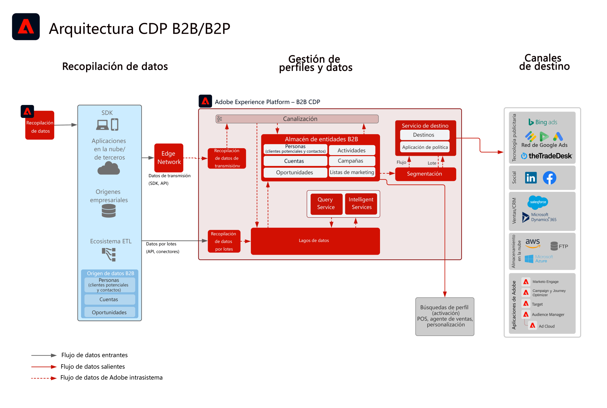

# Activación de audiencias y perfiles B2B

Utilice la información de cuentas, oportunidades y posibles clientes vinculada a un cliente individual para crear perfiles B2B procesables y, así, mejorar la personalización y la segmentación en todos los canales.

## Casos de uso

* Cree audiencias de personas para segmentación y personalización entre canales con datos B2B, incluidas cuentas, oportunidades y posibles clientes.
* Active audiencias en cualquier destino de Experience Platform para segmentación y personalización.

## Aplicaciones

* Real-time Customer Data Platform Edición B2B

## Patrones de integración

* Fuentes de datos B2B (Marketo, Salesforce, etc.) -> Real-time Customer Data Platform edición B2B -> Destinos
Se pueden usar varias fuentes de datos B2B para asignar datos de cuentas, posibles clientes, oportunidades y personas a la edición B2B de Real-time Customer Data Platform.

## Arquitectura

 

## Guardas

Tenga en cuenta que los guardas y los pasos de implementación relacionados con Marketo Engage solo son relevantes cuando Marketo Engage se utiliza como origen o destino.

### Admisión de varias instancias y organizaciones de IMS:

A continuación, se describen los patrones admitidos de asignación de instancias de Experience Platform y Marketo Engage.

#### Marketo como fuente de datos para Experience Platform:

* Se admiten varias instancias de Marketo Engage en una instancia de Experience Platform.
* No se admiten varias instancias de Marketo Engage en varias instancias de Experience Platform.
* No se admite una instancia de Marketo Engage en varias instancias de Experience Platform.
* Se admite una instancia de Marketo Engage en una instancia de Experience Platform y varios entornos aislados.

#### Marketo como destino para Experience Platform:

* Se admite Experience Platform en varias instancias de Marketo Engage
* Se admiten varias instancias de Experience Platform en una instancia de Marketo Engage

#### Guardas de perfil y segmentación de Experience Platform:

* Consulte los guardas de perfil y la segmentación para Experience Platform - [Directrices de perfil y segmentación](https://experienceleague.adobe.com/docs/experience-platform/profile/guardrails.html?lang=es)
* Los segmentos B2B que incluyen cuentas, posibles clientes y oportunidades utilizan relaciones de varias entidades que hace que la evaluación de segmentos se convierta en lote. La segmentación por streaming es compatible con segmentos que están limitados a personas y eventos.

#### Experience Platform - Conector de origen de Marketo Engage:

* El relleno histórico puede tardar hasta 7 días en completarse según el volumen de datos.
* Las actualizaciones de datos y los cambios en curso de Marketo se envían a Experience Platform a través de la API de flujo continuo, que puede estar latente hasta unos 5 minutos en el caso del perfil y hasta unos 15 minutos en el caso del lago de datos en función del volumen.

#### Experience Platform - Conector de destino de Marketo:

* El uso compartido de segmentos de streaming de Real-time Customer Data Platform en Marketo Engage puede tardar hasta 5 minutos.
* La segmentación por lotes se comparte una vez al día en función de la programación de segmentación de Experience Platform. Los segmentos B2B que incluyen cuentas, posibles clientes y oportunidades utilizan relaciones de varias entidades que hace que el segmento se convierta en lote.

#### Guardas de Marketo Engage:

* Los contactos y posibles clientes deben ingerirse y definirse directamente en Marketo Engage para que la audiencia de Real-time Customer Data Platform coincida con un posible cliente y un contacto de Marketo Engage.

#### Guardas de destino

* Consulte la documentación de destino para obtener instrucciones específicas sobre los destinos. [Directrices de destino](https://experienceleague.adobe.com/docs/experience-platform/destinations/home.html?lang=es)

## Pasos de implementación

Para obtener información sobre cómo implementar y configurar la edición B2B de Real-time Customer Data Platform, consulte la edición B2B de la documentación de Real-time Customer Data Platform. [Edición B2B de Real-time Customer Data Platform](https://experienceleague.adobe.com/docs/experience-platform/rtcdp/b2b-overview.html?lang=es)

Existen dos patrones de implementación posibles. Tanto la capacidad de ingerir datos y perfiles B2B de Marketo Engage como la capacidad de ingerir datos B2B de otras fuentes de datos de CRM.

## Consideraciones sobre la implementación

Directrices sobre consideraciones y configuraciones clave del modelo.

* Integración de CRM con y sin Marketo:
Si la implementación va a utilizar Marketo Engage como fuente y este está conectado a CRM, utilice el conector de origen de Marketo en Experience Platform para introducir los datos de CRM en Experience Platform. Utilice el conector de origen de Experience Platform si es necesario introducir tablas adicionales. Si la implementación no va a utilizar Marketo Engage como origen, conecte el origen del CRM directamente con AEP a través del conector de Experience Platform de origen del CRM.
* No se recomienda la iniciación ni la potenciación de posibles clientes con la edición B2B de Real-time Customer Data Platform por sí sola. Se recomienda el uso de una herramienta de potenciación de posibles clientes (como Marketo Engage) para este caso de uso.
* El conector de destino de Marketo Engage para AEP, que envía audiencias a Marketo Engage para su activación, solo inserta direcciones de correo electrónico y ECID. No crea un nuevo posible cliente si el contacto no existe todavía; por lo tanto, es necesario introducir el perfil y los datos del posible cliente en Marketo Engage.

## Documentación relacionada

* [Edición B2B de Real-time Customer Data Platform](https://experienceleague.adobe.com/docs/experience-platform/rtcdp/b2b-overview.html?lang=en)
* [Adobe Experience Platform](https://experienceleague.adobe.com/docs/experience-platform.html?lang=es)
* [Marketo Engage](https://experienceleague.adobe.com/docs/marketo/using/home.html?lang=es)
* [Adobe Experience Platform: Conector de origen de Marketo](https://experienceleague.adobe.com/docs/experience-platform/sources/connectors/adobe-applications/marketo/marketo.html?lang=es)
* [Adobe Experience Platform: Conector de destino de Marketo](https://experienceleague.adobe.com/docs/marketo/using/product-docs/core-marketo-concepts/smart-lists-and-static-lists/static-lists/push-an-adobe-experience-cloud-segment-to-a-marketo-static-list.html?lang=es)