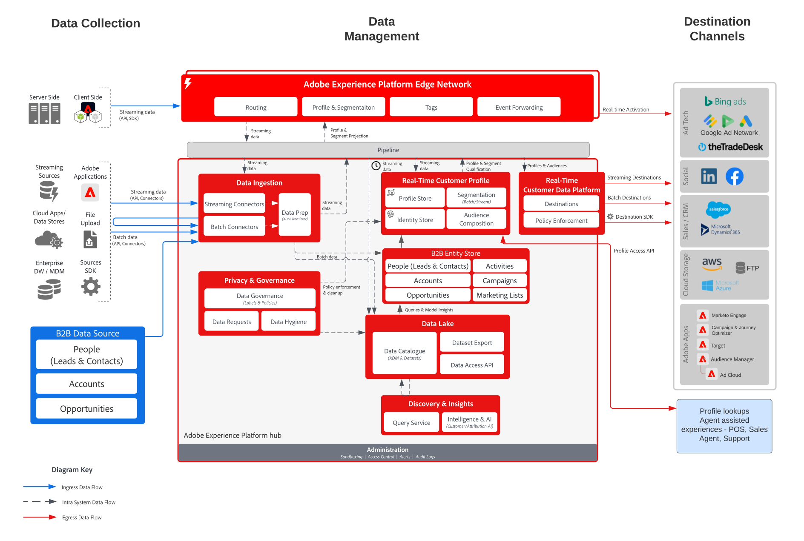

# Activación de audiencias y perfiles B2B

Utilice la información de cuentas, oportunidades y posibles clientes vinculada a un cliente individual para crear perfiles b2b procesables y así mejorar la personalización y la segmentación en todos los canales.

## Casos de uso

* Cree audiencias de personas para segmentación y personalización entre canales con datos B2B, incluidas cuentas, oportunidades y posibles clientes.
* Active audiencias en cualquier destino de Experience Platform para segmentación y personalización.

## Aplicaciones

* Real-time Customer Data Platform Edición B2B

## Patrones de integración

* Fuentes de datos B2B (Marketo, Salesforce, etc.) -> Real-time Customer Data Platform B2B Edition -> Destinos Se pueden usar varias fuentes de datos B2B para asignar datos de cuenta, posible cliente, oportunidad y personas a B2B Edition de Real-time Customer Data Platform.

## Arquitectura

 

## Guardas

Tenga en cuenta que las protecciones y los pasos de implementación relacionados con el Marketo Engage solo son relevantes cuando el Marketo Engage se utiliza como origen o destino.

### Compatibilidad con varias instancias y organizaciones IMS:

A continuación se describen los patrones admitidos de asignación de instancias de Experience Platform y Marketo Engage.

#### Marketo como fuente de datos para el Experience Platform:

* Se admiten varias instancias de Marketo Engage en una instancia de Experience Platform.
* No se admiten varias instancias de Marketo Engage en muchas instancias de Experience Platform.
* No se admite una instancia de Marketo Engage para muchas instancias de Experience Platform.
* Se admite una instancia de Marketo Engage en una instancia de Experience Platform y varios entornos limitados.

#### Marketo como destino para el Experience Platform:

* Se admite el Experience Platform a muchas instancias de Marketo Engage
* Se admiten muchas instancias de Experience Platform en una instancia de Marketo Engage

#### Protección de perfil y segmentación del Experience Platform:

* Consulte las protecciones de perfil y segmentación para el Experience Platform - [Directrices de perfil y segmentación](https://experienceleague.adobe.com/docs/experience-platform/profile/guardrails.html?lang=es)
* Los segmentos B2B que incluyen cuentas, posibles clientes y oportunidades utilizan relaciones de varias entidades que resultan en que la evaluación de segmentos se convierta en lote. La segmentación por transmisión es compatible con segmentos que están limitados a personas y eventos.

#### Experience Platform - Conector de origen de Marketo Engage:

* El relleno histórico puede tardar hasta 7 días en completarse, según el volumen de datos.
* Las actualizaciones de datos y los cambios en curso de Marketo se envían al Experience Platform a través de la API de flujo continuo, que puede estar latente hasta unos 5 minutos para el perfil, y a unos 15 minutos para el lago de datos en función del volumen.

#### Experience Platform - Conector de destino de Marketo:

* El uso compartido de segmentos de transmisión de Real-time Customer Data Platform a Marketo Engage puede tardar hasta 5 minutos.
* La segmentación por lotes se comparte una vez al día en función de la programación de segmentación del Experience Platform. Los segmentos B2B que incluyen cuentas, posibles clientes y oportunidades utilizan relaciones de varias entidades que resultan en que el segmento se convierta en lote.

#### Marketo Engage:

* Los contactos y posibles clientes deben ingerirse y definirse directamente en Marketo Engage para que la audiencia de Real-time Customer Data Platform coincida con un contacto de Marketo Engage y un posible cliente.

#### Protecciones de destino

* Consulte la documentación de destino para obtener instrucciones específicas sobre los destinos. [Directrices de destino](https://experienceleague.adobe.com/docs/experience-platform/destinations/home.html?lang=en)

## Pasos de implementación

Para obtener instrucciones sobre cómo implementar y configurar la edición B2B de Real-time Customer Data Platform, consulte la edición B2B de la documentación de Real-time Customer Data Platform. [Edición B2B de Real-time Customer Data Platform](https://experienceleague.adobe.com/docs/experience-platform/rtcdp/b2b-overview.html?lang=en)

Existen dos patrones de implementación posibles. Tanto la capacidad de ingerir datos y perfiles B2B desde el Marketo Engage como la capacidad de ingerir datos B2B desde otras fuentes de datos CRM.

## Consideraciones sobre la implementación

Directrices sobre consideraciones y configuraciones clave del modelo.

* Integración de CRM con y sin Marketo: Si la implementación va a utilizar Marketo Engage como fuente y el Marketo Engage está conectado a CRM, utilice el conector de origen de Marketo en Experience Platform para introducir los datos CRM en el Experience Platform. Utilice el conector de origen del Experience Platform si es necesario introducir tablas adicionales. Si la implementación no va a utilizar Marketo Engage como origen, conecte el origen CRM directamente a AEP mediante el conector del Experience Platform de origen CRM.
* No se recomienda la iniciación y el desarrollo del posible cliente con la edición B2B de Real-time Customer Data Platform por sí sola. Se recomienda el uso de una herramienta de crianza de clientes potenciales (como un Marketo Engage) para este caso de uso.
* Conector de destino de Marketo Engage para AEP que envía audiencias al Marketo Engage para su activación, solo inserta direcciones de correo electrónico y ECID. No crea un nuevo posible cliente si el contacto no existe todavía, por lo tanto es necesario introducir el perfil y los datos del posible cliente en el Marketo Engage.

## Documentación relacionada

* [Edición B2B de Real-time Customer Data Platform](https://experienceleague.adobe.com/docs/experience-platform/rtcdp/b2b-overview.html?lang=en)
* [Adobe Experience Platform](https://experienceleague.adobe.com/docs/experience-platform.html?lang=es)
* [Marketo Engage](https://experienceleague.adobe.com/docs/marketo/using/home.html?lang=en)
* [Adobe Experience Platform: Conector de origen de Marketo](https://experienceleague.adobe.com/docs/experience-platform/sources/connectors/adobe-applications/marketo/marketo.html?lang=es)
* [Adobe Experience Platform: Conector de destino de Marketo](https://experienceleague.adobe.com/docs/marketo/using/product-docs/core-marketo-concepts/smart-lists-and-static-lists/static-lists/push-an-adobe-experience-cloud-segment-to-a-marketo-static-list.html?lang=en)