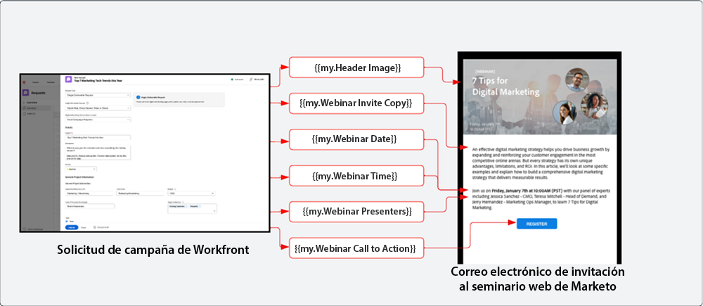
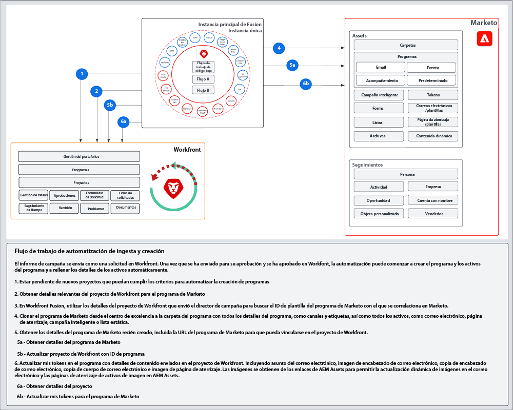

# Ingesta y creación {#intake-and-create}

El número de solicitudes de marketing que llegan a un equipo de operaciones de marketing para lanzar nuevas campañas puede convertir un equipo de alto rendimiento en una puerta giratoria de tareas repetitivas, lo que provoca agotamiento y estancamiento de la innovación.

Al establecer un proceso para enviar solicitudes de campaña y automatizar la creación de campañas de marketing solicitadas comúnmente, puede: aumente la velocidad de sus campañas, reduzca los errores, dirija las solicitudes al miembro correcto de las operaciones de marketing, equilibre y mejore la utilización de los recursos y centre más sus operaciones de marketing en tareas más estratégicas.

Con Workfront y Marketo Engage, una conexión de sistema a sistema permite obtener detalles de un [Formulario de solicitud de Workfront](https://experienceleague.adobe.com/docs/workfront/using/administration-and-setup/customize/custom-forms/create-or-edit-a-custom-form.html){target=&quot;_blank&quot;} para crear un programa de Marketo Engage, rellene las variables clave como: líneas de asunto, copia de correo electrónico, imágenes, fechas, horas, información de evento, etc.

Para lograr esta integración, utilizará Workfront Fusion, una capa de automatización de trabajo que le permite automatizar flujos de trabajo entre Workfront y otros sistemas.

El flujo de trabajo siguiente muestra una solicitud de un seminario web que realiza un administrador de campaña mediante un formulario de solicitud de Workfront. Los detalles enviados en la solicitud luego déclencheur un programa y un correo electrónico para crearlos en Marketo Engage para el seminario web. Además, se toman detalles del formulario de solicitud para rellenar el contenido del correo electrónico.

>[!TIP]
>
>Para obtener más información sobre los distintos tipos de objetos en Workfront que se utilizan para organizar el trabajo de la campaña de marketing y cómo se asigna a un programa de Marketo Engage, consulte la [Información general sobre Marketo y Workfront](/help/blueprints/b2b/campaign-supply-chain/overview.md){target=&quot;_blank&quot;}.

## Preparación del proceso de desarrollo de campañas para la automatización {#prepare-your-campaign-development-process-for-automation}

Detrás de cada buena automatización del flujo de trabajo, hay un proceso definido que garantiza que los equipos y las partes interesadas obtengan el máximo valor de la automatización.

**¿Qué tipos de solicitudes de marketing recibirá?**

Piense en qué tipos de tácticas de marketing ejecutará, como correos electrónicos, formación, seminarios web de origen y eventos. ¿También ejecuta seminarios web de terceros o anuncios en pantalla? Cada una de estas solicitudes debe considerarse ya que pueden necesitar campos de entrada específicos en el formulario de solicitud y se asignarán a diferentes plantillas de programa en Marketo Engage que se clonarán.

También querrá saber si está ejecutando campañas en varias regiones. Si este es el caso, debe tener en cuenta que un proyecto de Workfront crea varios programas en Marketo Engage, y cada programa representa la compatibilidad con distintos idiomas.

Es importante conocer por adelantado qué tipos de solicitudes de marketing espera recibir para garantizar que las solicitudes se puedan facilitar de forma automatizada.

**¿Qué información se debe capturar en la solicitud de campaña?**

Piense en los elementos clave de información que deberán capturarse en el formulario de solicitud para cada una de las diferentes tácticas que ejecuta. A continuación se muestran algunos ejemplos de información que puede capturar en un formulario de Workfront para automatizar el desarrollo de su campaña.

<table> 
  <tr> 
   <td><b>Táctica de marketing</b></td>
   <td><b>Información para capturar</b></td>
  </tr>
  <tr> 
   <td>Explosión de correo electrónico</td>
   <td>・ Asunto del correo electrónico 
・ Fecha programada 
・ Copia por correo electrónico 
・ Llamada a la acción 
・ Imágenes: se puede hacer referencia directamente a las direcciones URL de AEM Assets para su uso en Marketo 
・ Criterios de calificación de la audiencia</td>
  </tr>
  <tr>
   <td>Seminario web/Evento</td>
   <td>・ Nombre del evento 
・ Fecha del evento 
・ Hora del evento 
・ Ciudad del evento 
・ Descripción del evento 
・ Página de grabación de seminario web: PageURL OnDemand 
・ Nombres de los altavoces 
・ Títulos del altavoz 
・ Imágenes del altavoz 
・ Correos electrónicos necesarios (invitación, confirmación, recordatorio, seguimiento) 
・ Imágenes de encabezado de correo electrónico 
・ Criterios de calificación de la audiencia</td>
  </tr>
  <tr>
   <td>Nurtura</td>
   <td>・ Número de correos electrónicos 
・ Copia por correo electrónico 
・ Encabezados de correo electrónico 
・ Llamada a la acción 
・ Criterios de calificación de la audiencia</td>
  </tr>
  </tbody>
</table>

>[!NOTE]
>
>En la actualidad, la creación de audiencias mediante programación mediante automatización está limitada en Marketo Engage, ya que los tokens no son compatibles con listas inteligentes. Esto significa que las audiencias deberán ser creadas en Marketo Engage por un usuario o, si tiene una audiencia predeterminada con la que se comunica continuamente, puede incluir una lista inteligente configurada como parte de la plantilla de programa clonada durante el proceso de automatización.

### Establezca su Centro de excelencia {#establish-your-center-of-excellence}

Si desea automatizar la creación de programas, necesitará un centro de excelencia en Marketo Engage. Un centro de excelencia incluye programas y recursos con plantillas para ayudar a acelerar y estandarizar el proceso de desarrollo de campañas. Por ejemplo, puede tener una plantilla de programa para las diferentes necesidades de campaña: correo electrónico, formación, evento presencial y seminario web. Además, puede tener varias plantillas de programa de correo electrónico que utilice para diferentes regiones o diferentes tipos de anuncios de correo electrónico.

Construir su centro de excelencia con plantillas de programa en Marketo Engage es uno de los primeros pasos para tener un enfoque más programático de la ejecución de campañas y actuará como base para automatizar las solicitudes de campañas.

Una vez que tenga un conjunto de plantillas de programa reutilizables, puede escalar aún más sus esfuerzos mediante la automatización descrita en este modelo para aumentar la velocidad del desarrollo de su campaña.

Para obtener más información sobre la creación de su propio centro de excelencia, consulte la [Comunidad de Marketo](https://nation.marketo.com/t5/product-blogs/marketo-master-class-center-of-excellence-with-chelsea-kiko/ba-p/243221){target=&quot;_blank&quot;} para conocer las prácticas recomendadas.

### Usar tokens para rellenar contenido {#use-tokens-to-populate-content}

Con Marketo Engage, los tokens se pueden usar para rellenar contenido en los recursos de campaña. Por ejemplo, después de clonar una plantilla de correo electrónico del centro de excelencia, Workfront Fusion puede tomar los detalles de la solicitud de campaña en Workfront y pasarlos al programa Mis tokens en el Marketo Engage. Los valores de token se pueden heredar directamente en el correo electrónico para crear el correo electrónico.

### Rellenar imágenes desde AEM Assets {#populate-images-from-aem-assets}

Puede automatizar aún más el desarrollo de su correo electrónico y de su página de aterrizaje mediante tokens de Marketo Engage en combinación con vínculos a recursos en AEM Assets. Los solicitantes de campaña pueden enviar vínculos de imagen publicados desde AEM Assets como parte del proceso de solicitud. Workfront Fusion puede tomar esos vínculos e incrustarlos en el HTML de un correo electrónico mediante tokens de Marketo Engage.

Recuerde que tendrá que crear sus Programas y Plantillas de programa en Marketo Engage para utilizar Mis tokens, de modo que Fusion pueda actualizar los valores de los tokens con la información enviada en Workfront.

>[!NOTE]
>
>AEM Assets no es necesario para admitir este flujo de trabajo, pero puede permitir un proceso más simplificado para administrar los recursos de campaña en toda la cadena de suministro de desarrollo de campañas.

### Crear una biblioteca de búsqueda para todos los tipos de solicitud de programa {#assemble-a-lookup-library-for-all-program-request-types}

Al automatizar la creación de nuevos programas de Marketo Engage a partir de solicitudes de Workfront, es importante incluir un paso en la automatización de Workfront Fusion que pueda tomar información de la solicitud de Workfront y buscar las plantillas de programa correctas que deben clonarse en Marketo Engage.

Para ello, puede importar un conjunto de datos en Workfront Fusion que incluya una lista de todas las plantillas de programa diferentes en su centro de excelencia de Marketo Engage.

Algunos datos básicos que se deben incluir en la biblioteca de búsqueda de plantillas de programa son:

<table> 
  <tr> 
   <td><b>Columna</b></td>
   <td><b>Descripción</b></td>
  </tr>
  <tr> 
   <td>Tipo de campaña</td>
   <td>Puede tratarse de correo electrónico, seminario web, alimentación, evento, seminario web de terceros, importación de listas, etc. El tipo de campaña actuará como una descripción legible de lo que se solicita.</td>
  </tr>
  <tr> 
   <td>Tipo de solicitud de Workfront</td>
   <td>Este es el tipo de solicitud que se selecciona en el formulario de Workfront. Podría ser el mismo que el tipo de campaña, como correo electrónico, seminario web, alimentación o evento. Se utiliza para asignar la entrada seleccionada en el formulario de Workfront a una plantilla de programa en Marketo.</td>
  </tr>
  <tr> 
   <td>Workfront Form ID</td>
   <td>El ID exclusivo del formulario de solicitud de Workfront utilizado para validar la solicitud de escritura se está asignando a la plantilla de programa de Marketo Engage.</td>
  </tr>
  <tr> 
   <td>Marketo Program ID</td>
   <td>Este es el ID de la plantilla de programa en el Marketo Engage que se asigna a la solicitud que se está realizando. Tener esta información fácilmente disponible en Workfront Fusion permitirá que Fusion realice la solicitud al Marketo Engage y sepa exactamente qué programa clonar.</td>
  </tr>
  </tbody>
</table>

## Flujo de entrada y creación de automatización {#intake-and-create-automation-flow}

A continuación, se muestra un ejemplo de cómo se puede ensamblar la lógica del flujo de trabajo en Fusion utilizando precompilado [Workfront](https://experienceleague.adobe.com/docs/workfront/using/adobe-workfront-fusion/fusion-apps-and-modules/workfront-modules.html){target=&quot;_blank&quot;} y [Marketo Engage](https://experienceleague.adobe.com/docs/workfront/using/adobe-workfront-fusion/fusion-apps-and-modules/marketo-modules.html){target=&quot;_blank&quot;} módulos que permiten entregar la automatización más rápido.

## Recursos {#resources}

* [Módulos Adobe Marketo Engage](https://experienceleague.adobe.com/docs/workfront/using/adobe-workfront-fusion/fusion-apps-and-modules/marketo-modules.html){target=&quot;_blank&quot;}

* [Módulos Adobe Workfront](https://experienceleague.adobe.com/docs/workfront/using/adobe-workfront-fusion/fusion-apps-and-modules/workfront-modules.html){target=&quot;_blank&quot;}

* [Información general sobre Marketo y Workfront](/help/blueprints/b2b/campaign-supply-chain/overview.md){target=&quot;_blank&quot;}
