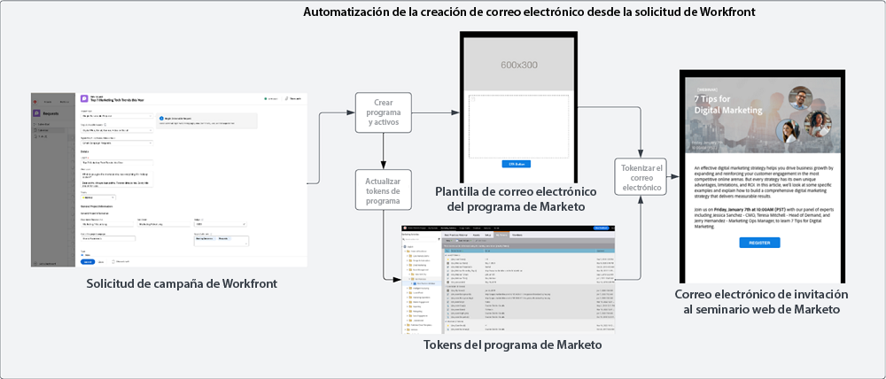

# Ingesta y creación   modelo {#intake-and-create}

El número de solicitudes de marketing que llegan a un equipo de operaciones de marketing para lanzar nuevas campañas puede convertir un equipo de alto rendimiento en un bucle de tareas repetitivas, con el consiguiente agotamiento y estancamiento de la innovación.

Al establecer un proceso para enviar solicitudes de campaña y automatizar la creación de las campañas de marketing más solicitadas habitualmente, el usuario puede: aumentar la velocidad de sus campañas, reducir los errores, dirigir las solicitudes al miembro correcto de operaciones de marketing, equilibrar y mejorar la utilización de los recursos y centrar más sus operaciones de marketing en tareas de mayor estrategia.

Con Workfront y Marketo Engage, una conexión de sistema a sistema permite utilizar los detalles de un [Formulario de solicitud de Workfront](https://experienceleague.adobe.com/docs/workfront/using/administration-and-setup/customize/custom-forms/create-or-edit-a-custom-form.html?lang=es){target="_blank"} para crear un programa de Marketo Engage y, posteriormente, completar las variables clave, como: líneas de asunto, copia por correo electrónico, imágenes, fechas, horas, información de un evento, etc.

Para lograr esta integración, se utilizará Workfront Fusion, una capa de automatización de trabajo que permite automatizar flujos de trabajo entre Workfront y otros sistemas.

El flujo de trabajo siguiente muestra una solicitud de un seminario web realizada por un director de campaña mediante un formulario de solicitud de Workfront. Los detalles enviados en la solicitud activan un programa y un correo electrónico para crear en Marketo Engage de cara al seminario web. Además, se adoptan detalles del formulario de solicitud para rellenar el contenido del correo electrónico.

{zoomable=&quot;yes&quot;}

>[!TIP]
>
>Para obtener más información sobre los distintos tipos de objetos en Workfront que se utilizan para organizar el trabajo de la campaña de marketing y cómo se correlacionan con un programa de Marketo Engage, consulte la [Información general sobre Marketo y Workfront](/help/blueprints/b2b/campaign-supply-chain/overview.md){target="_blank"}.

## Preparación del proceso de desarrollo de campañas para la automatización {#prepare-your-campaign-development-process-for-automation}

Detrás de cada buena automatización del flujo de trabajo, hay un proceso definido que garantiza que los equipos y las partes interesadas obtengan el máximo valor de la automatización.

**¿Qué tipos de solicitudes de marketing recibirá?**

Piense en qué tipos de tácticas de marketing ejecutará, como correos electrónicos, acompañamiento, seminarios web propios y eventos. ¿También ejecuta seminarios web de terceros o anuncios en pantalla? Cada una de estas solicitudes debe tenerse en cuenta, ya que pueden requerir campos de entrada específicos en el formulario de solicitud y se correlacionarán con diferentes plantillas de programa en Marketo Engage, que se clonarán.

También querrá saber si está ejecutando campañas en varias regiones. Si este es el caso, debe tener en cuenta que un proyecto de Workfront crea varios programas en Marketo Engage, y cada programa representa compatibilidad con idiomas distintos.

Es importante saber de antemano qué tipos de solicitudes de marketing espera recibir, para garantizar que las solicitudes se puedan facilitar de forma automatizada.

**¿Qué información se debe recoger en la solicitud de campaña?**

Piense en los elementos clave de información que deberán recogerse en el formulario de solicitud para cada una de las diferentes tácticas que ejecute. A continuación se muestran algunos ejemplos de información que puede recoger en un formulario de Workfront para automatizar el desarrollo de su campaña.

<table> 
  <tr> 
   <td><b>Táctica de marketing</b></td>
   <td><b>Información a recoger</b></td>
  </tr>
  <tr> 
   <td>Envío masivo de correo electrónico</td>
   <td>• Asunto del correo electrónico 
• Fecha planificada 
• Copia por correo electrónico 
• Llamada a la acción 
• Imágenes: se puede hacer referencia directamente a las direcciones URL de AEM Assets para su uso en Marketo 
• Criterios de calificación de la audiencia</td>
  </tr>
  <tr>
   <td>Seminario web/evento</td>
   <td>• Nombre del evento 
• Fecha del evento 
• Hora del evento 
• Ciudad del evento 
• Descripción del evento 
• Página de grabación de seminario web: URL de la página bajo demanda 
• Nombres de los ponentes 
• Cargos de los ponentes 
• Imágenes de los ponentes 
• Correos electrónicos necesarios (invitación, confirmación, recordatorio, seguimiento) 
• Imágenes de encabezado de correo electrónico 
• Criterios de calificación de la audiencia</td>
  </tr>
  <tr>
   <td>Acompañamiento</td>
   <td>• Número de correos electrónicos 
• Copia por correo electrónico 
• Encabezados de correo electrónico 
• Llamada a la acción 
• Criterios de calificación de la audiencia</td>
  </tr>
  </tbody>
</table>

>[!NOTE]
>
>En la actualidad, la creación de audiencias de forma programática mediante automatización está limitada en Marketo Engage, ya que los tokens no son compatibles con las listas inteligentes. Esto significa que las audiencias deberá crearlas en Marketo Engage un usuario o, si se dispone de una audiencia predeterminada con la que se establece comunicación continuamente, se puede incluir una lista inteligente configurada como parte de la plantilla de programa clonada durante el proceso de automatización.

### Establecer el centro de excelencia {#establish-your-center-of-excellence}

Si desea automatizar la creación de programas, necesitará un centro de excelencia en Marketo Engage. Un centro de excelencia incluye programas y activos con plantillas para ayudar a acelerar y estandarizar el proceso de desarrollo de campañas. Por ejemplo, puede tener una plantilla de programa para las diferentes necesidades de campaña: correo electrónico, acompañamiento, evento presencial y seminario web. Además, puede tener varias plantillas de programa de correo electrónico que utilice para distintas regiones o diferentes tipos de anuncios de correo electrónico.

Crear su centro de excelencia con plantillas de programa en Marketo Engage es uno de los primeros pasos para tener un enfoque más programático hacia la ejecución de campañas y actuará como base para automatizar las solicitudes de campañas.

Una vez que tenga un conjunto de plantillas de programa reutilizables, puede escalar aún más sus esfuerzos mediante la automatización descrita en este modelo para aumentar la velocidad del desarrollo de su campaña.

Para obtener más información sobre la creación de su propio centro de excelencia, consulte la [Comunidad de Marketo](https://nation.marketo.com/t5/product-blogs/marketo-master-class-center-of-excellence-with-chelsea-kiko/ba-p/243221){target="_blank"} para conocer las prácticas recomendadas.

### Usar tokens para rellenar contenido {#use-tokens-to-populate-content}

Con Marketo Engage, los tokens se pueden usar para rellenar contenido en los activos de campaña. Por ejemplo, después de clonar una plantilla de correo electrónico del centro de excelencia, Workfront Fusion puede adoptar los detalles de la solicitud de campaña en Workfront y pasarlos a Mis tokens en el programa de Marketo Engage. Los valores de token se pueden heredar directamente en el correo electrónico para crear el mensaje de salida.

{zoomable=&quot;yes&quot;}

### Rellenar imágenes desde AEM Assets {#populate-images-from-aem-assets}

Puede automatizar aún más el desarrollo de su correo electrónico y de su página de aterrizaje mediante tokens de Marketo Engage en combinación con vínculos a activos en AEM Assets. Los solicitantes de campaña pueden enviar vínculos de imagen publicados desde AEM Assets como parte del proceso de solicitud. Workfront Fusion puede adoptar estos vínculos e incrustarlos en el código HTML de un correo electrónico mediante tokens de Marketo Engage.

Recuerde que tendrá que crear sus programas y plantillas de programa en Marketo Engage para utilizar Mis tokens, de modo que Fusion pueda actualizar los valores de los tokens con la información enviada en Workfront.

>[!NOTE]
>
>AEM Assets no es necesario para admitir este flujo de trabajo, pero puede permitir un proceso más simplificado para administrar activos de campaña en toda la cadena de suministro de desarrollo de campañas.

### Crear una biblioteca de búsqueda para todos los tipos de solicitud de programa {#assemble-a-lookup-library-for-all-program-request-types}

Al automatizar la creación de nuevos programas de Marketo Engage a partir de solicitudes de Workfront, es importante incluir un paso en la automatización de Workfront Fusion que pueda adoptar información de la solicitud de Workfront y buscar las plantillas de programa correctas que deben clonarse en Marketo Engage.

Para ello, puede importar un conjunto de datos en Workfront Fusion que incluya una lista de todas las plantillas de programa diferentes en su centro de excelencia de Marketo Engage.

Algunos datos básicos que se deben incluir en la biblioteca de búsqueda de plantillas de programa son:

<table> 
  <tr> 
   <td><b>Columna</b></td>
   <td><b>Descripción</b></td>
  </tr>
  <tr> 
   <td>Tipo de campaña</td>
   <td>Puede tratarse de elementos como los siguientes: correo electrónico, seminario web, acompañamiento, evento, seminario web de terceros, importación de listas, etc. El tipo de campaña actuará como una descripción legible de lo que se solicita.</td>
  </tr>
  <tr> 
   <td>Tipo de solicitud de Workfront</td>
   <td>Este es el tipo de solicitud que se selecciona en el formulario de Workfront. Puede ser el mismo que el tipo de campaña, como correo electrónico, seminario web, acompañamiento o evento. Se utiliza para correlacionar la entrada seleccionada en el formulario de Workfront con una plantilla de programa en Marketo.</td>
  </tr>
  <tr> 
   <td>ID de formulario de Workfront</td>
   <td>El ID exclusivo del formulario de solicitud de Workfront utilizado para validar que la solicitud de escritura se está correlacionando con la plantilla de programa de Marketo Engage.</td>
  </tr>
  <tr> 
   <td>ID de programa de Marketo</td>
   <td>Este es el ID de la plantilla de programa en Marketo Engage que se correlaciona con la solicitud que se está realizando. Tener esta información muy a mano en Workfront Fusion permitirá que Fusion realice la solicitud a Marketo Engage y sepa exactamente qué programa clonar.</td>
  </tr>
  </tbody>
</table>

## Flujo de ingesta y creación de automatización {#intake-and-create-automation-flow}

A continuación, se muestra un ejemplo de cómo se puede ensamblar la lógica del flujo de trabajo en Fusion utilizando módulos de [Workfront](https://experienceleague.adobe.com/docs/workfront/using/adobe-workfront-fusion/fusion-apps-and-modules/workfront-modules.html?lang=es){target="_blank"} and [Marketo Engage](https://experienceleague.adobe.com/docs/workfront/using/adobe-workfront-fusion/fusion-apps-and-modules/marketo-modules.html?lang=es){target="_blank"} precompilados que permitan disponer de automatización con mayor rapidez.

Usar tokens para rellenar contenido

## Recursos {#resources}

* [Módulos de Adobe Marketo Engage](https://experienceleague.adobe.com/docs/workfront/using/adobe-workfront-fusion/fusion-apps-and-modules/marketo-modules.html?lang=es){target="_blank"}

* [Módulos de Adobe Workfront](https://experienceleague.adobe.com/docs/workfront/using/adobe-workfront-fusion/fusion-apps-and-modules/workfront-modules.html?lang=es){target="_blank"}

* [Información general sobre Marketo y Workfront](/help/blueprints/b2b/campaign-supply-chain/overview.md){target="_blank"}
