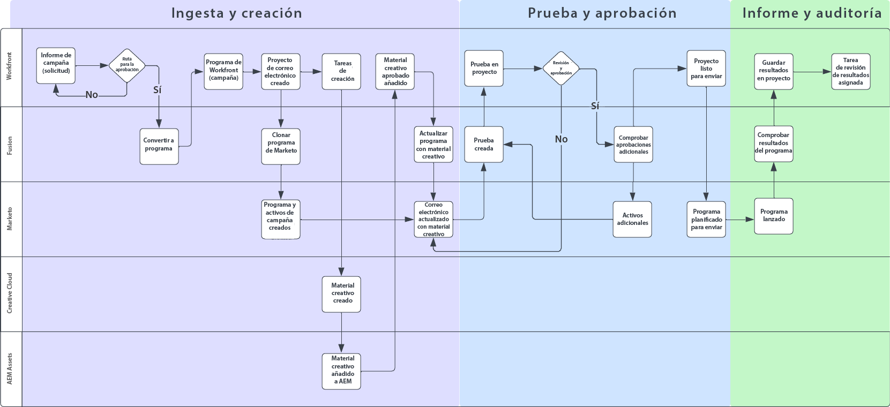
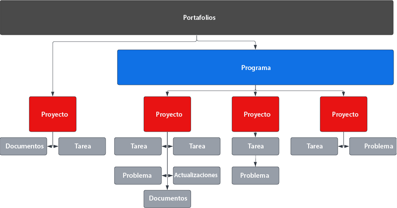
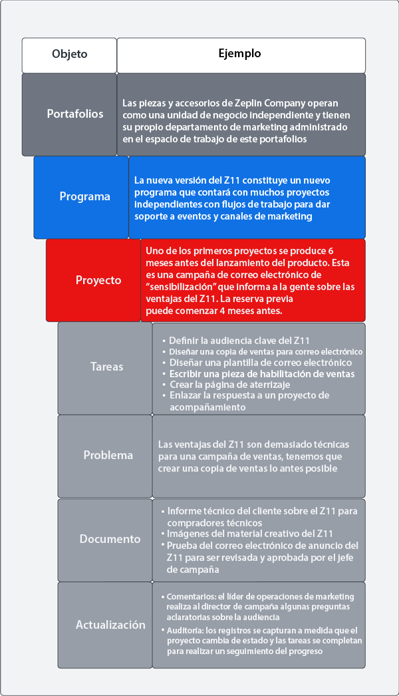
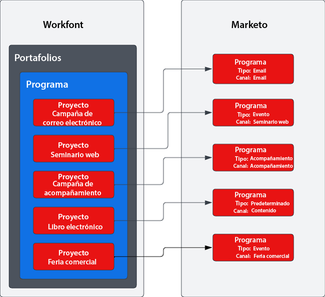

# Información general {#overview}

## Lograr un tiempo de salida al mercado más rápido con la cadena de suministro de campaña optimizada {#achieving-faster-time-to-market-with-optimized-campaign-supply-chain}

El trabajo del marketing sigue creciendo con nuevos canales y más formas de personalizar las comunicaciones cada día. Los equipos de marketing necesitan maneras de seguir automatizando y evolucionando para soportar las cambiantes demandas de marketing en todo el mundo.

**&quot;ROI siempre ha sido el verdadero objetivo. Los ingresos son buenos, pero no a costo alguno, sobre todo hoy&quot;. - OCM, sector de servicios empresariales**

Las organizaciones que logran un mayor ROI a la vez que aumentan sus ingresos lo hacen optimizando su proceso de desarrollo de campañas, optimizando su velocidad de ejecución de campañas y mejorando la supervisión en toda la función de marketing.

Si su organización busca lograr objetivos similares descritos a continuación, este documento le resultará útil:

* Escale las operaciones de campaña para admitir equipos de marketing interfuncionales
* Tiempo de comercialización más rápido con un proceso de solicitud de campaña optimizado
* Establezca un sistema de registro para aumentar la visibilidad entre las partes interesadas de la campaña
* Revisar y aprobar recursos de campaña (imágenes, copia de correo electrónico)

Los equipos de operaciones de Campaign necesitan sistemas que les permitan planificar y ejecutar campañas de marketing de forma eficiente y eficaz. Tanto si se trata de un correo electrónico, un seminario web, un evento, un medio de pago, una formación o una distribución de contenido, los equipos de marketing necesitan una solución central para organizar los colaboradores de campaña, los entregables y la ejecución.

Al integrar el sistema de activación de marketing multicanal (Marketo Engage) con la planificación de marketing y el sistema de registro (Workfront), puede aumentar la velocidad de la campaña y proporcionar una mejor visibilidad a las partes interesadas.

Con Workfront Fusion, los equipos de operaciones de marketing pueden en gran medida eliminar los pasos manuales y propensos a errores que implican la traducción de un informe de marketing a una campaña. Workfront Fusion ofrece una capa de integración predeterminada entre Workfront y Marketo Engage que permite flexibilidad y eficacia en el desarrollo de flujos de trabajo entre sistemas. Puede obtener más información sobre cómo configurar la integración y las acciones que se pueden realizar para automatizar los flujos de trabajo [here](https://experienceleague.adobe.com/docs/workfront/using/adobe-workfront-fusion/fusion-apps-and-modules/marketo-modules.html){target=&quot;_blank&quot;}.

## Planificación de campañas para la ejecución: casos de uso de automatización {#campaign-planning-to-execution-automation-use-cases}

* Compatibilidad con equipos de operaciones de marketing mediante la automatización de la creación de campañas en Marketo Engage mediante solicitudes de admisión en Workfront
* Comparta borradores de correos electrónicos y páginas de aterrizaje creadas en Marketo Engage con Workfront para obtener la revisión final y la aprobación de las partes interesadas interfuncionales
* Compartir los resultados de la campaña de Marketo Engage a Workfront para democratizar el acceso a las métricas de campaña

A continuación, puede ver un diagrama de flujo de trabajo del proceso de desarrollo de la campaña en el caso de una solicitud de explosión de correo electrónico. Además, puede ver cómo Workfront Fusion puede desempeñar un papel entre Workfront y el Marketo Engage para impulsar la automatización de procesos y flujos de trabajo a lo largo del ciclo de desarrollo de campañas.

Tome nota de las diferentes fases del proceso de desarrollo de la campaña.

1. Admisión y creación: la solicitud de campaña se realiza y los recursos de campaña se ensamblan mediante programación.

1. Probar y aprobar: una vez que la campaña se haya montado, es hora de que las partes interesadas revisen los recursos de la campaña y los cierren. por ejemplo, correos electrónicos y páginas de aterrizaje.

1. Informe y auditoría: comparta los resultados de la campaña con Workfront para proporcionar una buena visibilidad a las partes interesadas interfuncionales.

>[!NOTE]
>
>En el ejemplo anterior, Workfront está administrando y planificando los esfuerzos de trabajo durante todo el ciclo de vida del Programa para Marketo Engage. Dicho esto, la flexibilidad de Workfront puede extenderse a la gestión de todos los esfuerzos del equipo de marketing. Esto incluye marketing basado en cuentas, cadenas de suministro de contenido de marketing, administración de agencias, administración de campañas digitales y sociales y programas de habilitación de ventas.

## Explicación de cómo se representan las iniciativas de marketing en Workfront {#understanding-how-marketing-initiatives-are-represented-in-workfront}

Adobe Workfront permite a las organizaciones administrar el trabajo para lograr una ejecución más eficiente. En Workfront hay una jerarquía de objetos que proporciona un marco para la planificación, la administración de recursos y la colaboración entre varios equipos.

Será importante comprender cómo asignar el proceso empresarial a estos objetos para comprender la relación entre Workfront y Marketo Engage.

### Jerarquía de Portfolio definida {#portfolio-hierarchy-defined}

<table> 
  <tr> 
   <td><b>Objeto</b></td>
   <td><b>Definición</b></td>
  </tr>
  <tr> 
   <td>Portfolio</td>
   <td>Puede utilizar Portfolio y programas en Workfront para organizar Proyectos. Mediante la organización de proyectos, puede comparar proyectos similares y determinar dónde se gastarán mejor los recursos.  
   (p. ej., se crea un Portfolio para una unidad de negocio dentro de una empresa centrada en la venta de servicios o productos).</td>
  </tr>
  <tr>
   <td>Programa</td>
   <td>Puede usar Programas de Workfront para organizar Proyectos. Mediante la organización de proyectos, puede comparar proyectos similares y determinar dónde se gastarán mejor los recursos.  
   (p. ej., una estrategia de marketing con un objetivo de alto nivel, como crear conciencia e impulsar la demanda de un nuevo lanzamiento de producto).</td>
  </tr>
  <tr>
   <td>Proyecto</td>
   <td>Los proyectos de Workfront son una colección de elementos de trabajo que deben completarse para lograr un objetivo específico, un envío, un producto, etc.  
   (p. ej., una táctica de marketing como una explosión de correo electrónico, una campaña de nutrición, un seminario web o un evento presencial). Un solo proyecto también puede ser más complejo si abarca varias tácticas, como un correo electrónico, un anuncio en pantalla, una página de aterrizaje y un documento técnico descargable, todas ellas pensadas para impulsar el mismo resultado).</td>
  </tr>
  <tr>
   <td>Tarea</td>
   <td>Tareas de Workfront son elementos de trabajo planificados que pueden formar parte de un proyecto o iniciativa. Las tareas se asignan a usuarios o equipos para que las completen.  
   (p. ej., una tarea para crear un segmento de audiencia o crear un borrador de correo electrónico puede ser una tarea asociada con un proyecto para desarrollar un programa de correo electrónico de Marketo Engage).</td>
  </tr>
  <tr>
   <td>Problema</td>
   <td>Los problemas son elementos de trabajo no planificados en Workfront. Pueden ser problemas que ocurren durante un proyecto o solicitudes que se envían a través de una cola de solicitudes.  
   (p. ej., se produce un problema porque la imagen del banner de correo electrónico tiene dimensiones incorrectas).</td>
  </tr>
  <tr>
   <td>Documento</td>
   <td>Los documentos pueden ser documentos tradicionales, como documentos de palabra o presentaciones. También pueden ser archivos de imagen. Workfront permite la prueba de recursos mediante comentarios y anotaciones en documentos e imágenes para permitir la colaboración entre equipos.  
   (por ejemplo, una imagen de encabezado de correo electrónico que debe revisarse).</td>
  </tr>
  <tr>
   <td>Actualizar</td>
   <td>Incluye comentarios y registros de auditoría para realizar un seguimiento del trabajo y facilitar la colaboración en Workfront.  
   (por ejemplo, el registro de auditoría de la nueva versión de la imagen).</td>
  </tr>
  </tbody>
</table>

## Ejemplo de administración de trabajo de la iniciativa de marketing {#marketing-initiative-work-management-example}

Veamos cómo se desarrolla la jerarquía de portafolios de Workfront en un ejemplo real.

La Compañía Zeplin está lanzando una versión actualizada de uno de sus accesorios de tractor para utilidades compactas llamado Z11, que supera al modelo Z10 anterior al ofrecer una buena durabilidad y personalización. Con esto necesitan planear, desarrollar y ejecutar su estrategia de marketing para impulsar la demanda y crear conciencia para su nueva liberación de la división de tractores de su negocio. Esta estrategia de marketing debe incluir diferentes tácticas de marketing para sensibilizar a los clientes y sensibilizarlos al cliente de Z10.

La jerarquía siguiente muestra cómo la estrategia, las tácticas, las tareas y los recursos se asignan a Workfront para esta campaña de marketing.

## Asignación de Workfront a Marketo {#mapping-workfront-to-marketo}

Con Workfront como sistema ascendente para la planificación de marketing y la organización de proyectos, es importante comprender cómo se puede compartir la información entre Marketo Engage y Workfront.

Para que estos sistemas funcionen en conjunto a medida que se desarrollan nuevas iniciativas de marketing, es importante comprender cómo los diferentes tipos de registros de Workfront asignan los tipos de registros en Marketo Engage.

### Asignación de proyectos de Workfront a programas de Marketo Engage {#mapping-workfront-projects-to-marketo-engage-programs}

Con Workfront Fusion como capa de integración, puede asignar sus proyectos en Workfront a un programa en Marketo Engage. Por ejemplo, en el caso anterior, Zeplin quiere crear conciencia sobre el nuevo modelo Zeplin. Con esto crean un nuevo Programa en Workfront que aloja varias tácticas de marketing que se representan como Proyectos. Una táctica es un correo electrónico de sensibilización que debe dirigirse a los clientes existentes del modelo Z10 para informarles sobre el nuevo modelo Z11. En Workfront habría un proyecto creado para representar esta táctica de correo electrónico con un conjunto de tareas asociadas a ella para crear la audiencia, conseguir elementos creativos para las imágenes de correo electrónico y ensamblar el correo electrónico en Marketo Engage. El proyecto en Workfront puede asignarse a un programa de correo electrónico en Marketo Engage para que la información se pueda sincronizar entre sistemas.

A continuación, se muestra un ejemplo de cómo un programa puede incluir varios proyectos y cómo esos proyectos de Workfront pueden asignarse a Programas en Marketo Engage.

Puede que desee poner en marcha una iniciativa de marketing de gran tamaño que necesite que varios proyectos de Workfront se alojen en un programa de Workfront, o puede que tenga una solicitud única para un seminario web o correo electrónico que solo necesite crear un único proyecto de Workfront. Independientemente de sus necesidades, con Workfront, Workfront Fusion y Marketo Engage, su equipo tiene la flexibilidad de integrar su proceso de desarrollo de campañas sin problemas, desde la planificación hasta la ejecución.

### Asignación de tareas de Workfront a recursos de Marketo Engage {#mapping-workfront-tasks-to-marketo-engage-assets}

A medida que comience a asignar el proceso de desarrollo de campañas en Workfront, también puede pensar en qué tareas se asignarán para funcionar en Marketo Engage y cómo se puede capturar la información en Workfront, ayudar a aumentar la coherencia, la eficacia y la precisión en la cadena de suministro de desarrollo de campañas.

Los proyectos de Workfront se pueden crear plantillas para que el proceso se pueda definir claramente cada vez que ejecute una táctica de marketing específica. Por ejemplo, al ejecutar una campaña de correo electrónico, habrá un conjunto estándar de tareas que deben completarse para su organización. Estas tareas pueden incluir una reunión inicial con las partes interesadas, la obtención de recursos creativos, la aprobación del elemento creativo, la creación de la audiencia de destino, la creación del correo electrónico, la traducción del correo electrónico, la aprobación del correo electrónico y el uso compartido de los resultados de la campaña de correo electrónico con las partes interesadas.

Algunas de estas tareas pueden asignarse directamente al trabajo que se debe realizar en Marketo Engage. Por ejemplo, la tarea de generación de correo electrónico en Workfront se puede personalizar para incluir campos que pasarán información al Marketo Engage para automatizar el ensamblado del correo electrónico. Pueden incluir elementos como la línea de asunto, la copia y las imágenes en el correo electrónico.

## Pasos siguientes {#next-steps}

Ahora que tiene una comprensión fundamental de cómo Workfront y el Marketo Engage pueden desbloquear nuevas eficiencias en la cadena de suministro del desarrollo de campañas, consulte los siguientes documentos y recursos sobre cómo automatizar los flujos de trabajo y los procesos entre Marketo Engage y Workfront mediante Workfront Fusion.

### Introducción a la integración de Workfront Fusion, Workfront y Marketo Engage {#getting-started-with-workfront-fusion}

* [Ingesta y creación](/help/blueprints/optimize-campaign-supply-chain-with-marketo-and-workfront/intake-and-create.md){target=&quot;_blank&quot;} - Automatización del desarrollo de campaña con Marketo Engage y Workfront

* Prueba y aprobación (próximamente)

* Informe y auditoría (próximamente)

### Administración de los nombres de campaña de los Marketo Engage y sus direcciones URL asociadas {#managing-marketo-engage-campaign-names}

La estandarización de las convenciones de nomenclatura para campañas y direcciones URL es una base clave para una gestión precisa del programa en Marketo Engage y ayuda a impulsar un proceso más coherente en toda la cadena de suministro de la campaña. Si está buscando herramientas para ayudarle con esto, le recomendamos que verifique algunas herramientas de código abierto gratuitas de [Servicios de éxito de Adobe](https://main--marketo-campaign-tools--dr-adobe.hlx.live/){target=&quot;_blank&quot;} que permite crear un enfoque coherente para crear y administrar campañas de Marketo Engage y sus direcciones URL asociadas.

### Recursos {#resources}

* [Workfront Fusion para Marketo Engage](https://experienceleague.adobe.com/docs/workfront/using/adobe-workfront-fusion/fusion-apps-and-modules/marketo-modules.html){target=&quot;_blank&quot;}

* [Workfront Fusion para Workfront](https://experienceleague.adobe.com/docs/workfront/using/adobe-workfront-fusion/fusion-apps-and-modules/workfront-modules.html){target=&quot;_blank&quot;}
