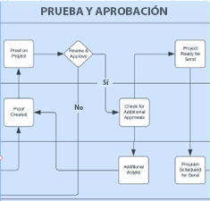
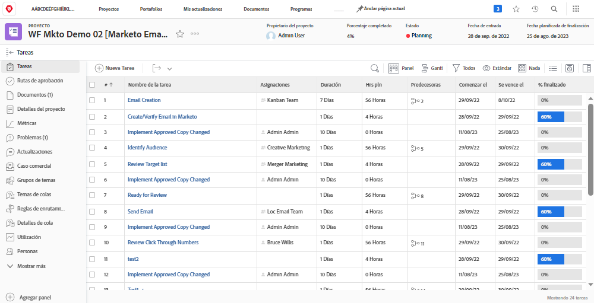
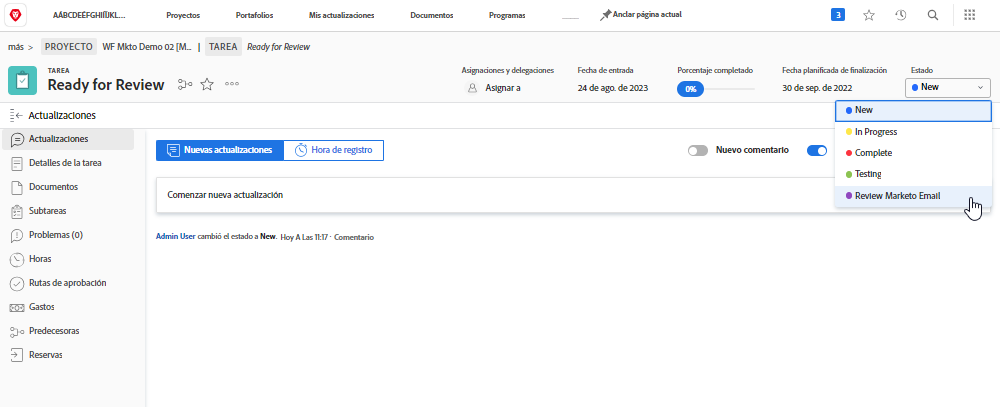
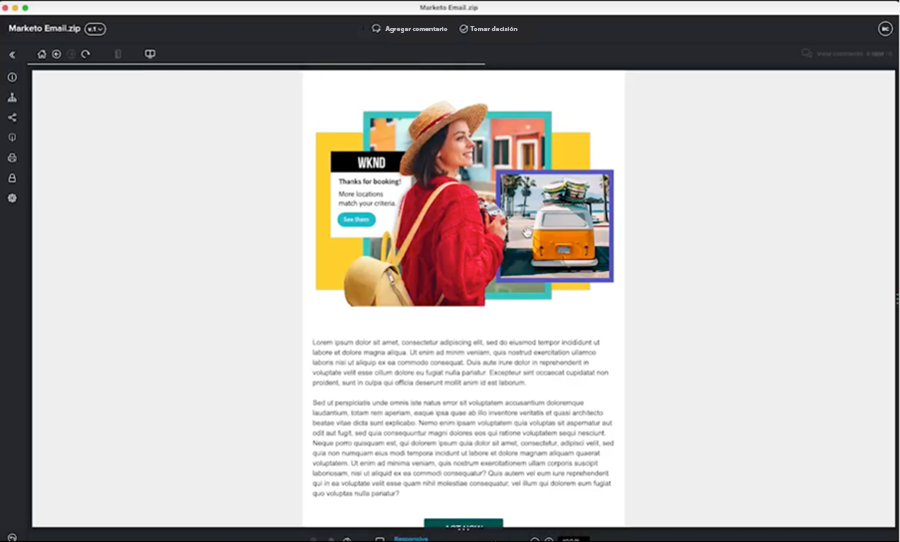

# Revisar y aprobar modelo {#review-and-approve-blueprint}

Asegurarse de que los activos y las campañas de marketing cumplen las expectativas y los estándares de una empresa va más allá de la entrega del contenido y la mensajería adecuados a la audiencia adecuada. Las organizaciones también tienen la responsabilidad de mantener las políticas internas, las regulaciones del sector e incluso los requisitos legales previos para embarcarse en nuevas iniciativas de marketing. Al incorporar pasos de revisión y aprobación en el proceso de desarrollo de campañas, los equipos de marketing pueden garantizar que el contenido y los mensajes sean precisos y cumplan con los estándares del sector, especialmente en industrias como las finanzas, la sanidad y los productos farmacéuticos.

Con Workfront y Marketo Engage, los equipos de marketing tienen la oportunidad de tener un sistema de marketing perfectamente conectado, con mensajes precisos y conformes con la normativa.

## Desbloquear revisiones y aprobaciones avanzadas para Marketo Engage con Workfront {#unlock-proofing-and-advanced-approvals}

Cuando pensamos en crear campañas de marketing, debemos tener en cuenta que varios sistemas admiten los diferentes pasos involucrados, incluidos: planificación, creación, revisión, comentarios, aprobación y ejecución. Con Workfront y Marketo Engage, los equipos tienen todas las herramientas necesarias para llevar a cabo el proceso completo de planificación e inicio de una nueva campaña de marketing. Además, los equipos pueden agilizar aún más su proceso de revisión y aprobación para aumentar la velocidad de desarrollo de las campañas, asegurando al mismo tiempo que la precisión y el cumplimiento se mantengan en el más alto nivel.

### Revisar y aprobar casos de uso desbloqueados con Marketo Engage y Workfront {#review-and-approve-use-cases-unlocked-with-marketo-engage-and-workfront}

* Elimine los comentarios dispares y aumente la colaboración en un lugar centralizado mediante la utilización de las funciones de anotación y comentarios de Workfront en los recursos de los Marketo Engage.

* Centralice sus aprobaciones activándolas en Marketo Engage desde los flujos de trabajo de aprobación de Workfront.

* Admita y optimice flujos de trabajo de aprobación complejos de recursos de marketing mediante la utilización de funciones de aprobación avanzadas de Workfront con recursos Marketo Engage.

* Democratice el acceso a los borradores de marketing extrayendo mediante programación recursos de Marketo en Workfront para que los revisen varias partes interesadas.

* Realice un seguimiento de los cambios y cree un seguimiento del papel centralizando todo el trabajo de revisión y revisión para los recursos de Marketo Engage en Workfront.

## Planificación del flujo de trabajo de prueba y aprobación {#planning-your-proof-and-approval-workflow}

Antes de configurar la integración de prueba y aprobación entre Marketo Engage y Workfront, tenga en cuenta lo siguiente:

* ¿Qué recursos deberán revisarse y aprobarse?
* ¿Quién debe ser el aprobador?
* ¿Necesitará haber varios aprobadores antes de que un recurso de marketing pueda iniciarse?
* ¿En qué punto del proceso de desarrollo de la campaña se montarán los recursos de marketing y estarán listos para revisarse?

Responder a estas preguntas le ayudará a obtener una línea de base sobre el aspecto que tendrá el flujo de aprobación y cómo empezar a pensar en la configuración de la instancia de Workfront.

## Creación de un flujo de trabajo de prueba y aprobación entre Marketo Engage y Workfront {#building-a-proof-and-approval-workflow}

Para optimizar el proceso de prueba y aprobación entre Workfront y Marketo Engage, puede integrar las dos soluciones con Workfront Fusion. Workfront Fusion proporciona una interfaz de flujo de trabajo para activar acciones y pasar información entre las instancias de Workfront y de Marketo Engage.

Para ello, considere los pasos a continuación como parte del proceso para una experiencia integrada de revisión y aprobación.

1. Configure el proyecto de Workfront con una tarea Listo para revisión.
1. Almacene en déclencheur el correo electrónico del Marketo Engage para sincronizar con Workfront con un cambio de estado de tarea.
1. Convierta su archivo de correo electrónico de Marketo Engage a Proof revisable en Workfront.
1. Utilice las pruebas de Workfront para colaborar mediante comentarios y anotaciones.
1. Apruebe Workfront Proof para almacenar en déclencheur la aprobación de recursos en Marketo Engage y, a continuación, marque la tarea como completada.

### Configuración de un proyecto de Workfront con una tarea Listo para revisión {#configure-a-workfront-project-with-a-ready-for-review-task}

Uso [plantillas de proyecto](https://experienceleague.adobe.com/docs/workfront/using/manage-work/projects/create-and-manage-project-templates/project-template-overview.html){target="_blank"} para recopilar la mayoría de los procesos, la información y la configuración repetibles asociados con los proyectos de su organización. Puede definir tareas, poner temas en cola, crear formularios personalizados y adjuntar documentos en la plantilla.

En la plantilla de proyecto de Workfront, incluya tareas para revisar los recursos que forman parte de la campaña de marketing. Además, puede añadir un proceso de aprobación para gestionar aprobaciones únicas o aprobaciones de varios niveles más complejas.

Si desea iniciar una nueva campaña de correo electrónico, debe tener una plantilla de proyecto que incluya una tarea para revisar el correo electrónico, así como un proceso de aprobación para garantizar que el correo electrónico sea aprobado por la parte interesada adecuada antes de que se pueda enviar.

{zoomable=&quot;yes&quot;}

### Almacene en déclencheur el correo electrónico del Marketo Engage para sincronizar con Workfront con el cambio de estado de la tarea {#trigger-your-marketo-engage-email-to-sync-to-workfront}

Como parte del proceso de revisión, querrá poder sincronizar los correos electrónicos con su proyecto de Workfront una vez que su equipo de marketing los haya revisado. Para ello, se recomienda configurar una tarea Listo para revisión con un [estado de tarea](https://experienceleague.adobe.com/docs/workfront/using/manage-work/projects/update-work-on-a-project/update-task-status.html){target="_blank"} esto significa que el correo electrónico está listo para revisarse. En nuestro ejemplo, añadimos un estado Revisar correo electrónico de Marketo a nuestra tarea que se puede seleccionar cuando el borrador del correo electrónico está listo para que lo revisen las partes interesadas.

Con este estado en su proyecto de Workfront, puede configurar el escenario de Workfront Fusion para que escuche la tarea Listo para revisión y se actualice a &quot;Revisar correo electrónico de Marketo&quot;. Una vez actualizado, el escenario puede recuperar el correo electrónico del Marketo Engage como archivo de HTML, comprimirlo y guardar una copia en los documentos de proyecto de Workfront que se revisarán.

{zoomable=&quot;yes&quot;}

### Conversión del correo electrónico del Marketo Engage en una prueba revisable en Workfront {#convert-your-marketo-engage-email-to-reviewable-proof-in-workfront}

Una vez que la tarea Listo para revisión se haya movido al estado &quot;Revisar correo electrónico de Marketo&quot; y el correo electrónico del Marketo Engage se haya guardado en Workfront, puede configurar el escenario de Workfront Fusion para convertir el correo electrónico en una Prueba de Workfront.

### Utilice las pruebas de Workfront para colaborar mediante comentarios y anotaciones {#use-workfront-proofing-to-collaborate}

[Corrección de Workfront](https://experienceleague.adobe.com/docs/workfront/using/review-and-approve-work/proofing/proofing-overview/proofing-basics.html){target="_blank"} Las funciones de permiten a su equipo de marketing tomar un nuevo recurso, como una imagen o un correo electrónico, y colaborar mediante comentarios y anotaciones. Una vez que una prueba está lista para ejecutarse, los responsables de la toma de decisiones pueden aprobarla desde la herramienta de prueba.

{zoomable=&quot;yes&quot;}

### Aprobar Workfront Proof y déclencheur la aprobación de recursos en el Marketo Engage, marcar la tarea como completada {#approve-workfront-proof-and-trigger-asset-approval-in-marketo-engage}

Workfront Fusion puede detectar cuándo las partes interesadas han aprobado el correo electrónico y enviar una solicitud al Marketo Engage para que apruebe el correo electrónico dentro de Marketo.

Con el correo electrónico revisado/aprobado por los miembros del equipo adecuados, el correo electrónico está listo para su publicación en Marketo Engage.

## Plantillas de escenario de Fusion {#fusion-scenario-templates}

Para optimizar el desarrollo de los flujos de trabajo de revisión y aprobación en su propia instancia de Workfront y Marketo Engage, hemos creado plantillas de Fusion Templates que le ayudarán a dar sus primeros pasos con la integración. Puede utilizar estas plantillas buscando &quot;Marketo&quot; en la sección Public Templates de Fusion y descargándolas en su instancia.

### Revisar un correo electrónico Prueba del borrador del correo electrónico del Marketo Engage en Workfront {#review-an-email-proof-of-your-marketo-engage-email-draft-in-workfront}

El siguiente escenario de fusión le llevará a través de la primera mitad del flujo de revisión y aprobación, en la que el borrador del correo electrónico se puede extraer del Marketo Engage y guardarse en Workfront como una prueba. Una vez guardado como una prueba en los documentos del proyecto de Workfront, las partes interesadas en marketing pueden revisarlo, comentarlo y anotarlo como parte del proceso de revisión.

{zoomable=&quot;yes&quot;}

### Aprobar un correo electrónico en Workfront que almacene en déclencheur la aprobación del recurso en Marketo Engage {#approve-an-email-in-workfront-that-triggers-approval}

El escenario de fusión siguiente se puede utilizar para detectar cuándo se ha aprobado una prueba en Workfront y enrutar esa aprobación al Marketo Engage para actualizar el borrador del correo electrónico de modo que esté activo y listo para utilizarse en un programa de Marketo Engage.

{zoomable=&quot;yes&quot;}

En conjunto, estos dos escenarios se pueden utilizar para crear una ruta bidireccional para extraer recursos de marketing de Marketo Engage en flujos de trabajo sólidos de revisión y aprobación de Workfront, y devolver las aprobaciones al Marketo Engage desde Workfront.
