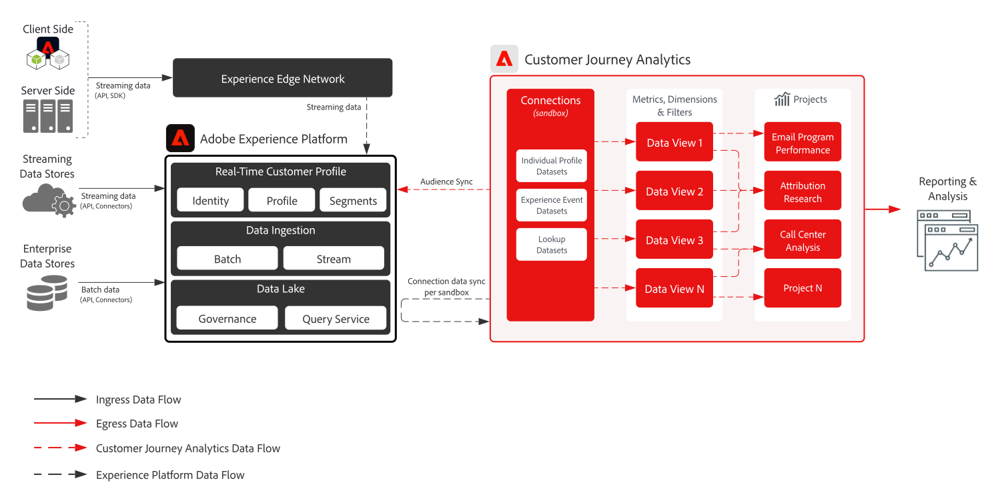

# Modelo de Customer Journey Analytics B2B

Customer Journey Analytics B2B edition permite los informes y análisis basados en cuentas para las organizaciones B2B. A diferencia del análisis B2C centrado en las personas, este modelo coloca la **cuenta** en el centro del modelo de datos para que pueda analizar recorridos de compra B2B complejos entre varias partes interesadas, grupos de compra y ciclos de ventas. Utilice [!DNL Customer Journey Analytics] para unificar los datos de comportamiento con dimensiones B2B (cuentas, oportunidades, campañas y listas de marketing) para obtener información basada en el recorrido y crear audiencias.

## Aplicaciones

* Adobe [!DNL Customer Journey Analytics] (B2B edition)
* Adobe Experience Platform (para datos de eventos y B2B)

## Casos de uso

* **Optimizar el marketing de la cuenta**: Analice el impacto del marketing en campañas, canales y contenido en grupos de compra dentro de cuentas, la progresión de la canalización y las oportunidades de ampliación de venta/venta cruzada.
* **Aumentar las cuentas clave**: identifique los puntos de contacto de alto valor en los grupos de compra dentro de las cuentas clave para informar las acciones de marketing y ventas, y calcule el valor de duración del cliente a nivel de cuenta.
* **Generar valor de producto**: mida el impacto de las versiones de productos y el uso en la satisfacción del cliente en los niveles de cuenta y usuario para optimizar las características e informar el desarrollo.
* **Análisis B2B basado en personas**: combine el contexto de oportunidad y la cuenta con el comportamiento de los usuarios individuales para la puntuación de posibles clientes, la participación y el análisis de recorridos.

## Prerrequisitos

* [!DNL Customer Journey Analytics] derecho de B2B edition.
* Datos de comportamiento y B2B en Adobe Experience Platform: conjuntos de datos B2B (cuentas, oportunidades, personas, campañas, listas de marketing y actividades B2B) y datos de evento (canales web, móviles u otros) disponibles en una [conexión CJA](https://experienceleague.adobe.com/docs/analytics-platform/using/cja-connections/create-connection.html).
* [Nomenclatura B2B para CJA](https://experienceleague.adobe.com/docs/analytics-platform/using/cja-dataviews/b2b.html): configuración de vista de datos específica de B2B (ID de cuenta, ID de oportunidad y dimensiones relacionadas) para la conexión.

## Arquitectura

{zoomable="yes"}

Los datos fluyen desde Experience Platform (conjuntos de datos de eventos y B2B) a [!DNL Customer Journey Analytics] a través de una conexión CJA. Las dimensiones B2B se exponen en las vistas de datos, de modo que el análisis y las audiencias se pueden crear en los niveles de cuenta, oportunidad y persona.

## Guardas

* Para ver los límites y derechos de los productos B2B edition, consulte la [descripción del producto Customer Journey Analytics B2B](https://helpx.adobe.com/legal/product-descriptions/customer-journey-analytics-b2b.html).
* Para conocer los límites técnicos de Analytics Platform y CJA, consulte [Protecciones de Analytics Platform](https://experienceleague.adobe.com/en/docs/analytics-platform/using/technotes/guardrails).
* Para conocer los límites de ingesta y conexión de datos de CJA, consulte [Protecciones de ingesta de datos de Customer Journey Analytics](https://experienceleague.adobe.com/docs/experience-platform/sources/connectors/adobe-applications/analytics.html#what-is-the-expected-latency-for-analytics-data-on-platform%3F).
* Si publica audiencias de CJA en Real-time Customer Data Platform, consulte [Protecciones para compartir audiencias de Customer Journey Analytics](https://experienceleague.adobe.com/docs/analytics-platform/using/cja-components/audiences/publish.html#latency).
* Para obtener latencias de extremo a extremo y protecciones de plataforma, consulte el [documento de protecciones de implementación](../experience-platform/guardrails.md).

## Pasos de implementación

1. **Ingesta de datos de eventos y B2B en Experience Platform**: Incorpore datos de cuenta, oportunidad, persona, campaña y actividad, además de eventos de comportamiento, mediante [fuentes](https://experienceleague.adobe.com/docs/experience-platform/sources/home.html?lang=es) (por ejemplo, [!DNL Marketo Engage], CRM u otros conectores B2B).
2. **Crear una conexión de CJA** — [Agregue los conjuntos de datos de Experience Platform relevantes](https://experienceleague.adobe.com/docs/analytics-platform/using/cja-connections/create-connection.html) (evento B2B y ) a una conexión de Customer Journey Analytics.
3. **Configurar B2B en la vista de datos** — Habilitar [dimensiones de nomenclatura y clave B2B](https://experienceleague.adobe.com/docs/analytics-platform/using/cja-dataviews/b2b.html) (ID de cuenta, ID de oportunidad, etc.) en las vistas de datos de la conexión.
4. **Generar análisis y audiencias basados en cuentas**: use [informes y casos de uso B2B de CJA](https://experienceleague.adobe.com/docs/analytics-platform/using/cja-usecases/b2b.html?lang=es) para crear informes, desgloses y audiencias en el nivel de cuenta y oportunidad; opcionalmente, [publique audiencias en Real-Time CDP](https://experienceleague.adobe.com/docs/analytics-platform/using/cja-components/audiences/publish.html?lang=es) para la activación.

## Documentación relacionada

### Customer Journey Analytics B2B edition

* [Customer Journey Analytics B2B edition](https://experienceleague.adobe.com/docs/analytics-platform/using/cja-overview/cja-b2b/cja-b2b-edition.html)
* [Casos de uso B2B](https://experienceleague.adobe.com/docs/analytics-platform/using/cja-usecases/b2b.html?lang=es)
* [Información general sobre casos de uso de B2B edition](https://experienceleague.adobe.com/docs/analytics-platform/using/cja-usecases/b2b/b2b-edition/use-cases-overview.html)
* [Ejemplo de proyecto B2B basado en personas](https://experienceleague.adobe.com/docs/analytics-platform/using/cja-usecases/b2b/example.html)

### Conexiones y vistas de datos

* [Crear una conexión](https://experienceleague.adobe.com/docs/analytics-platform/using/cja-connections/create-connection.html)
* [Configuración de vista de datos B2B](https://experienceleague.adobe.com/docs/analytics-platform/using/cja-dataviews/b2b.html)

### Audiencias y barreras

* [Publicación de audiencias de CJA en Real-Time CDP](https://experienceleague.adobe.com/docs/analytics-platform/using/cja-components/audiences/publish.html?lang=es)
* [Experience Platform y protecciones de aplicaciones](../experience-platform/guardrails.md)
