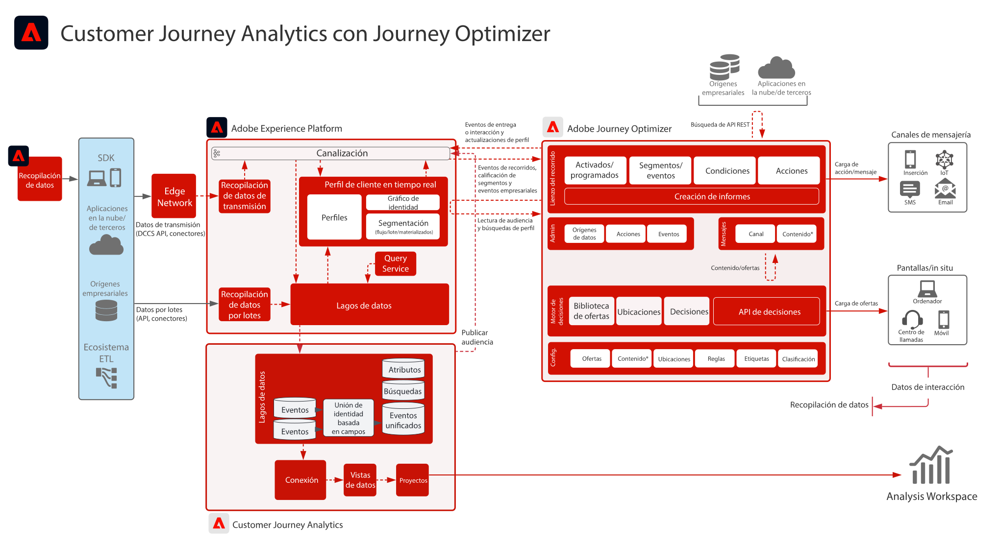

# Customer Journey Analytics con modelo de Journey Optimizer

Los datos de Journey Optimizer se comparten con el lago de datos de Experience Platform y están disponibles para su ingesta, análisis y creación de informes dentro de Customer Journey Analytics. El envío de recorridos, la interacción y la eficacia pueden analizarse y notificarse desde Customer Journey Analytics.

Además, las audiencias creadas en Customer Journey Analytics pueden publicarse en Experience Platform Real-Time Customer Profile y están disponibles para la ejecución de recorridos en Journey Optimizer.

## Guía de implementación

Consulte la siguiente documentación para obtener instrucciones sobre la implementación y configuración de los datos de Journey Optimizer en Customer Journey Analytics. [Documentación](https://experienceleague.adobe.com/docs/journey-optimizer/using/reporting/reports/sharing-overview.html?lang=es)

## Arquitectura para Customer Journey Analytics con Journey Optimizer

{zoomable="yes"}
