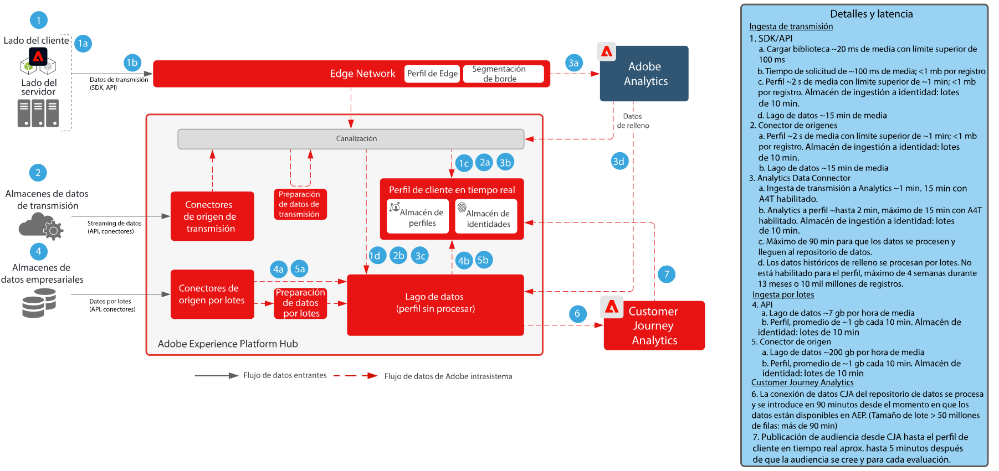

# Customer Journey Analytics con Real-Time Customer Data Platform    modelo

Cree y publique audiencias identificadas en Customer Journey Analytics (CJA) en Real-Time Customer Profile en Adobe Experience Platform para la segmentación y personalización de clientes. Ideal para crear audiencias que utilicen datos históricos o audiencias más refinadas a partir de filtros granulares y campos calculados en Customer Journey Analytics.

## Guía de publicación de audiencias de Customer Journey Analytics

Consulte la siguiente documentación para obtener instrucciones sobre la implementación y configuración de la publicación de audiencias de Customer Journey Analytics en Real-Time Customer Data Platform. [Documentación](https://experienceleague.adobe.com/docs/analytics-platform/using/cja-components/audiences/publish.html?lang=es)

## Modelos de arquitectura de Customer Journey Analytics

{zoomable=&quot;yes&quot;}

## Diagrama de guardas para los modelos de Customer Journey Analytics

* Para obtener más información sobre los mecanismos de protección y las latencias de extremo a extremo, consulte el [documento de mecanismos de protección de implementación](../experience-platform/deployment/guardrails.md)

{zoomable=&quot;yes&quot;}

## Preguntas frecuentes

* Si en RTCDP no existe un perfil correspondiente al enviado por CJA, ¿se creará un nuevo perfil o las audiencias solo se registrarán desde CJA para perfiles que ya están presentes? Sí, se creará un nuevo perfil. Como resultado, si la implementación de RTCDP es solo para clientes conocidos, las reglas de audiencia de CJA deben escribirse para que filtren solo perfiles con identidades conocidas. Esto garantizará que el recuento de perfiles en RTCDP no aumente a partir de perfiles anónimos si no se desea.

* ¿Envía CJA los datos de audiencia como eventos de canalización o como un archivo plano que también se dirige al lago de datos? Las audiencias de CJA se transmiten a través de la canalización al servicio de perfiles de RTCDP, pero los datos también se almacenan en el lago de datos como un conjunto.

* ¿Qué identidades envía CJA? CJA envía cualquier identidad configurada como “ID de persona” durante la configuración de CJA.

* ¿Qué se establece como identidad principal? Cualquiera que sea la identidad que el usuario seleccionó cuando configuró CJA como ID de “persona” principal.

* ¿El servicio de identidad también procesa los mensajes de CJA? Es decir, ¿puede CJA añadir identidades a un gráfico de identidad de perfil mediante el uso compartido de audiencias? No, el servicio de identidad no procesa los mensajes de CJA.

## Entradas relacionadas en el blog

* [[!DNL Blueprint for Multi-Channel Orchestration in Adobe Experience Platform]](https://medium.com/adobetech/blueprint-for-multi-channel-orchestration-in-adobe-experience-platform-c68317e94184)
* [[!DNL Leveraging External Data Platforms in Adobe Experience Platform Journey Orchestration]](https://medium.com/adobetech/leveraging-external-data-platforms-in-adobe-experience-platform-journey-orchestration-54fc6134fe17)
* [[!DNL Event-Based Triggering on Adobe Experience Platform Orchestration Service using Apache Airflow]](https://medium.com/adobetech/event-based-triggering-on-adobe-experience-platform-orchestration-service-using-apache-airflow-8607b28251f1)
* [[!DNL Adobe Campaign Classic Integration with Journey Orchestration]](https://medium.com/adobetech/adobe-campaign-classic-integration-with-journey-orchestration-ae577653281)
* [[!DNL Demonstrating the Power of Adobe's New Journey Orchestration Service to Build Personalized Omnichannel Experiences in Real-Time]](https://medium.com/adobetech/demonstrating-the-power-of-adobes-new-journey-orchestration-service-to-build-personalized-aa60d88cd34)
* [[!DNL Journey Orchestration in an Omnichannel World]](https://medium.com/adobetech/journey-orchestration-in-an-omnichannel-world-3a2d32d556d9)
