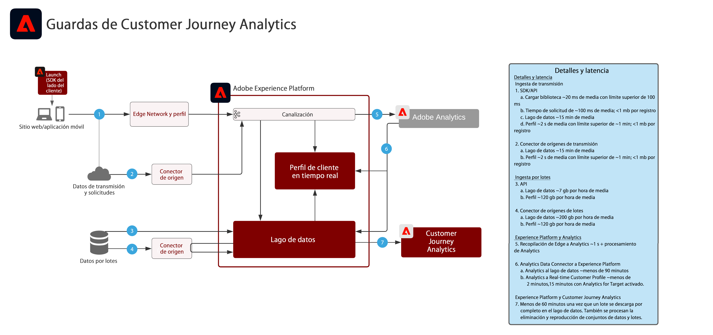

# Customer Journey Analytics

Customer Journey Analytics muestra cómo las marcas pueden unificar datos y comportamientos del cliente de varios canales y fuentes de interacción para crear una vista basada en el recorrido de todas las interacciones del cliente. La creación de informes y el análisis se pueden realizar en el servicio de la aplicación Customer Journey Analytics para evaluar y obtener datos sobre la interacción del cliente y sus patrones de comportamiento.

Los análisis más comunes incluyen lo siguiente:

* Rutas de conversión arriba/abajo
* Contenido más visto
* Categorías y productos
* Qué campañas resultaron en conversión y más participación
* Análisis de uso de herramientas para optimizar las experiencias de autoservicio

| Modelo | Descripción | Aplicaciones de Experience Cloud |
|---|---|---|
| **[Análisis de recorridos multicanal](digital-behavioral-data-consolidation.md)** | <ul><li>Obtenga una sola vista consolidada con el comportamiento del cliente para todos los diferentes canales, unificando los datos de distintas propiedades web, móvil y sin conexión.</li></ul> | <ul><li>Adobe Experience Platform</li><li>Customer Journey Analytics</li><li>Adobe Analytics (opcional)</li></ul> |
| **[Análisis del recorrido de desvío de llamadas](call-deflect.md)** | <ul><li>Determine qué comportamientos tienen más posibilidades de resultar en una llamada atendida por un agente, uniendo los datos del centro de llamadas con otros derivados de la web, móvil u otras interacciones.</li><li>Esta información se puede utilizar para optimizar la experiencia del cliente y reducir la ruta a interacciones atendidas por agentes gracias al contenido y a las herramientas optimizadas para el autoservicio.  </li></ul> | <ul><li>Adobe Experience Platform</li><li>Customer Journey Analytics</li> |

## Guardas para los modelos de Customer Journey Analytics

### Diagrama de guardas

## Entradas relacionadas en el blog

* [[!DNL Blueprint for Multi-Channel Orchestration in Adobe Experience Platform]](https://medium.com/adobetech/blueprint-for-multi-channel-orchestration-in-adobe-experience-platform-c68317e94184)
* [[!DNL Leveraging External Data Platforms in Adobe Experience Platform Journey Orchestration]](https://medium.com/adobetech/leveraging-external-data-platforms-in-adobe-experience-platform-journey-orchestration-54fc6134fe17)
* [[!DNL Event-Based Triggering on Adobe Experience Platform Orchestration Service using Apache Airflow]](https://medium.com/adobetech/event-based-triggering-on-adobe-experience-platform-orchestration-service-using-apache-airflow-8607b28251f1)
* [[!DNL Adobe Campaign Classic Integration with Journey Orchestration]](https://medium.com/adobetech/adobe-campaign-classic-integration-with-journey-orchestration-ae577653281)
* [[!DNL Demonstrating the Power of Adobe’s New Journey Orchestration Service to Build Personalized Omnichannel Experiences in Real-Time]](https://medium.com/adobetech/demonstrating-the-power-of-adobes-new-journey-orchestration-service-to-build-personalized-aa60d88cd34)
* [[!DNL Journey Orchestration in an Omnichannel World]](https://medium.com/adobetech/journey-orchestration-in-an-omnichannel-world-3a2d32d556d9)
