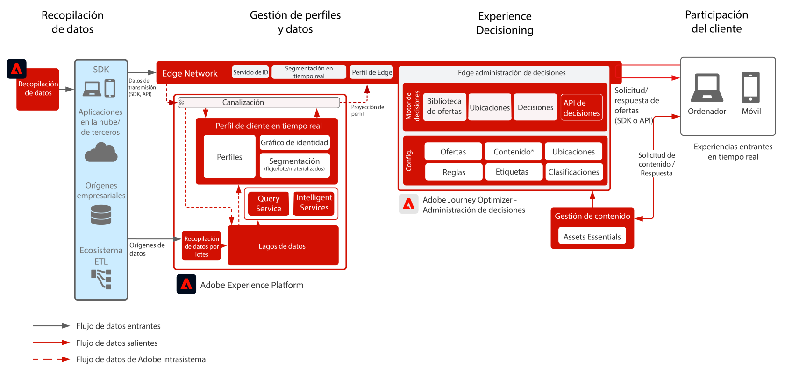

# Journey Optimizer - [!DNL Decision Management] en el modelo de Edge

[!DNL Decision Management] es un servicio proporcionado como parte de [!DNL Journey Optimizer]. Este modelo describe los casos de uso y las capacidades técnicas de la aplicación, y proporciona una explicación profunda de los diversos componentes y consideraciones sobre arquitectura que componen Gestión de decisiones.

>[!MORELIKETHIS]
>
>Para obtener más información sobre [!DNL Decision Management], consulte la [descripción general del modelo](https://experienceleague.adobe.com/docs/blueprints-learn/architecture/customer-journeys/journey-optimizer/decision-management/decision-management-overview.html?lang=es) o visite la [documentación del producto](https://experienceleague.adobe.com/docs/journey-optimizer/using/offer-decisioniong/get-started-decision/starting-offer-decisioning.html?lang=es).

[!DNL Decision Management] se puede implementar de una de las dos maneras siguientes. La primera se realiza a través del concentrador [!DNL Experience Platform], que es una arquitectura de centro de datos única. En el método &quot;hub&quot;, las ofertas se ejecutan, personalizan y entregan con una latencia de un segundo. Por lo tanto, la arquitectura del hub es la más adecuada para la experiencia del cliente que no requiere latencia de subsegundo. Algunos ejemplos incluyen tomas de decisiones sobre ofertas que se proporcionan para los quioscos o experiencias asistidas por agentes, como en los centros de llamadas o en las interacciones personales.

El segundo método es a través de Experience Platform [!DNL Edge Network], que es una infraestructura distribuida geográficamente a nivel global para ofrecer experiencias rápidas de segundo y milisegundo. La experiencia del consumidor final que ejecuta la infraestructura de Edge más cercana a la geolocalización de los consumidores para minimizar la latencia. [!DNL Decision Management] en Edge está diseñado para ofrecer experiencias de consumidores en tiempo real. Estas incluyen experiencias como solicitudes de personalización de entrada web o móvil.

Este modelo abarcará los aspectos específicos de Gestión de decisiones en Edge.

Para obtener más información sobre Gestión de decisiones en el hub, consulte el modelo [Gestión de decisiones en el hub](https://experienceleague.adobe.com/docs/blueprints-learn/architecture/customer-journeys/journey-optimizer/decision-management/decision-management-hub.html?lang=es).

## Casos de uso para Gestión de decisiones en Edge

* Casos de uso de streaming en los que la latencia de contexto de perfil es estricta por debajo de los 15 minutos de latencia y la ejecución de la administración de decisiones es de subsegundo.
* Personalización en línea mediante experiencias entrantes web o móviles.
* Ejecución de recorridos en varios canales: coherencia de ofertas en todos los canales de interacción web, móvil, correo electrónico y otros a través de Adobe Journey Optimizer.

## Arquitectura

## Patrones de integración

| Integración | Descripción |
| :-- | :--- |
| [Gestión de decisiones con Adobe Target](https://experienceleague.adobe.com/docs/target/using/integrate/ajo/offer-decision.html?lang=es) | Gestión de decisiones se puede integrar con Adobe Target de modo que las ofertas se puedan probar y entregar como experiencias de Target. |

## Guardas

* Para obtener más información sobre las guardas de Journey Optimizer, consulte las [Guardas de Journey Optimizer](https://experienceleague.adobe.com/docs/journey-optimizer/using/get-started/limitations.html?lang=es).

* Si quiere información sobre las guardas de Gestión de decisiones, consulte la siguiente [Descripción del producto de Gestión de decisiones](https://helpx.adobe.com/es/legal/product-descriptions/offer-decisioning-app-service.html).

[Protecciones y guía de latencia de extremo a extremo](https://experienceleague.adobe.com/docs/blueprints-learn/architecture/architecture-overview/guardrails.html?lang=es)

## Documentación relacionada

* [Adobe Experience Platform](https://experienceleague.adobe.com/docs/experience-platform.html?lang=es)
* [Adobe Journey Optimizer](https://experienceleague.adobe.com/docs/journey-optimizer.html?lang=es)
* [Gestión de decisiones de Adobe Journey Optimizer](https://experienceleague.adobe.com/docs/journey-optimizer/using/offer-decisioniong/get-started-decision/starting-offer-decisioning.html?lang=es)
* [Descripción del producto Adobe Journey Optimizer](https://helpx.adobe.com/es/legal/product-descriptions/adobe-journey-optimizer.html)
* [Descripción del producto de Gestión de decisiones de Adobe](https://helpx.adobe.com/es/legal/product-descriptions/offer-decisioning-app-service.html)
