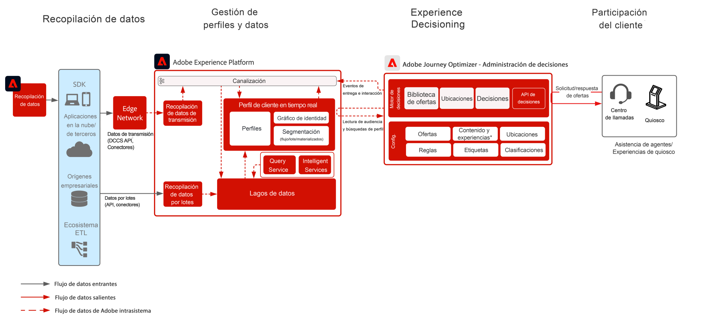
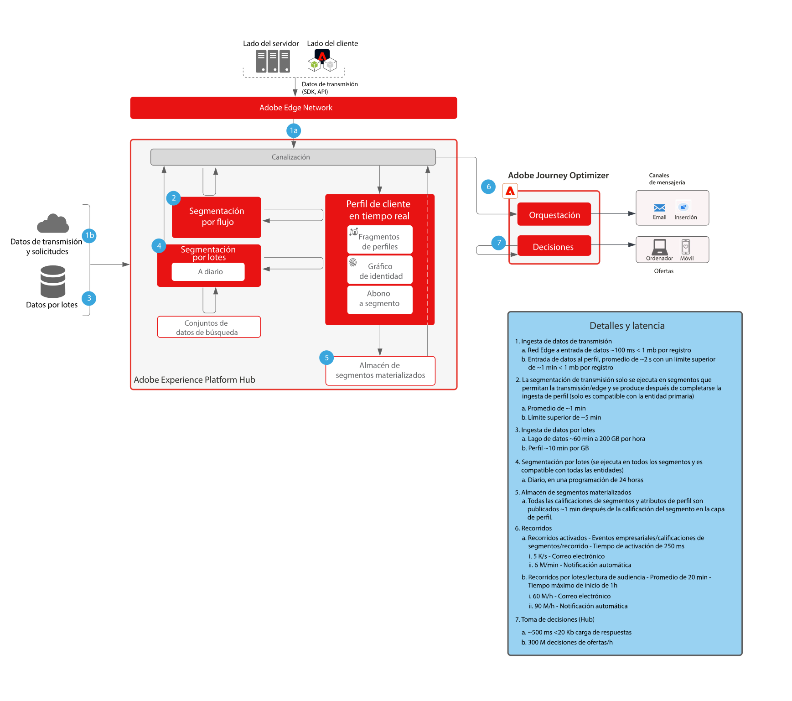

# Modelo de Gestión de decisiones en el centro

Para obtener más información sobre Gestión de decisiones, consulte la documentación del producto [AQUÍ](https://experienceleague.adobe.com/docs/journey-optimizer/using/offer-decisioniong/get-started-decision/starting-offer-decisioning.html?lang=es) y la Información general sobre Gestión de decisiones [AQUÍ](https://experienceleague.adobe.com/docs/blueprints-learn/architecture/customer-journeys/journey-optimizer/decision-management/decision-management-overview.html?lang=es)

Gestión de decisiones de Adobe es un servicio que se proporciona como parte de Adobe Journey Optimizer. Este modelo describe los casos de uso y las capacidades técnicas de la aplicación, y proporciona una explicación profunda de los diversos componentes y consideraciones sobre arquitectura que componen Gestión de decisiones.

Journey Optimizer se utiliza para ofrecer la mejor oferta y experiencia a sus clientes en todos los puntos de contacto y en el momento adecuado. Gestión de decisiones facilita la personalización con una biblioteca principal de ofertas de marketing y un motor de decisión que aplica reglas y restricciones a perfiles enriquecidos y en tiempo real creados por Adobe Experience Platform para ayudarle a enviar a sus clientes la oferta correcta en el momento adecuado.

Gestión de decisiones se puede implementar de una de las dos maneras siguientes. La primera es a través del hub de Adobe Experience Platform, que es una arquitectura de centro de datos central. En el enfoque «hub», las ofertas se ejecutan, personalizan y entregan con una latencia de más de 500 ms. Por lo tanto, la arquitectura del hub es la más adecuada para las experiencias de los clientes que no requieren latencia de subsegundo. Algunos ejemplos incluyen tomas de decisiones sobre ofertas que se proporcionan para los quioscos o experiencias asistidas por agentes, como en los centros de llamadas o en las interacciones personales. Las ofertas que se insertan en correos electrónicos y en campañas salientes también emplean el enfoque hub.

El segundo enfoque es a través de la red Experience Edge, que es una infraestructura distribuida globalmente y ubicada geográficamente para ofrecer experiencias rápidas de subsegundo y milisegundo. La experiencia del consumidor final que ejecuta la infraestructura de Edge más cercana a la ubicación geográfica del consumidor para minimizar la latencia. Gestión de decisiones en Edge está diseñado para ofrecer experiencias de consumidores en tiempo real, como solicitudes de personalización entrantes web o móviles.

Este modelo abarcará los aspectos específicos de Gestión de decisiones en el hub.

Para obtener más información sobre Gestión de decisiones en Edge, consulte el modelo [Gestión de decisiones en Edge](https://experienceleague.adobe.com/docs/blueprints-learn/architecture/customer-journeys/journey-optimizer/decision-management/decision-management-edge.html?lang=es).

## Casos de uso para Gestión de decisiones en el hub

* Ofertas personalizadas en quioscos y en experiencias de tienda.
* Ofertas personalizadas a través de la experiencia asistida por agentes, como centros de llamadas o interacciones de ventas.
* Ofertas incluidas en correos electrónicos, SMS, notificaciones push móviles u otras interacciones salientes.
* Proporcionar ofertas a proveedores de servicio externos y sistemas de mensajería para su envío.
* Ejecución de recorridos en varios canales: coherencia de ofertas en todos los canales de interacción web, móvil, correo electrónico y otros a través de Adobe Journey Optimizer.

 

## Arquitectura

 

## Prerrequisitos

Adobe Experience Platform

* Los esquemas y conjuntos de datos deben configurarse en el sistema para poder configurar las fuentes de datos de Journey Optimizer
* Para los esquemas basados en clases de eventos de experiencia, agregue el grupo de campos &#39;ID de evento de orquestación&#39; cuando desee que se active un evento que no sea un evento basado en reglas
* Para los esquemas basados en clases de perfil individual, agregue el grupo de campos &#39;Detalles de prueba de perfil&#39; para poder cargar perfiles de prueba para utilizarlos con Journey Optimizer

 

## Guardas

* Para obtener más información sobre las guardas de Journey Optimizer, consulte las [Guardas de Journey Optimizer](https://experienceleague.adobe.com/docs/journey-optimizer/using/get-started/limitations.html?lang=es).
* Si quiere información sobre las guardas de Gestión de decisiones, consulte la siguiente [Descripción del producto de Gestión de decisiones](https://helpx.adobe.com/es/legal/product-descriptions/offer-decisioning-app-service.html).
* Solicitudes por segundo =2000.
* Latencia de respuesta &lt;500ms.
* Acceso completo a Real-Time Customer Profile, lo que incluye las suscripciones a audiencias, atributos y eventos de experiencia.

### Guardas de ingesta de datos

 

### Guardas de activación

 

## Patrones de implementación

* Implementado en canales de correo electrónico, SMS y de salida mediante integración directa con [Adobe Journey Optimizer](https://experienceleague.adobe.com/docs/journey-optimizer/using/offer-decisioniong/get-started-decision/offers-e2e.html?lang=es).
* Para la implementación basada en API de servidor de Gestión de decisiones, aproveche la [API Decisioning](https://experienceleague.adobe.com/docs/journey-optimizer/using/offer-decisioniong/api-reference/offer-delivery/decisioning-vs-edge-apis.html?lang=es).
* Para la implementación de la toma de decisiones por lotes para entregar ofertas de forma masiva a una aplicación de entrega de mensajes, utilice la [API de Batch Decisioning](https://experienceleague.adobe.com/docs/journey-optimizer/using/offer-decisioniong/api-reference/offer-delivery/batch-decisioning-api.html?lang=es).
* Para experiencias en tiempo real basadas en Edge, utilice el SDK web/móvil o la API de Edge Decisioning como se describe en la sección [Gestión de decisiones en el modelo de Edge](https://experienceleague.adobe.com/docs/blueprints-learn/architecture/customer-journeys/journey-optimizer/decision-management/decision-management-edge.html?lang=es).
 

## Pasos de implementación

### Adobe Experience Platform

#### Esquemas/conjuntos de datos

1. [Configurar perfil individual, evento de experiencia y esquemas de identidad múltiple](https://experienceleague.adobe.com/?recommended=ExperiencePlatform-D-1-2021.1.xdm&amp;lang=es) según los datos ofrecidos por los clientes en Experience Platform.
1. [Crear conjuntos de datos](https://experienceleague.adobe.com/docs/platform-learn/tutorials/data-ingestion/create-datasets-and-ingest-data.html?lang=es) en Experience Platform para la ingesta.
1. [Añadir etiquetas de uso de datos](https://experienceleague.adobe.com/docs/platform-learn/tutorials/data-governance/classify-data-using-governance-labels.html?lang=es) al conjunto de datos de Experience Platform para la gobernanza.
1. [Crear políticas](https://experienceleague.adobe.com/docs/platform-learn/tutorials/data-governance/create-data-usage-policies.html?lang=es) que refuercen la gobernanza en los destinos.

#### Perfil/identidad

1. [Crear áreas de nombres específicas para los clientes](https://experienceleague.adobe.com/docs/platform-learn/tutorials/identities/label-ingest-and-verify-identity-data.html?lang=es).
1. [Añadir identidades a los esquemas](https://experienceleague.adobe.com/docs/platform-learn/tutorials/identities/label-ingest-and-verify-identity-data.html?lang=es).
1. [Activar los esquemas y los conjuntos de datos del perfil](https://experienceleague.adobe.com/docs/platform-learn/tutorials/profiles/bring-data-into-the-real-time-customer-profile.html?lang=es).
1. [Configurar políticas de fusión](https://experienceleague.adobe.com/docs/platform-learn/tutorials/profiles/create-merge-policies.html?lang=es) para diferenciar las vistas de [!UICONTROL Real-Time Customer Profile] (opcional).
1. Crear segmentos para el uso de Journey.

#### Orígenes/destinos

1. [Incorporar datos en Experience Platform](https://experienceleague.adobe.com/?recommended=ExperiencePlatform-D-1-2020.1.dataingestion&amp;lang=es) mediante API de flujo y conectores de origen.

## Documentación relacionada

* [Adobe Experience Platform](https://experienceleague.adobe.com/docs/experience-platform.html?lang=es)
* [Adobe Journey Optimizer](https://experienceleague.adobe.com/docs/journey-optimizer.html?lang=es)
* [Gestión de decisiones de Adobe Journey Optimizer](https://experienceleague.adobe.com/docs/journey-optimizer/using/offer-decisioniong/get-started-decision/starting-offer-decisioning.html?lang=es)
* [Descripción del producto Adobe Journey Optimizer](https://helpx.adobe.com/es/legal/product-descriptions/adobe-journey-optimizer.html)
* [Descripción del producto de Gestión de decisiones de Adobe](https://helpx.adobe.com/es/legal/product-descriptions/offer-decisioning-app-service.html)
