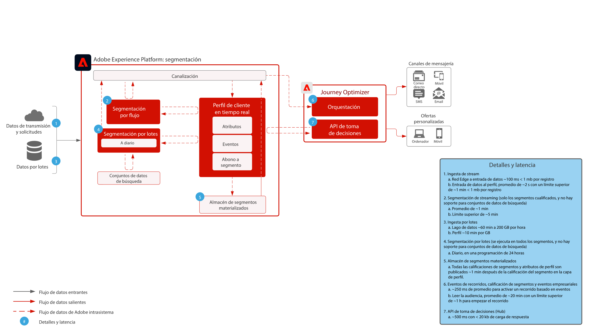

# Journey Optimizer

Adobe Journey Optimizer es un sistema diseñado específicamente para que los equipos de marketing reaccionen en tiempo real a los comportamientos de los clientes y se dirijan a ellos dondequiera que estén. Las funcionalidades de gestión de datos se han trasladado a Adobe Experience Platform, lo que permite a los equipos de marketing centrarse en lo mejor saben: generar conversaciones personalizadas y de recorrido del cliente de primera clase. Este modelo describe las capacidades técnicas de la aplicación y proporciona información detallada de los distintos componentes arquitectónicos que forman Adobe Journey Optimizer.

 

## Casos de uso

* Mensajes activados
* Confirmaciones de bienvenida y registro
* Abandonos del carro de compras y formulario de solicitud
* Mensajería activada por localización
* Experiencias en el estadio
* Experiencias de viaje y hospitalidad antes de la llegada y estancia

 

## Arquitectura

 

## Escenarios de modelo

| Escenario | Descripción | Competencias |
| :-- | :--- | :--- |
| [Mensajería de terceros](3rd-party-messaging.md) | Muestra cómo se puede utilizar Adobe Journey Optimizer con sistemas de mensajería de terceros para organizar y enviar comunicaciones personalizadas | Entregue comunicaciones personalizadas 1:1 en el momento a los clientes a medida que interactúan con su marca o empresa  Consideraciones: <ul><li>El sistema de terceros debe admitir tokens de portador para la autenticación</li><li>No hay compatibilidad con IP estáticas debido a la arquitectura de varios inquilinos</li><li>Tenga en cuenta las limitaciones arquitectónicas del sistema de terceros cuando se trata de llamadas API por segundo. Puede ser necesario que el cliente compre un volumen adicional del proveedor de terceros para admitir el volumen proveniente de Journey Optimizer</li><li>No admite Gestión de decisiones en mensajes o cargas útiles</li></ul> |

 

## Patrones de integración

| Integración | Descripción | Competencias |
| :-- | :--- | :--- |
| [Journey Optimizer con Adobe Campaign](ajo-and-campaign.md) | Muestra cómo puede utilizar Adobe Journey Optimizer para orquestar experiencias 1:1 utilizando el perfil del cliente en tiempo real y aprovechar el sistema de mensajería transaccional nativo de Adobe Campaign para enviar el mensaje | Aproveche el perfil de cliente en tiempo real y la potencia de Journey Optimizer para orquestar en el momento las experiencias mientras utiliza las capacidades nativas de mensajería en tiempo real de Adobe Campaign para realizar la comunicación de último momento  Consideraciones: <ul><li>La aplicación Campaign debe estar en la v7 >21.1 o v8</li><li>Rendimiento de mensajería</li><ul><li>Campaign v7: hasta 50 000 por hora</li><li>Campaign v8: hasta 1 millón por hora</li><li>Campaign Standard: hasta 50 000 por hora</li></ul><li>No se establece ninguna limitación, por lo que los casos de uso necesitan una revisión técnica de un arquitecto empresarial</li><li>No se admite la utilización de Gestión de decisiones en el mensaje enviado por Campaign</li></ul> |

 

## Prerrequisitos

Adobe Experience Platform

* Los esquemas y conjuntos de datos deben configurarse en el sistema para poder configurar las fuentes de datos de Journey Optimizer
* Para los esquemas basados en clases de eventos de experiencia, agregue el grupo de campos &#39;ID de evento de orquestación&#39; cuando desee que se active un evento que no sea un evento basado en reglas
* Para los esquemas basados en clases de perfil individual, agregue el grupo de campos &#39;Detalles de prueba de perfil&#39; para poder cargar perfiles de prueba para utilizarlos con Journey Optimizer

Correo electrónico

* Debe tener un subdominio listo para utilizarse en el envío de mensajes
* El subdominio se puede delegar completamente a Adobe (recomendado) o se pueden usar CNAME para señalar a servidores DNS específicos de Adobe (personalizado)
* Se necesita el registro TXT de Google para cada subdominio para garantizar una buena entrega

Push móvil

* El cliente debe tener un desarrollador móvil disponible para generar la aplicación
* SDK móvil de Adobe Experience Platform

 

## Guardas

[Vínculo del producto de guardas de Journey Optimizer](https://experienceleague.adobe.com/docs/journeys/using/starting-with-journeys/limitations.html?lang=es)

Tenga en cuenta estos elementos no incluidos en el vínculo anterior:

* Segmentos por lotes: debe conocer el volumen diario de usuarios adecuados y garantizar que el sistema de destino pueda soportar el pico de rendimiento por recorrido y durante todos los recorridos.
* Segmentos por flujo: debe asegurarse de que el pico inicial de calificaciones de perfil pueda gestionarse junto con el volumen de calificación de flujo diario por recorrido y durante todos los recorridos.
* Compatibilidad nativa con Gestión de decisiones solo en los mensajes (sin acciones personalizadas)
* Tipos de mensajes admitidos:
   * Correo electrónico
   * Push (FCM/APNS)
   * Acciones personalizadas (a través de la API Rest)
* Integraciones salientes a sistemas de terceros
   * No es compatible con una sola IP estática, ya que nuestra infraestructura es de varios inquilinos (debe realizar la lista de permitidos de todas las IP del centro de datos)
   * Solo se admiten métodos de PUT y POST para acciones personalizadas
   * Autenticación mediante usuario/contraseña o token de autorización
* No es posible empaquetar y mover componentes individuales de Adobe Experience Platform o Journey Optimizer entre varios entornos limitados. Debe volver a implementarse en nuevos entornos

### Guardas de ingesta de datos

 

### Guardas de activación

 

## Pasos de implementación

### Adobe Experience Platform

#### Esquemas/conjuntos de datos

1. [Configurar perfil individual, evento de experiencia y esquemas de identidad múltiple](https://experienceleague.adobe.com/?recommended=ExperiencePlatform-D-1-2021.1.xdm) según los datos ofrecidos por los clientes en Experience Platform.
1. [Crear conjuntos de datos](https://experienceleague.adobe.com/docs/platform-learn/tutorials/data-ingestion/create-datasets-and-ingest-data.html?lang=es) en Experience Platform para la ingesta.
1. [Añadir etiquetas de uso de datos](https://experienceleague.adobe.com/docs/platform-learn/tutorials/data-governance/classify-data-using-governance-labels.html?lang=es) al conjunto de datos de Experience Platform para la gobernanza.
1. [Crear políticas](https://experienceleague.adobe.com/docs/platform-learn/tutorials/data-governance/create-data-usage-policies.html?lang=es) que refuercen la gobernanza en los destinos.

#### Perfil/identidad

1. [Crear áreas de nombres específicas para los clientes](https://experienceleague.adobe.com/docs/platform-learn/tutorials/identities/label-ingest-and-verify-identity-data.html?lang=es).
1. [Añadir identidades a los esquemas](https://experienceleague.adobe.com/docs/platform-learn/tutorials/identities/label-ingest-and-verify-identity-data.html).
1. [Activar los esquemas y los conjuntos de datos del perfil](https://experienceleague.adobe.com/docs/platform-learn/tutorials/profiles/bring-data-into-the-real-time-customer-profile.html?lang=es).
1. [Configurar políticas de fusión](https://experienceleague.adobe.com/docs/platform-learn/tutorials/profiles/create-merge-policies.html?lang=es) para diferenciar las vistas de [!UICONTROL Real-time Customer Profile] (opcional).
1. Crear segmentos para el uso de Journey.

#### Origen/destino

1. [Incorporar datos en Experience Platform](https://experienceleague.adobe.com/?recommended=ExperiencePlatform-D-1-2020.1.dataingestion&amp;lang=es) mediante API de flujo y conectores de origen.

### Journey Optimizer

1. Configure la fuente de datos de Experience Platform y determine qué campos deben almacenarse en caché como parte de los datos profileStreaming utilizados para iniciar un recorrido del cliente. Primero debe configurarse en Journey Optimizer para obtener un ID de organización. Este ID de organización debe entregarse al desarrollador para usarse con la ingesta
1. Configure orígenes externos de datos.
1. Configure acciones personalizadas.

### Configuración push móvil

1. Implemente el SDK móvil de Experience Platform para recopilar tokens push e información de inicio de sesión con el fin de volver a perfiles de cliente conocidos
1. Aproveche las etiquetas de Adobe y cree una propiedad móvil con la siguiente extensión:
1. Adobe Journey Optimizer
1. Adobe Experience Platform Edge Network
1. Identidad  para Edge Network
1. Núcleo móvil
1. Asegúrese de tener un conjunto de datos dedicado para implementaciones de aplicaciones móviles vs. implementaciones web
1. Para obtener más información, siga la [Guía móvil de Adobe Journey Optimizer](https://aep-sdks.gitbook.io/docs/using-mobile-extensions/adobe-journey-optimizer)

## Documentación relacionada

* [Documentación de Experience Platform](https://experienceleague.adobe.com/docs/experience-platform.html?lang=es)
* [Documentación de las etiquetas de Experience Platform](https://experienceleague.adobe.com/docs/experience-platform/tags/home.html?lang=es)
* [Documentación del SDK móvil de Experience Platform](https://experienceleague.adobe.com/docs/mobile.html?lang=es)
* [Documentación de Journey Optimizer](https://experienceleague.adobe.com/docs/journey-optimizer/using/ajo-home.html?lang=es)
* [Descripción del producto Journey Optimizer](https://helpx.adobe.com/es/legal/product-descriptions/adobe-journey-optimizer.html)
