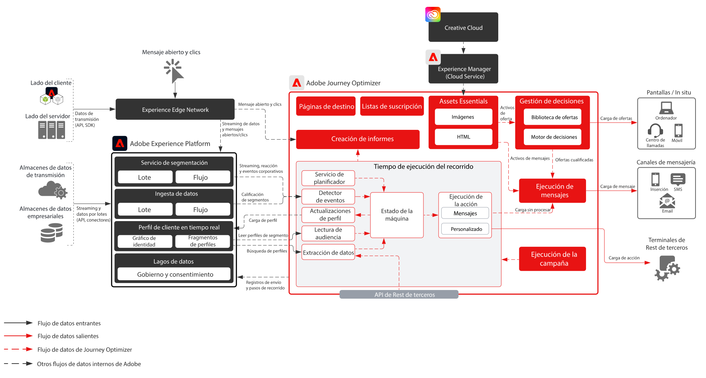

# [!DNL Journey Optimizer] modelos

El Adobe [!DNL Journey Optimizer] es un sistema creado específicamente para que los equipos de marketing reaccionen en tiempo real a los comportamientos de los clientes y los cumplan allí donde se encuentren. Las funcionalidades de administración de datos se han trasladado al Adobe [!DNL Experience Platform], lo que permite a los equipos de marketing centrarse en lo que mejor saben hacer: crear recorridos de clientes de primer nivel y conversaciones personalizadas.

Este modelo describe las capacidades técnicas de la aplicación y proporciona una explicación detallada de los distintos componentes de arquitectura que conforman [!DNL Journey Optimizer].

## Casos de uso

* Mensajes activados
* Confirmaciones de bienvenida y registro
* Abandonos del carro de compras y formulario de solicitud
* Mensajería activada por localización
* Experiencias en el estadio
* Experiencias de viaje y hospitalidad antes de la llegada y estancia

## Arquitectura

## Escenarios de modelo

| Escenario | Descripción | Competencias |
| :-- | :--- | :--- |
| [Mensajería de terceros](3rd-party-messaging.md) | Muestra cómo se puede utilizar el Adobe [!DNL Journey Optimizer] con sistemas de mensajería de terceros para organizar y enviar comunicaciones personalizadas | Entregue comunicaciones personalizadas 1:1 en el momento a los clientes a medida que interactúan con su marca o empresa  Consideraciones: <ul><li>El sistema de terceros debe admitir tokens de portador para la autenticación</li><li>No hay compatibilidad con IP estáticas debido a la arquitectura de varios inquilinos</li><li>Tenga en cuenta las limitaciones arquitectónicas del sistema de terceros cuando se trata de llamadas API por segundo. Puede ser necesario que el cliente compre volumen adicional del proveedor de terceros para admitir el volumen procedente de [!DNL Journey Optimizer]</li><li>No admite Gestión de decisiones en mensajes o cargas útiles</li></ul> |

 

## Patrones de integración

| Integración | Descripción | Competencias |
| :-- | :--- | :--- |
| [[!DNL Journey Optimizer] con Adobe Campaign](ajo-and-campaign.md) | Muestra cómo puede usar el Adobe [!DNL Journey Optimizer] para orquestar experiencias 1:1 mediante el Perfil del cliente en tiempo real y aprovechar el sistema nativo de mensajería transaccional de Adobe Campaign para enviar el mensaje | Aproveche el perfil del cliente en tiempo real y la potencia de [!DNL Journey Optimizer] para orquestar las experiencias del momento mientras utiliza las capacidades nativas de mensajería en tiempo real de Adobe Campaign para realizar la comunicación de la última milla  Consideraciones: <ul><li>La aplicación Campaign debe estar en la v7 >21.1 o v8</li><li>Rendimiento de mensajería</li><ul><li>Campaign v7: hasta 50 000 por hora</li><li>Campaign v8: hasta 1 millón por hora</li><li>Campaign Standard: hasta 50 000 por hora</li></ul><li>No se establece ninguna limitación, por lo que los casos de uso necesitan una revisión técnica de un arquitecto empresarial</li><li>No se admite la utilización de Gestión de decisiones en el mensaje enviado por Campaign</li></ul> |

 

## Prerrequisitos

Adobe [!DNL Experience Platform]:

* Los esquemas y conjuntos de datos deben configurarse en el sistema para poder configurar [!DNL Journey Optimizer] orígenes de datos
* Para los esquemas basados en clases de eventos de experiencia, agregue el grupo de campos &#39;ID de evento de orquestación&#39; cuando desee que se active un evento que no sea un evento basado en reglas
* Para esquemas basados en clases de Perfil individual, agregue el grupo de campos &quot;Detalles de prueba de perfil&quot; para poder cargar perfiles de prueba para usarlos con [!DNL Journey Optimizer]

Correo electrónico:

* Debe tener un subdominio listo para utilizarse en el envío de mensajes
* El subdominio se puede delegar completamente a Adobe (recomendado) o se pueden usar CNAME para señalar a servidores DNS específicos de Adobe (personalizado)
* Se necesita el registro TXT de Google para cada subdominio para garantizar una buena entrega

Inserción móvil:

* El cliente debe tener un desarrollador móvil disponible para generar la aplicación
* SDK móvil de Adobe Experience Platform

## Guardas

[[!DNL Journey Optimizer] Vínculo de producto de protecciones](https://experienceleague.adobe.com/en/docs/journey-optimizer/using/get-started/guardrails)

[Protecciones y guía de latencia de extremo a extremo](https://experienceleague.adobe.com/docs/blueprints-learn/architecture/architecture-overview/deployment/guardrails.html)

## Documentación relacionada

* [[!DNL Experience Platform] documentación](https://experienceleague.adobe.com/docs/experience-platform.html?lang=es)
* [[!DNL Experience Platform] Documentación de etiquetas](https://experienceleague.adobe.com/docs/experience-platform/tags/home.html?lang=es)
* [[!DNL Experience Platform Mobile SDK] documentación](https://experienceleague.adobe.com/docs/mobile.html?lang=es)
* [[!DNL Journey Optimizer] documentación](https://experienceleague.adobe.com/docs/journey-optimizer/using/ajo-home.html?lang=es)
* [[!DNL Journey Optimizer] descripción del producto](https://helpx.adobe.com/es/legal/product-descriptions/adobe-journey-optimizer.html)
