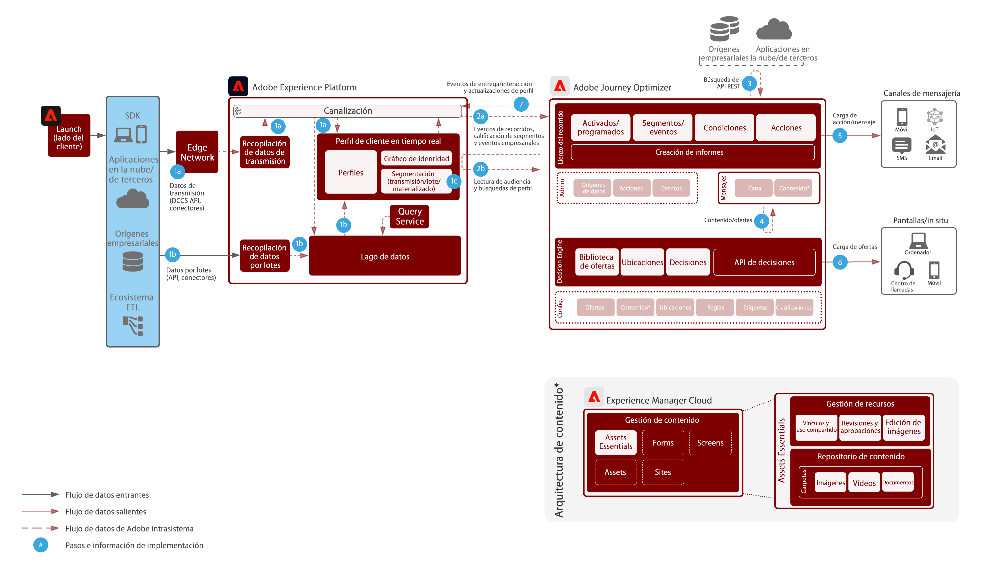

# Journey Optimizer

Adobe Journey Optimizer es un sistema diseñado específicamente para que los equipos de marketing reaccionen en tiempo real a los comportamientos de los clientes y se dirijan a ellos dondequiera que estén. Las funcionalidades de gestión de datos se han trasladado a Adobe Experience Platform, lo que permite a los equipos de marketing centrarse en lo mejor saben: generar conversaciones personalizadas y de recorrido del cliente de primera clase.  Este modelo describe las capacidades técnicas de la aplicación y proporciona información detallada de los distintos componentes arquitectónicos que forman Adobe Journey Optimizer.

## Casos de uso

* Mensajes activados
* Confirmaciones de registro
* Abandonos del carro de compras y formulario de solicitud
* Mensajería activada por localización

## Arquitectura

## Patrones de integración

* Adobe Experience Platform -> Journey Optimizer

## Prerrequisitos

1. El cliente debe poder acceder a Experience Cloud con una organización IMS válida
1. Push móvil

* El cliente debe tener un desarrollador móvil disponible para generar la aplicación
* SDK móvil de Adobe Experience Platform
* Recopilación de datos
   * Propiedad de etiquetas móviles
      * Extensiones:
         * Extensión de Adobe Journey Optimizer
         * Adobe Experience Platform Edge Network
         * Identidad
         * Núcleo móvil
         * Perfil
   * Configuraciones de aplicaciones
   * Flujos de datos
      * Habilitado para Experience Platform
      * Conjunto de datos de evento: se utiliza para recopilar el comportamiento móvil general.
      * Conjunto de datos de perfil: conjunto de datos de perfil push de AJO (no puede ser diferente)

## Guardas

* Consulte este vínculo para obtener más información sobre los guardas de Journey Optimizer [LINK](https://experienceleague.adobe.com/docs/journeys/using/starting-with-journeys/limitations.html?lang=es)
* Segmentos por lotes: debe conocer el volumen diario de usuarios adecuados y garantizar que el sistema de destino pueda soportar el pico de rendimiento por recorrido y durante todos los recorridos.
* Segmentos por flujo: debe asegurarse de que el pico inicial de calificaciones de perfil pueda gestionarse junto con el volumen de calificación de flujo diario por recorrido y durante todos los recorridos.
* Actividad de actualización de perfil: el perfil de cliente en tiempo real se puede actualizar de forma nativa en un recorrido.  Se produce un retraso de hasta 1 minuto al procesar la actualización en el almacén de perfiles
* Eventos empresariales: se puede activar un recorrido basado en segmentos de lectura para que comience a partir de una llamada externa al sistema de JO.
* De forma nativa, solo admite Offer Decisioning en mensajes. Compatibilidad futura a través de acción nativa
* Canales admitidos:
   * Correo electrónico
   * Push (FCM/APNS)
   * Puntos finales de API Rest
* Procesa 5000 eventos por segundo con escalado horizontal (la cartera es una limitación)
* Las pruebas A/B se realizan utilizando dos envíos y determinando los resultados mediante QS o CJA
* Integración de Litmus: debe tener una cuenta de Litmus para aprovecharse de la integración

## Pasos de implementación

### Adobe Experience Platform

#### Esquemas/conjuntos de datos

1. [Configurar perfil individual, evento de experiencia y esquemas de identidad múltiple](https://experienceleague.adobe.com/?recommended=ExperiencePlatform-D-1-2021.1.xdm) según los datos ofrecidos por los clientes en Experience Platform.
1. Crear esquemas de Adobe Campaign para: broadLog, trackingLog, direcciones no entregables y preferencias de perfil (opcional).
1. [Crear conjuntos de datos](https://experienceleague.adobe.com/docs/platform-learn/tutorials/data-ingestion/create-datasets-and-ingest-data.html?lang=es) en Experience Platform para la ingesta.
1. [Añadir etiquetas de uso de datos](https://experienceleague.adobe.com/docs/platform-learn/tutorials/data-governance/classify-data-using-governance-labels.html?lang=es) al conjunto de datos de Experience Platform para la gobernanza.
1. [Crear políticas](https://experienceleague.adobe.com/docs/platform-learn/tutorials/data-governance/create-data-usage-policies.html?lang=es) que refuercen la gobernanza en los destinos.

#### Perfil/identidad

1. [Crear áreas de nombres específicas para los clientes](https://experienceleague.adobe.com/docs/platform-learn/tutorials/identities/label-ingest-and-verify-identity-data.html?lang=es).
1. [Añadir identidades a los esquemas](https://experienceleague.adobe.com/docs/platform-learn/tutorials/identities/label-ingest-and-verify-identity-data.html).
1. [Activar los esquemas y los conjuntos de datos del perfil](https://experienceleague.adobe.com/docs/platform-learn/tutorials/profiles/bring-data-into-the-real-time-customer-profile.html?lang=es).
1. [Configurar políticas de fusión](https://experienceleague.adobe.com/docs/platform-learn/tutorials/profiles/create-merge-policies.html?lang=es) para diferenciar las vistas de [!UICONTROL Real-time Customer Profile] (opcional).
1. Crear segmentos para el uso en campañas.

#### Origen/destino

1. [Realizar la ingesta de datos en Experience Platform](https://experienceleague.adobe.com/?recommended=ExperiencePlatform-D-1-2020.1.dataingestion&amp;lang=es) utilizando las API de flujo y conectores de origen.1. Configurar el destino de almacenamiento de los blobs de [!DNL Azure] para su uso con Adobe Campaign.

#### Implementación de aplicaciones móviles

1. Implementar el SDK de Adobe Campaign de Adobe Campaign Classic o el SDK Experience Platform de Adobe Campaign Standard. En el caso de contar con Experience Platform Launch, recomendamos utilizar la extensión de Adobe Campaign Classic o Adobe Campaign Standard con el SDK de Experience Platform.

### Journey Orchestration

1. El flujo de datos utilizado para iniciar el recorrido del cliente debe configurarse primero en Journey Optimizer para obtener un ID de organización. Este ID de organización debe entregarse al desarrollador para usarse con la ingesta.
1. Configurar orígenes externos de datos.
1. Configurar acciones personalizadas.

## Documentación relacionada

* [Documentación de Adobe Experience Platform](https://experienceleague.adobe.com/docs/experience-platform.html?lang=es)
* [Documentación de Journey Optimizer](https://experienceleague.adobe.com/docs/journey-optimizer/using/ajo-home.html?lang=es)
* [Documentación de Experience Platform Launch](https://experienceleague.adobe.com/docs/launch.html?lang=es)
* [Documentación del SDK Experience Platform Mobile](https://experienceleague.adobe.com/docs/mobile.html?lang=es)
