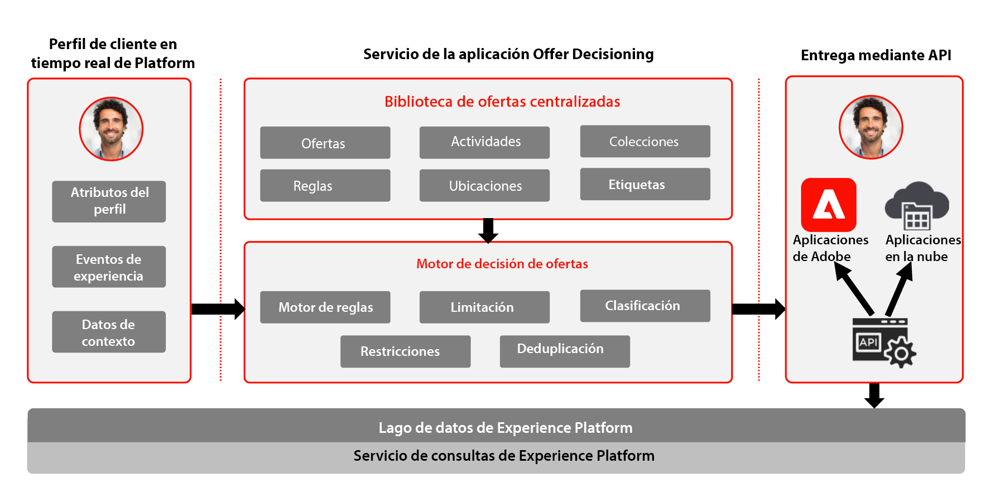

# Journey Optimizer: Información general del Offer decisioning

Para obtener más información sobre la gestión de decisiones, consulte la documentación del producto [AQUÍ](https://experienceleague.adobe.com/docs/journey-optimizer/using/offer-decisioniong/get-started-decision/starting-offer-decisioning.html)

Administración de decisiones de Adobe es un servicio que se proporciona como parte de Adobe Journey Optimizer. Este modelo describe los casos de uso y las capacidades técnicas de la aplicación y proporciona una explicación profunda de los diversos componentes y consideraciones arquitectónicos que componen el Offer decisioning.

Journey Optimizer se utiliza para ofrecer la mejor oferta y experiencia a sus clientes en todos los puntos de contacto y en el momento adecuado. El offer decisioning facilita la personalización con una biblioteca central de ofertas de marketing y un motor de decisión que aplica reglas y restricciones a perfiles enriquecidos y en tiempo real creados por Adobe Experience Platform para ayudarle a enviar a sus clientes la oferta correcta en el momento adecuado.

La capacidad de gestión de decisiones consta de dos componentes principales:

* Biblioteca de ofertas centralizada, que es la interfaz en la que se crean y administran los distintos elementos que componen las ofertas, y se definen sus reglas y restricciones.
* El motor de decisión de ofertas que aprovecha los datos de Adobe Experience Platform y los perfiles del cliente en tiempo real, junto con la biblioteca de ofertas, para seleccionar el momento, los clientes y los canales adecuados a los que se enviarán las ofertas.

La Administración de decisiones se puede implementar de una de las dos maneras siguientes, en el perímetro o a través del concentrador. Cada uno de estos métodos tiene un conjunto específico de interfaces y protocolos para operar el servicio como se describe en los respectivos modelos a los que se hace referencia a continuación. También pueden obtenerse más detalles en la documentación de gestión de decisiones [AQUÍ](https://experienceleague.adobe.com/docs/journey-optimizer/using/offer-decisioniong/api-reference/offer-delivery-api/decisioning-vs-edge-apis.html).

## Gestión de decisiones en el centro

La primera es a través del concentrador de Adobe Experience Platform, que es una arquitectura de centro de datos central. En el enfoque &quot;hub&quot;, las ofertas se ejecutan, personalizan y entregan en >500 ms de latencia. Por lo tanto, la arquitectura de concentrador es la más adecuada para las experiencias de los clientes que no requieren latencia de subsegundo, los ejemplos incluyen decisiones de oferta que se proporcionan para los quioscos o experiencias asistidas por el agente, como en los centros de llamadas o en las interacciones personales. Las ofertas que se insertan en correos electrónicos, mensajes SMS o notificaciones push y otras campañas salientes también se impulsan mediante el enfoque de concentrador. Para obtener más información sobre la gestión de decisiones en el centro, consulte [Gestión de decisiones en el centro](https://experienceleague.adobe.com/docs/blueprints-learn/architecture/customer-journeys/journey-optimizer/offer-decisioning/offers-hub.html?lang=en) modelo.

### Casos de uso para la gestión de decisiones en el centro

* Ofertas personalizadas en quioscos y en experiencias de tienda.
* Ofertas personalizadas a través de la experiencia asistida por el agente, como centros de llamadas o interacciones de ventas.
* Ofertas incluidas en correos electrónicos, SMS u otras interacciones salientes.
* Ejecución de recorridos en varios canales : ofrece coherencia en todos los canales de interacción web, móvil, correo electrónico y otros a través de Adobe Journey Optimizer.

## Administración de decisiones en el perímetro

El segundo método es a través de la red Experience Edge, que es una infraestructura distribuida globalmente y ubicada geográficamente para ofrecer experiencias rápidas de subsegundo y milisegundo. La experiencia del consumidor final que ejecuta la infraestructura perimetral más cercana a la ubicación geográfica del consumidor para minimizar la latencia. La administración de decisiones en Edge está diseñada para ofrecer experiencias de consumidores en tiempo real, como solicitudes de personalización entrantes web o móviles. Para obtener más información sobre la administración de decisiones en Edge, consulte la [Administración de decisiones en el perímetro](https://experienceleague.adobe.com/docs/blueprints-learn/architecture/customer-journeys/journey-optimizer/offer-decisioning/offers-edge.html?lang=en) modelo.

### Casos de uso para la gestión de decisiones en Edge

* Personalización en línea mediante experiencias entrantes web o móviles.
* Ejecución de recorridos en varios canales : ofrece coherencia en todos los canales de interacción web, móvil, correo electrónico y otros a través de Adobe Journey Optimizer.

## Documentación relacionada

* [Adobe Experience Platform](https://experienceleague.adobe.com/docs/experience-platform.html)
* [Adobe Journey Optimizer](https://experienceleague.adobe.com/docs/journey-optimizer.html)
* [Administración de decisiones de Adobe Journey Optimizer](https://experienceleague.adobe.com/docs/journey-optimizer/using/offer-decisioniong/get-started-decision/starting-offer-decisioning.html)
* [Descripción del producto de Adobe Journey Optimizer](https://helpx.adobe.com/es/legal/product-descriptions/adobe-journey-optimizer.html)
* [Descripción del producto del Offer decisioning de Adobe](https://helpx.adobe.com/legal/product-descriptions/offer-decisioning-app-service.html)
