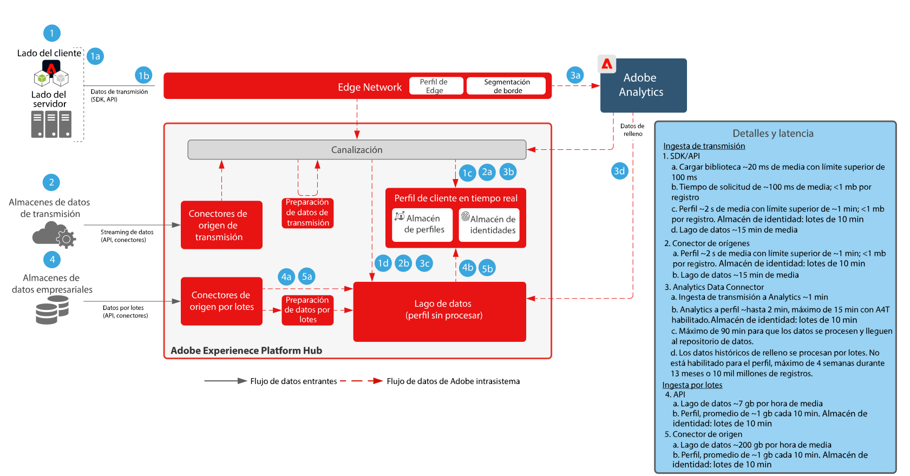

# Modelo de preparación e ingesta de datos

Modelo de preparación e ingesta de datos incluye todos los métodos mediante los cuales se pueden preparar e ingerir datos en el Adobe [!DNL Experience Platform].

La preparación de datos incluye mapear los datos de origen en el esquema del Modelo de datos de experiencia (XDM). También incluye realizar transformaciones de datos, como dar formato a las fechas, unir/concatenar/convertir campos o unir/fusionar/reescribir registros. La preparación de datos ayuda a unificar la información del cliente, lo que ofrece un análisis agregado/filtrado, incluyendo la creación de informes o la preparación de datos para el ensamblaje/ciencia de datos/activación de perfiles de los clientes.

## Arquitectura

## Guardas de ingesta de datos

El diagrama siguiente ilustra las protecciones de rendimiento promedio y la latencia para la ingesta de datos en el Adobe [!DNL Experience Platform].

## Métodos de ingesta de datos

<table cellspacing="0" class="Table" style="border-collapse:collapse; width:1123px">
<tbody>
<tr>
<td colspan="4" style="background-color:#308fff; border-bottom:4px solid white; border-left:1px solid white; border-right:1px solid white; border-top:1px solid white; height:31px; vertical-align:top; width:1123px">

<strong>Orígenes de flujo</strong>

</td>
</tr>
<tr>
<td style="background-color:#969696; border-bottom:1px solid white; border-left:1px solid white; border-right:1px solid white; border-top:none; height:20px; vertical-align:top; width:222px">

Método

</td>
<td style="background-color:#969696; border-bottom:1px solid white; border-left:none; border-right:1px solid white; border-top:none; height:20px; vertical-align:top; width:401px">

Casos de uso comunes

</td>
<td style="background-color:#969696; border-bottom:1px solid white; border-left:none; border-right:1px solid white; border-top:none; height:20px; vertical-align:top; width:218px">

Protocolos

</td>
<td style="background-color:#969696; border-bottom:1px solid white; border-left:none; border-right:1px solid white; border-top:none; height:20px; vertical-align:top; width:282px">

Consideraciones

</td>
</tr>
<tr>
<td style="background-color:#e8eeff; border-bottom:1px solid white; border-left:1px solid white; border-right:1px solid white; border-top:none; height:39px; vertical-align:top; width:222px">

<a href="https://experienceleague.adobe.com/docs/experience-platform/edge/home.html?lang=es" style="color:#0563c1; text-decoration:underline">SDK web/móvil de Adobe</a>

</td>
<td style="background-color:#e8eeff; border-bottom:1px solid white; border-left:none; border-right:1px solid white; border-top:none; height:39px; vertical-align:top; width:401px">
<ul style="list-style-type:square">
<li>Recopilación de datos de sitios web y aplicaciones móviles.</li>
<li>Método preferido para la recopilación del lado del cliente.</li>
</ul>
</td>
<td style="background-color:#e8eeff; border-bottom:1px solid white; border-left:none; border-right:1px solid white; border-top:none; height:39px; vertical-align:top; width:218px">

Push, HTTP, JSON

</td>
<td style="background-color:#e8eeff; border-bottom:1px solid white; border-left:none; border-right:1px solid white; border-top:none; height:39px; vertical-align:top; width:282px">
<ul>
<li>Implemente varias aplicaciones de Adobe utilizando un único SDK.</li>
</ul>
</td>
</tr>
<tr>
<td style="background-color:#cddbff; border-bottom:1px solid white; border-left:1px solid white; border-right:1px solid white; border-top:none; height:39px; vertical-align:top; width:222px">

<a href="https://experienceleague.adobe.com/docs/experience-platform/sources/ui-tutorials/create/streaming/http.html?lang=es" style="color:#0563c1; text-decoration:underline">Conector de API HTTP</a>

</td>
<td style="background-color:#cddbff; border-bottom:1px solid white; border-left:none; border-right:1px solid white; border-top:none; height:39px; vertical-align:top; width:401px">
<ul style="list-style-type:square">
<li>Recopilación a partir de orígenes de flujo, transacciones, eventos relevantes del cliente y señales</li>
</ul>
</td>
<td style="background-color:#cddbff; border-bottom:1px solid white; border-left:none; border-right:1px solid white; border-top:none; height:39px; vertical-align:top; width:218px">

Push, API de REST, JSON

</td>
<td style="background-color:#cddbff; border-bottom:1px solid white; border-left:none; border-right:1px solid white; border-top:none; height:39px; vertical-align:top; width:282px">
<ul>
<li>Los datos se transmiten directamente al hub, por lo que no hay segmentación en tiempo real de Edge ni reenvío de eventos.</li>
</ul>
</td>
</tr>
<tr>
<td style="background-color:#e8eeff; border-bottom:1px solid white; border-left:1px solid white; border-right:1px solid white; border-top:none; height:39px; vertical-align:top; width:222px">

<a href="https://experienceleague.adobe.com/docs/experience-platform/edge-network-server-api/data-collection/interactive-data-collection.html?lang=es" style="color:#0563c1; text-decoration:underline">[!DNL Edge Network] API</a>

</td>
<td style="background-color:#e8eeff; border-bottom:1px solid white; border-left:none; border-right:1px solid white; border-top:none; height:39px; vertical-align:top; width:401px">
<ul style="list-style-type:square">
<li>Recopilación de fuentes de flujo continuo, transacciones, eventos de clientes relevantes y señales de la distribución global [!DNL Edge Network]</li>
</ul>
</td>
<td style="background-color:#e8eeff; border-bottom:1px solid white; border-left:none; border-right:1px solid white; border-top:none; height:39px; vertical-align:top; width:218px">

Push, API de REST, JSON

</td>
<td style="background-color:#e8eeff; border-bottom:1px solid white; border-left:none; border-right:1px solid white; border-top:none; height:39px; vertical-align:top; width:282px">
<ul>
<li>Los datos se transmiten a través de [!DNL Edge Network]. Es compatible con la segmentación en tiempo real en Edge. </li>
</ul>
</td>
</tr>
<tr>
<td style="background-color:#cddbff; border-bottom:1px solid white; border-left:1px solid white; border-right:1px solid white; border-top:none; height:39px; vertical-align:top; width:222px">

<a href="https://experienceleague.adobe.com/docs/experience-platform/sources/connectors/adobe-applications/analytics.html?lang=es" style="color:#0563c1; text-decoration:underline">Aplicaciones de Adobe</a>

</td>
<td style="background-color:#cddbff; border-bottom:1px solid white; border-left:none; border-right:1px solid white; border-top:none; height:39px; vertical-align:top; width:401px">
<ul style="list-style-type:square">
<li>Implementación previa de Adobe Analytics, Marketo, Campaign, Target, AAM</li>
</ul>
</td>
<td style="background-color:#cddbff; border-bottom:1px solid white; border-left:none; border-right:1px solid white; border-top:none; height:39px; vertical-align:top; width:218px">

Push, conectores de origen y API

</td>
<td style="background-color:#cddbff; border-bottom:1px solid white; border-left:none; border-right:1px solid white; border-top:none; height:39px; vertical-align:top; width:282px">
<ul>
<li>El enfoque recomendado es la migración al SDK web/móvil en lugar de los SDK de aplicaciones tradicionales.</li>
</ul>
</td>
</tr>
<tr>
<td style="background-color:#e8eeff; border-bottom:1px solid white; border-left:1px solid white; border-right:1px solid white; border-top:none; height:39px; vertical-align:top; width:222px">

<a href="https://experienceleague.adobe.com/docs/experience-platform/ingestion/streaming/overview.html?lang=es" style="color:#0563c1; text-decoration:underline">Conectores de origen de streaming</a>

</td>
<td style="background-color:#e8eeff; border-bottom:1px solid white; border-left:none; border-right:1px solid white; border-top:none; height:39px; vertical-align:top; width:401px">
<ul style="list-style-type:square">
<li>Ingesta de un flujo de eventos empresariales, que normalmente se utiliza para compartir datos empresariales en varias aplicaciones de flujo descendente. </li>
</ul>
</td>
<td style="background-color:#e8eeff; border-bottom:1px solid white; border-left:none; border-right:1px solid white; border-top:none; height:39px; vertical-align:top; width:218px">

Push, API de REST, JSON

</td>
<td style="background-color:#e8eeff; border-bottom:1px solid white; border-left:none; border-right:1px solid white; border-top:none; height:39px; vertical-align:top; width:282px">
<ul>
<li>Se debe transmitir en formato XDM.</li>
</ul>
</td>
</tr>
<tr>
<td style="background-color:#cddbff; border-bottom:1px solid white; border-left:1px solid white; border-right:1px solid white; border-top:none; height:39px; vertical-align:top; width:222px">

SDK de orígenes de flujo

</td>
<td style="background-color:#cddbff; border-bottom:1px solid white; border-left:none; border-right:1px solid white; border-top:none; height:39px; vertical-align:top; width:401px">
<ul style="list-style-type:square">
<li>Al igual que el conector de API HTTP, permite la tarjeta de configuración de autoservicio de un flujo de datos externo.</li>
</ul>
</td>
<td style="background-color:#cddbff; border-bottom:1px solid white; border-left:none; border-right:1px solid white; border-top:none; height:39px; vertical-align:top; width:218px">

Push, API HTTP, JSON

</td>
<td style="background-color:#cddbff; border-bottom:1px solid white; border-left:none; border-right:1px solid white; border-top:none; height:39px; vertical-align:top; width:282px">
<ul>
<li>[!DNL Edge Network]</li>
</ul>
</td>
</tr>
</tbody>
</table>

<table cellspacing="0" class="Table" style="border-collapse:collapse; width:1105px">
<tbody>
<tr>
<td colspan="4" style="background-color:#308fff; border-bottom:4px solid white; border-left:1px solid white; border-right:1px solid white; border-top:1px solid white; height:37px; vertical-align:top; width:1105px">

<strong>Orígenes por lote</strong>

</td>
</tr>
<tr>
<td style="background-color:#969696; border-bottom:1px solid white; border-left:1px solid white; border-right:1px solid white; border-top:none; height:34px; vertical-align:top; width:217px">

Método

</td>
<td style="background-color:#969696; border-bottom:1px solid white; border-left:none; border-right:1px solid white; border-top:none; height:34px; vertical-align:top; width:397px">

Casos de uso comunes

</td>
<td style="background-color:#969696; border-bottom:1px solid white; border-left:none; border-right:1px solid white; border-top:none; height:34px; vertical-align:top; width:215px">

Protocolos

</td>
<td style="background-color:#969696; border-bottom:1px solid white; border-left:none; border-right:1px solid white; border-top:none; height:34px; vertical-align:top; width:277px">

Consideraciones

</td>
</tr>
<tr>
<td style="background-color:#e8eeff; border-bottom:1px solid white; border-left:1px solid white; border-right:1px solid white; border-top:none; height:62px; vertical-align:top; width:217px">

<a href="https://experienceleague.adobe.com/docs/experience-platform/ingestion/batch/getting-started.html?lang=es" style="color:#0563c1; text-decoration:underline">API de ingesta por lotes</a>

</td>
<td style="background-color:#e8eeff; border-bottom:1px solid white; border-left:none; border-right:1px solid white; border-top:none; height:62px; vertical-align:top; width:397px">
<ul style="list-style-type:square">
<li>Ingesta de una empresa administrada. Limpieza y transformación de datos antes de su ingesta.</li>
</ul>
</td>
<td style="background-color:#e8eeff; border-bottom:1px solid white; border-left:none; border-right:1px solid white; border-top:none; height:62px; vertical-align:top; width:215px">

Push, JSON o Parquet

</td>
<td style="background-color:#e8eeff; border-bottom:1px solid white; border-left:none; border-right:1px solid white; border-top:none; height:62px; vertical-align:top; width:277px">
<ul>
<li>Debe administrar lotes y archivos para la ingesta</li>
</ul>
</td>
</tr>
<tr>
<td style="background-color:#cddbff; border-bottom:1px solid white; border-left:1px solid white; border-right:1px solid white; border-top:none; height:62px; vertical-align:top; width:217px">

<a href="https://experienceleague.adobe.com/docs/experience-platform/sources/connectors/cloud-storage/blob-s3.html?lang=es" style="color:#0563c1; text-decoration:underline">Conectores de origen por lotes</a>

</td>
<td style="background-color:#cddbff; border-bottom:1px solid white; border-left:none; border-right:1px solid white; border-top:none; height:62px; vertical-align:top; width:397px">
<ul style="list-style-type:square">
<li>Enfoque común para la ingesta de archivos desde ubicaciones de almacenamiento en la nube.</li>
<li>Conectores para aplicaciones comunes de CRM y marketing.</li>
<li>Ideal para la ingesta de grandes cantidades de datos históricos.</li>
</ul>
</td>
<td style="background-color:#cddbff; border-bottom:1px solid white; border-left:none; border-right:1px solid white; border-top:none; height:62px; vertical-align:top; width:215px">

Pull, CSV, JSON, Parquet

</td>
<td style="background-color:#cddbff; border-bottom:1px solid white; border-left:none; border-right:1px solid white; border-top:none; height:62px; vertical-align:top; width:277px">
<ul>
<li>No está siempre activado, ingesta inmediata. </li>
</ul>
</td>
</tr>
<tr>
<td style="background-color:#e8eeff; border-bottom:1px solid white; border-left:1px solid white; border-right:1px solid white; border-top:none; height:62px; vertical-align:top; width:217px">

<a href="https://experienceleague.adobe.com/docs/experience-platform/sources/connectors/cloud-storage/data-landing-zone.html?lang=es" style="color:#0563c1; text-decoration:underline">Data Landing Zone</a>

</td>
<td style="background-color:#e8eeff; border-bottom:1px solid white; border-left:none; border-right:1px solid white; border-top:none; height:62px; vertical-align:top; width:397px">
<ul style="list-style-type:square">
<li>Ubicación de almacenamiento de archivos aprovisionada por Adobe a la que enviar los archivos para su ingesta.</li>
</ul>
</td>
<td style="background-color:#e8eeff; border-bottom:1px solid white; border-left:none; border-right:1px solid white; border-top:none; height:62px; vertical-align:top; width:215px">

Push, CSV, JSON, Parquet

</td>
<td style="background-color:#e8eeff; border-bottom:1px solid white; border-left:none; border-right:1px solid white; border-top:none; height:62px; vertical-align:top; width:277px">
</td>
</tr>
<tr>
<td style="background-color:#cddbff; border-bottom:1px solid white; border-left:1px solid white; border-right:1px solid white; border-top:none; height:62px; vertical-align:top; width:217px">

<a href="https://experienceleague.adobe.com/docs/experience-platform/sources/sdk/overview.html?lang=es" style="color:#0563c1; text-decoration:underline">SDK de orígenes por lote</a>

</td>
<td style="background-color:#cddbff; border-bottom:1px solid white; border-left:none; border-right:1px solid white; border-top:none; height:62px; vertical-align:top; width:397px">
<ul style="list-style-type:square">
<li>Permite la tarjeta de configuración de autoservicio de una fuente de datos externa.</li>
<li>Ideal para conectores de socios o para una experiencia de flujo de trabajo adaptada para configurar un conector de empresa.</li>
</ul>
</td>
<td style="background-color:#cddbff; border-bottom:1px solid white; border-left:none; border-right:1px solid white; border-top:none; height:62px; vertical-align:top; width:215px">

Archivos de pull, API de REST, CSV o JSON

</td>
<td style="background-color:#cddbff; border-bottom:1px solid white; border-left:none; border-right:1px solid white; border-top:none; height:62px; vertical-align:top; width:277px">
<ul>
<li>Ejemplos: MailChimp, One Trust, Zendesk</li>
</ul>

 

</td>
</tr>
</tbody>
</table>