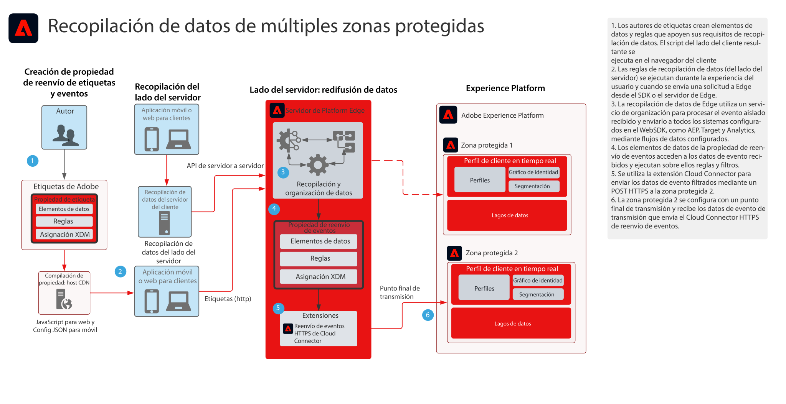

# Modelo de recopilación de datos de reenvío de eventos de múltiples zonas protegidas

El modelo de recopilación de datos de reenvío de eventos de múltiples zonas protegidas muestra cómo se pueden configurar los datos recopilados con los SDK móviles y web de Adobe Experience Platform con el fin de recopilar un solo evento y reenviarlo a múltiples zonas protegidas de AEP. Este modelo es un caso de uso específico que utiliza la función de reenvío de eventos de las etiquetas de Adobe.

Además de replicar el evento, con las funciones de reenvío de eventos, puede agregar, filtrar o manipular los datos recopilados originales que cumplan los requisitos de otras zonas protegidas. Por ejemplo, la zona protegida A debe recibir todos los elementos de datos de evento y la zona protegida B solo debe recibir datos que no sean de identificación personal.

El reenvío de eventos utiliza una propiedad de etiqueta independiente que contiene los elementos de datos, las reglas y las extensiones necesarias para sus requisitos de datos. Con un evento entrante, la propiedad Reenvío de eventos puede recopilar los datos y gestionarlos según sea necesario antes del reenvío.

La zona protegida de destino debería tener configurado un punto final de flujo HTTP para su uso por parte de la extensión HTTPS de reenvío de eventos.

## Casos de uso

* Informes de datos globales: cuando se utilizan varias zonas protegidas con el fin de aislar los entornos operativos y es necesario consolidar la recopilación de datos en una zona protegida para la creación de informes de varias zonas. El reenvío de eventos a una zona protegida de creación de informes permite que cada entorno operativo de zona protegida envíe datos a medida que se recopilan en tiempo real.
* Administre la recopilación de datos en zonas protegidas en función de distintas reglas de datos para cada entorno operativo de zona protegida. Entornos operativos que requieren el filtrado de datos confidenciales, como los servicios de salud y financieros

## Aplicaciones

* Recopilación de datos de Adobe Experience Platform

## Arquitectura

1. Los autores de etiquetas definen tanto una propiedad de etiqueta como una propiedad de reenvío de eventos. Los autores definen aquí los elementos de datos, las reglas y las acciones que administran la recopilación de datos. Tenga en cuenta que el código de propiedad de etiqueta se ejecuta en el cliente y se distribuye mediante un host CDN. El código de propiedad Reenvío de eventos se ejecuta en el servidor de Adobe Edge.

1. Los datos recopilados en el cliente se envían a [!DNL Edge Network]. Los clientes también tienen la opción de enviar datos primero a su propio servidor como método de recopilación del lado del servidor.  El SDK web puede proporcionar una capacidad de recopilación de servidor a servidor. Sin embargo, su implementación requiere un modelo de programación diferente. Consulte la documentación **[!DNL Edge Network]Información general de API de servidor** abajo

1. Plataforma [!DNL Edge Network] recibe cargas útiles de recopilación de datos y organiza el flujo de datos a los sistemas necesarios, como Target y Analytics.

1. Los elementos de datos de la propiedad Reenvío de eventos se utilizan para acceder a los datos de evento que llegan en la carga útil. Las reglas también permiten manipular los datos de evento antes del reenvío, de ser necesario. Por ejemplo, puede dar a los datos de transmisión el formato XDM necesario para su ingesta.

1. El reenvío de eventos proporciona la extensión HTTPS que permite reenviar los datos de evento a un punto final HTTPS.

1. La zona protegida 2 está configurada con un punto final de transmisión que recibe el evento reenviado.

## Documentación relacionada

* [Documentación del reenvío de eventos](https://experienceleague.adobe.com/docs/experience-platform/tags/event-forwarding/overview.html?lang=es)
* [Vídeos de reenvío de eventos](https://experienceleague.adobe.com/docs/launch-learn/tutorials/server-side/overview.html?lang=es)
* [Lección sobre el reenvío de eventos](https://experienceleague.adobe.com/docs/platform-learn/implement-web-sdk/event-forwarding/setup-event-forwarding.html?lang=es) del tutorial del SDK web
* [ información general del SDK web de Experience Platform](https://experienceleague.adobe.com/docs/experience-platform/edge/home.html?lang=es)
* [[!DNL Edge Network] Información general de API de servidor](https://experienceleague.adobe.com/docs/experience-platform/edge-network-server-api/overview.html?lang=es)

## Entradas relacionadas en el blog

* [Mejora del rendimiento del sitio web con el SDK web de Adobe Experience Platform y [!DNL Edge Network]](https://medium.com/adobetech/boosting-website-performance-with-adobe-experience-platform-web-sdk-and-edge-network-329fcf70fdf9)
* [Solución de problemas de implementación con el SDK web de Adobe Experience Platform y [!DNL Edge Network]](https://medium.com/adobetech/solving-implementation-pain-points-with-adobe-experience-platform-web-sdk-and-edge-network-880b635e6819)
* [SDK web de Adobe Experience Platform para gestión de audiencia](https://medium.com/adobetech/adobe-experience-platform-web-sdk-for-audience-management-751fa6d063bc)
* [SDK web de Adobe Experience Platform: Adobe Target](https://medium.com/adobetech/adobe-experience-platform-web-sdk-adobe-target-9b9f621d271)
* [Escenarios de migración del SDK web de Adobe Experience Platform para Adobe Analytics](https://medium.com/adobetech/adobe-experience-platform-web-sdk-migration-scenarios-for-adobe-analytics-91c255ec82b0)
* [Unificación de los servicios de Adobe Experience Platform con su SDK web](https://medium.com/adobetech/unify-your-adobe-experience-platform-services-with-adobe-experience-platform-web-sdk-75cf6851a9fc)
* [Aceleración del desarrollo de aplicaciones móviles con el SDK móvil de Adobe Experience Platform y Launch](https://medium.com/adobetech/accelerate-your-mobile-application-development-with-adobe-experience-platform-mobile-sdk-and-launch-ed023536d611)
* [Simplificación de las tareas de cliente con el SDK web de Adobe Experience Platform](https://medium.com/adobetech/simplifying-customer-workflows-with-adobe-experience-platform-web-sdk-4e54fe134f4a)
