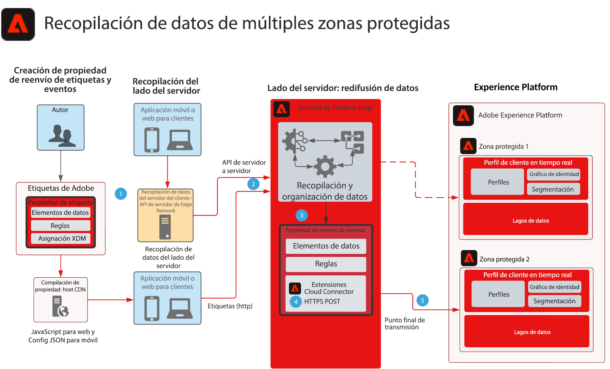

# Modelo de recopilación de datos de reenvío de eventos de múltiples zonas protegidas

Este modelo muestra cómo se pueden configurar los datos recopilados con los SDK web y móvil de Experience Platform para recopilar un único evento y reenviarlos a varios entornos limitados de AEP. Este modelo es un caso de uso específico para la recopilación de datos de varias zonas protegidas que utiliza el reenvío de eventos para lograr este objetivo.

Además de replicar el evento con las funciones de reenvío de eventos, puede agregar, filtrar o manipular los datos recopilados originales que cumplan los requisitos de otras zonas protegidas.

El reenvío de eventos utiliza una propiedad independiente que contiene los elementos de datos, las reglas y las extensiones necesarios para los requisitos de datos. Con un evento entrante, la propiedad de reenvío de eventos puede recopilar los datos y administrarlos según sea necesario antes del reenvío.

La zona protegida de destino requiere un punto final de flujo HTTP configurado que utilice la extensión de conector de Adobe Cloud.

## Casos de uso

* Informes de datos globales: cuando se utilizan varias zonas protegidas con el fin de aislar los entornos operativos y es necesario consolidar la recopilación de datos en una zona protegida para la creación de informes de varias zonas. El enrutamiento de un evento de Experience Edge a través del reenvío de eventos a una zona protegida de informes permite que cada entorno operativo de la zona protegida envíe datos a medida que se recopilan en tiempo real a una zona protegida de informes
* Administre la recopilación de datos en zonas protegidas en función de distintas reglas de datos para cada entorno operativo de zona protegida.

## Aplicaciones

* Recopilación de datos de Adobe Experience Platform
* Reenvío de eventos
* Extensión de AEP
* Extensión de conector de nube

## Consideraciones

Con el reenvío de eventos como enfoque para enviar datos a varios entornos limitados, hay consideraciones que deben tenerse en cuenta con la arquitectura de la solución.

### No hay datos HIPAA

El reenvío de eventos no se considera listo para HIPAA y no debe usarse en ningún caso de uso de HIPAA en el que se recopilen datos de HIPAA. Sin embargo, la infraestructura utilizada para el reenvío de eventos se considera preparada para HIPAA y queda a discreción del cliente. Aunque la propiedad Etiqueta de reenvío de eventos reside en el sistema de reenvío de eventos, toda la carga útil de datos recopilada se envía al sistema de reenvío de eventos para su procesamiento. Este proceso es el que hace que el reenvío de eventos sea preocupante para los casos de uso de HIPAA. Con toda la carga útil enviada al sistema de reenvío de eventos, esto incluiría cualquier valor de HIPAA. Aunque las reglas de reenvío de eventos filtrarán esos datos antes de enviarlos a su destino, esos datos HIPAA se siguen enviando a una infraestructura no preparada para HIPAA. Sin embargo, los datos de carga útil nunca se almacenan y son simplemente un paso a través.

### Diferentes flujos de datos y puntos finales de flujo

A medida que los datos fluyen a través de flujos de datos desde la red perimetral de Platform, al utilizar el reenvío de eventos a otra zona protegida de AEP, un requisito HARD es NO utilizar NUNCA la misma secuencia de datos o punto final de flujo que la secuencia de datos que hace la colección original. Esto puede resultar perjudicial para la instancia de AEP y provocar potencialmente una situación de denegación de servicio.

### Volúmenes de tráfico estimados

Los volúmenes de tráfico son necesarios para revisarlos con cada caso de uso. Esto es importante, ya que los volúmenes altos podrían provocar una situación de restricción y, si esto ocurre, se notificará a los clientes.

## Arquitectura

1. Se requiere la recopilación y el envío de datos de evento a la red perimetral de Platform para utilizar el reenvío de eventos. Los clientes pueden utilizar las etiquetas de Adobe para el lado del cliente o la API del servidor de red perimetral de Platform para la recopilación de datos de servidor a servidor. La API de red perimetral de Platform puede proporcionar una capacidad de recopilación de servidor a servidor. Sin embargo, su implementación requiere un modelo de programación diferente. Consulte [Información general sobre la API del servidor de red perimetral](https://experienceleague.adobe.com/docs/experience-platform/edge-network-server-api/overview.html?lang=en)

1. Las cargas útiles recopiladas se envían desde la implementación de etiquetas a Platform Edge Network al servicio de reenvío de eventos y se procesan mediante sus propios elementos de datos, reglas y acciones. Puede leer más sobre las diferencias de [Reenvío de etiquetas y eventos](https://experienceleague.adobe.com/docs/experience-platform/tags/event-forwarding/overview.html?lang=en#differences-from-tags).

1. También se requiere una propiedad de reenvío de eventos para recibir los datos de evento recopilados de la red perimetral de Platform. Si los datos de evento se enviaron a Platform Edge Network mediante una implementación de etiquetas implementada o una colección de servidor a servidor. Los autores definen los elementos de datos, las reglas y las acciones utilizadas para enriquecer los datos de evento antes del reenvío a la segunda zona protegida. Considere la posibilidad de utilizar el elemento de datos JavaScript de código personalizado para ayudar a estructurar los datos para la ingesta en zonas protegidas. En combinación con las capacidades de preparación de datos de AEP, tiene varias opciones para administrar la estructura de datos.

1. Actualmente, se requiere el uso de la extensión de conector de Adobe Cloud en la propiedad de reenvío de eventos. Una vez que las reglas procesan o enriquecen los datos de evento, Cloud Connector se utiliza dentro de una llamada de recuperación configurada para un POST que envía la carga útil a la segunda zona protegida

1. Se requiere un punto final de streaming para la ingesta de datos para la segunda zona protegida. También puede considerar las funcionalidades de preparación de datos en AEP para ayudar con la ingesta y asignación de cargas útiles de reenvío de eventos a XDM. Consulte la documentación de AEP Creación de una [Conexión de flujo HTTP API mediante la IU](https://experienceleague.adobe.com/docs/experience-platform/sources/ui-tutorials/create/streaming/http.html?lang=es)
