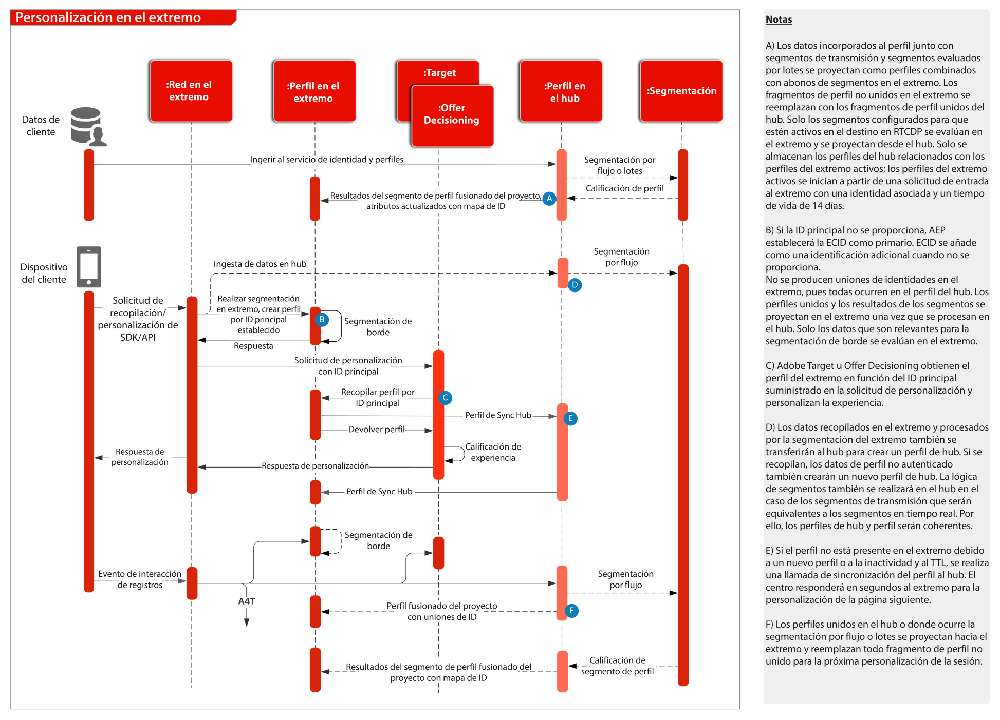

# Información general

Para obtener información general y detallada sobre el SDK web y móvil y la API de servidor de red de Edge, consulte lo siguiente.
* [Información general de WebSDK](https://experienceleague.adobe.com/docs/web-sdk.html?lang=es)
* [Información general de MobileSDK](https://aep-sdks.gitbook.io/docs/)
* [API del servidor de red de Edge](https://experienceleague.adobe.com/docs/experience-platform/edge-network-server-api/overview.html?lang=es)

Para obtener una descripción detallada de la funcionalidad de la aplicación que se admite en WebSDK, consulte la siguiente documentación.
* [Compatibilidad con la funcionalidad de la aplicación WebSDK](https://github.com/orgs/adobe/projects/18/views/1)

Para obtener más información sobre la migración de SDK específicos de aplicaciones a los SDK web y móviles, consulte la siguiente documentación.
* [Servicios de identidad](https://experienceleague.adobe.com/docs/experience-platform/edge/identity/overview.html?lang=es)
* [Analytics](https://experienceleague.adobe.com/docs/experience-platform/edge/data-collection/adobe-analytics/analytics-overview.html?lang=es)
* [Target](https://experienceleague.adobe.com/docs/experience-platform/edge/personalization/adobe-target/target-overview.html?lang=es)
* [Analytics for Target](https://experienceleague.adobe.com/docs/experience-platform/edge/personalization/adobe-target/a4t/overview.html?lang=es)

## Implementación del SDK web/móvil del Experience Platform o de la API del servidor de red de Edge

El diagrama de arquitectura siguiente ilustra el despliegue y la recopilación de datos utilizando el SDK web de Experience Platform.

Diagrama de secuencias de Experience Edge, Experience Platform Services y aplicaciones

## Documentación de referencia

* [Tutorial de implementación de Adobe Experience Cloud con SDK web](https://experienceleague.adobe.com/docs/platform-learn/implement-web-sdk/overview.html?lang=es)
* [Tutorial sobre implementación de Adobe Experience Cloud en aplicaciones móviles](https://experienceleague.adobe.com/docs/platform-learn/implement-mobile-sdk/overview.html?lang=es)