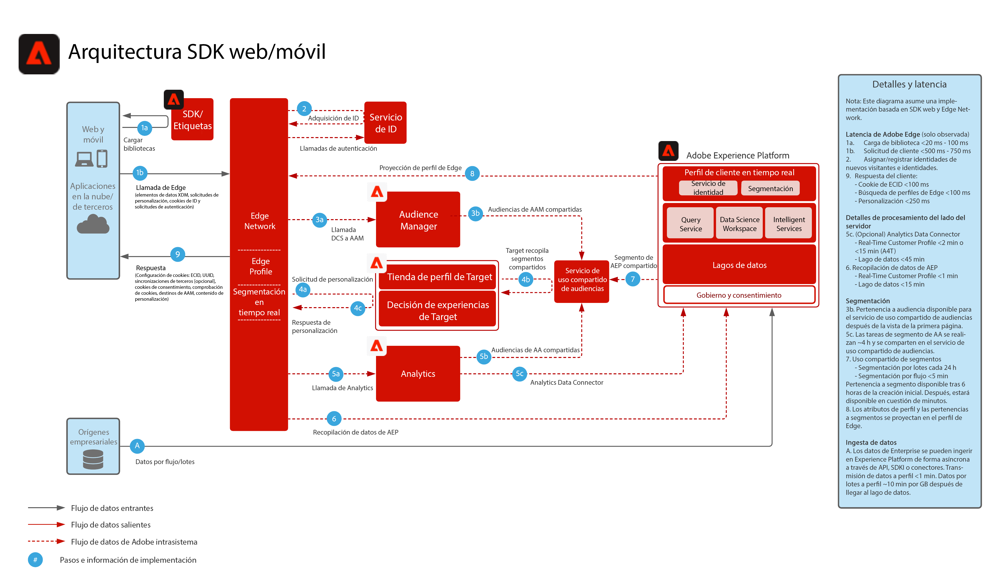

# Recopilación de datos del SDK web/móvil de Experience Platform

El diagrama de arquitectura siguiente ilustra las rutas de integración y la recopilación de datos utilizando el SDK web de Experience Platform.

## Documentación de referencia

* [Información general sobre el SDK web/móvil de Experience Platform](https://experienceleague.adobe.com/docs/experience-platform/edge/home.html?lang=es)
* [Tutorial de implementación de Adobe Experience Cloud con SDK web](https://experienceleague.adobe.com/docs/platform-learn/implement-web-sdk/overview.html?lang=es)
* [Tutorial sobre implementación de Adobe Experience Cloud en aplicaciones móviles](https://experienceleague.adobe.com/docs/platform-learn/implement-mobile-sdk/overview.html)