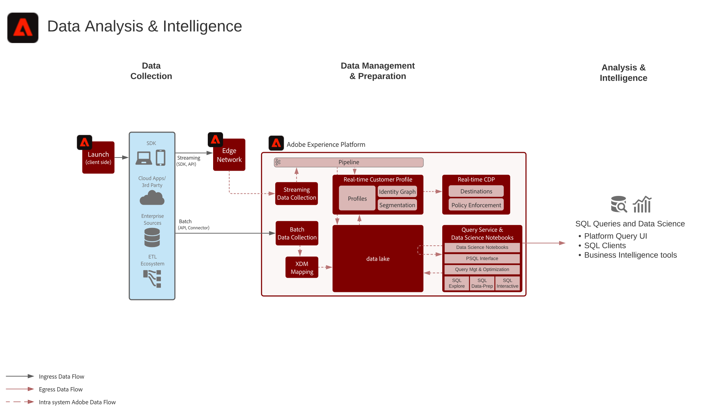

# Análisis de datos y modelo de inteligencia

El análisis de datos y la inteligencia comprenden la capacidad de Adobe Experience Platform para realizar consultas y análisis exploratorios de los datos que existen en el lago de datos.

El servicio de consulta de Experience Platform permite realizar consultas SQL en los datos. Data Science Workspace permite realizar la exploración de datos, la ciencia de datos y las cargas de trabajo de aprendizaje automático en los datos.

Además, Experience Platform permite que las conexiones con clientes SQL de terceros, interfaces y herramientas de Business Intelligence (BI) se conecten directamente a los datos de Experience Platform, accedan a ellos y los consulten, mediante el protocolo PostgreSQL.

Algunas protecciones se aplican para el tiempo de espera de la consulta y para la cantidad de datos que se incluyen en el resultado de la consulta, como se indica en los detalles del escenario.

## Casos de uso

* Consulta interactiva y agregación de datos
* Acceso de fila y columna a datos ingestados para exploración y validación
* Panorama y visualización de datos mediante herramientas de Business Intelligence

## Aplicaciones

* Adobe Experience Platform

## Situaciones

| Situación | Descripción | Aplicaciones/Servicios Experience Cloud |
|---|---|---|
| **Exploración de datos: consulta sin procesar de datos** | <ul><li>Escriba y realice consultas SQL en el lago de datos utilizando la interfaz de usuario de consulta interactiva o un cliente SQL conectado. Data Science Workspace también se puede utilizar para consultar y obtener información de los datos sin procesar en Experience Platform.</li></ul> | <ul><li>Adobe Experience Platform</li></ul> |
| **Enterprise Dashboard** | <ul><li>Conecte las herramientas del Business Intelligence al Experience Platform para visualizar los datos de los casos de uso de tableros e informes.</li></ul> | <ul><li>Adobe Experience Platform</li></ul> |

## Arquitectura

## Seguridad

* Límite de tiempo de 10 minutos para consultas interactivas
* Límite de 100 registros devuelto en la interfaz de usuario
* Límite de 50 000 registros devuelto mediante el conector SQL

## Pasos de la implementación

1. Configure conjuntos de datos y esquemas para la ingesta de datos en el lago de datos.
1. Ingesta de datos.
1. Confirme que los datos están disponibles para Query Service y Data Science Workspace para el acceso sin procesar y la consulta.
1. Conecte las herramientas del Business Intelligence y los clientes SQL al servicio de consulta para la visualización, consulta de datos y exploración.

## Documentación relacionada

* [Descripción del producto de Adobe Experience Platform Intelligence](https://helpx.adobe.com/legal/product-descriptions/adobe-experience-platform-intelligence---product-description.html)
* [Documentación del servicio de consultas](https://experienceleague.adobe.com/docs/experience-platform/query/home.html?lang=en)
