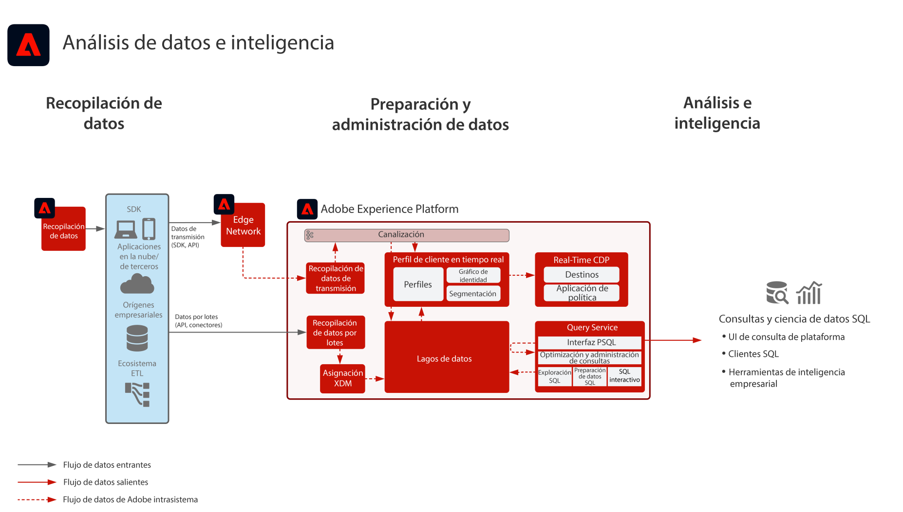

# Modelo de análisis de datos e inteligencia

El análisis y la inteligencia de datos comprende la capacidad de [!DNL Experience Platform] para realizar consultas exploratorias y análisis de los datos que existen en el lago de datos.

El [!DNL Experience Platform]servicio de consulta[!UICONTROL  de ] permite realizar consultas SQL en los datos.

[!DNL Experience Platform] permite que las conexiones con clientes SQL de terceros, interfaces y herramientas de Business Intelligence (BI) se conecten directamente a los datos de [!DNL Experience Platform], accedan a ellos y los consulten mediante el protocolo [!DNL PostgreSQL].

## Casos de uso

* Consulta interactiva y adición de datos
* Acceso por fila y columna a los datos ingeridos para su análisis y validación
* Creación de paneles y visualización de datos a través de las herramientas de inteligencia empresarial

Los casos de uso comunes adicionales para el servicio de consulta se describen aquí [Casos de uso de Query Service](https://experienceleague.adobe.com/docs/experience-platform/query/use-cases/abandoned-browse.html?lang=es)

## Aplicaciones

* Adobe[!DNL Experience Platform]

## Arquitectura

## Guardas

Consulte la documentación del producto Query Service para obtener más información sobre las prácticas recomendadas y los guardas.
[Guía de Query Service](https://experienceleague.adobe.com/docs/experience-platform/query/guardrails.html?lang=es)

## Documentación relacionada

* [Descripción del producto de Adobe [!DNL Experience Platform] Intelligence](https://helpx.adobe.com/es/legal/product-descriptions/adobe-experience-platform-intelligence---product-description.html)
* Documentación de [[!UICONTROL Query Service]](https://experienceleague.adobe.com/docs/experience-platform/query/home.html?lang=es)
