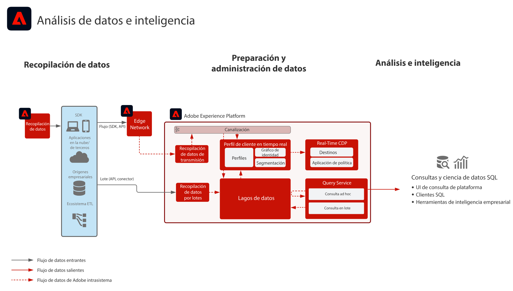

# Modelo de análisis de datos e inteligencia

El análisis de datos e inteligencia componen la habilidad de Adobe Experience Platform para realizar consultas y análisis de los datos presentes en el repositorio de datos.

[!UICONTROL Query Service] de Experience Platform permite realizar consultas SQL sobre los datos. [!UICONTROL Data Science Workspace] permite que las tareas de análisis y ciencia de datos, y también el aprendizaje automático, se realicen sobre los datos.

Además, Experience Platform puede conectarse con clientes SQL de terceros, interfaces y herramientas de inteligencia empresarial para comunicar y consultar directamente los datos contenidos en Experience Platform, así como acceder a ellos, utilizando el protocolo [!DNL PostgreSQL].

Se aplican ciertos guardas por extinción de tiempo de consulta y por la cantidad de datos que se incluyen en los resultados, tal como se describe en la información del modelo.

## Casos de uso

* Consulta interactiva y adición de datos
* Acceso por fila y columna a los datos ingeridos para su análisis y validación
* Creación de paneles y visualización de datos a través de las herramientas de inteligencia empresarial

## Aplicaciones

* Adobe Experience Platform

## Arquitectura

## Guardas

Consulte la documentación del producto del servicio de consulta para obtener más información sobre las prácticas recomendadas y las protecciones.
[Guía del servicio de consultas](https://experienceleague.adobe.com/docs/experience-platform/query/best-practices/writing-queries.html?lang=en#best-practices)

## Pasos de implementación

1. [Crear esquemas para la ingesta de datos.](https://experienceleague.adobe.com/docs/platform-learn/tutorials/schemas/create-a-schema.html)
1. [Crear conjuntos de datos para la ingesta de datos.](https://experienceleague.adobe.com/docs/platform-learn/tutorials/data-ingestion/create-datasets-and-ingest-data.html)
1. [Ingesta de datos a Experience Platform.](https://experienceleague.adobe.com/?recommended=ExperiencePlatform-D-1-2020.1.dataingestion)
1. Confirmar que [!UICONTROL Query Service] y [!UICONTROL Data Science Workspace] puedan acceder y consultar datos brutos.
1. Conectar herramientas de inteligencia empresarial y clientes SQL a [!UICONTROL Query Service] para la posterior visualización, consulta y análisis de datos.

## Documentación relacionada

* [Descripción del producto de inteligencia Adobe Experience Platform](https://helpx.adobe.com/es/legal/product-descriptions/adobe-experience-platform-intelligence---product-description.html)
* Documentación de [[!UICONTROL Query Service]](https://experienceleague.adobe.com/docs/experience-platform/query/home.html?lang=es)
