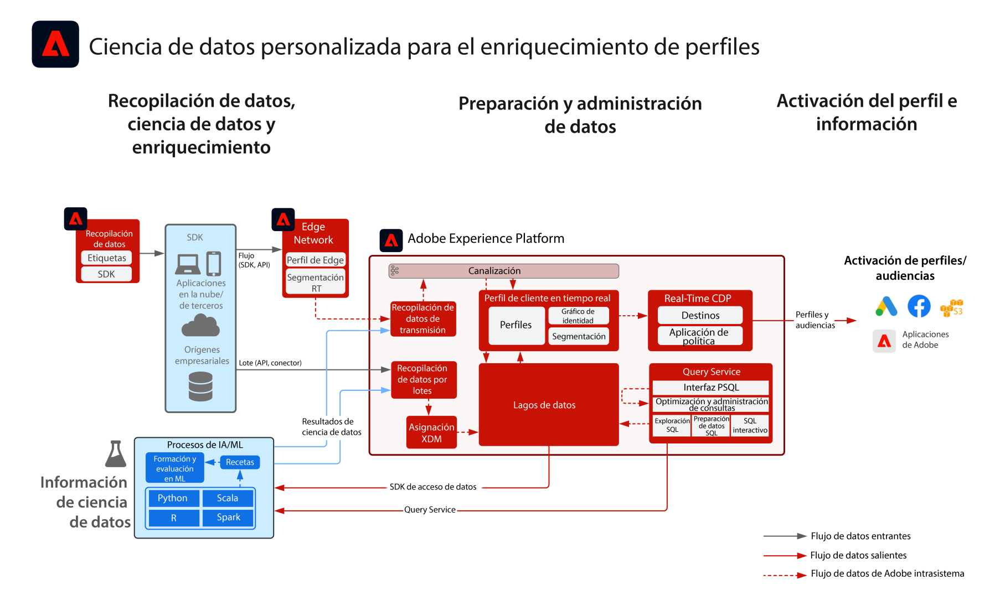

# Modelo de ciencia de datos personalizada para el enriquecimiento de perfiles

El modelo de ciencia de datos personalizado para el enriquecimiento de perfiles ilustra cómo se pueden usar los datos para entrenar, implementar y puntuar modelos a fin de proporcionar perspectivas de aprendizaje automático para Experience Platform y Real-time Customer Data Platform a partir de las herramientas de aprendizaje automático y la ciencia de datos. Las perspectivas modeladas se pueden ingerir en Experience Platform para enriquecer el perfil del cliente en tiempo real. Algunos ejemplos de datos recogidos por el aprendizaje informático incluyen calificación de valor de duración, afinidad de categoría y producto o tendencia a la conversión o cancelación.

## Casos de uso

* Extraiga información y descubra patrones de datos de clientes. A continuación, entrene y califique modelos a partir de estos datos.
* Enriquecer [!UICONTROL Real-time Customer Profile] con datos y atributos según modelo para una personalización más granular y una optimización mejorada de recorrido.
* Entrenar y calificar modelos para determinar datos del cliente tales como el valor de tiempo de vida del cliente, la tendencia a la conversión o cancelación, la afinidad de contenido y producto, y la calificación de participación.

## Arquitectura

## Pasos de implementación

1. [Crear esquemas](https://experienceleague.adobe.com/?recommended=ExperiencePlatform-D-1-2021.1.xdm) para la ingesta de datos.
1. [Crear conjuntos de datos](https://experienceleague.adobe.com/docs/platform-learn/tutorials/data-ingestion/create-datasets-and-ingest-data.html?lang=es) para la ingesta de datos.
1. [Ingesta de datos](https://experienceleague.adobe.com/?recommended=ExperiencePlatform-D-1-2020.1.dataingestion&amp;lang=es) a Experience Platform.

Para que los resultados del modelo se ingieran en el Perfil del cliente en tiempo real, debe hacer lo siguiente antes de introducir los datos:

1. [Configurar las identidades e identidad de áreas de nombres correctas](https://experienceleague.adobe.com/docs/platform-learn/tutorials/identities/label-ingest-and-verify-identity-data.html?lang=es) en el esquema para asegurar que los datos ingestados se puedan combinar en un perfil unificado.
1. [Activar los esquemas y los conjuntos de datos del perfil](https://experienceleague.adobe.com/docs/platform-learn/tutorials/profiles/bring-data-into-the-real-time-customer-profile.html?lang=es).

## Consideraciones sobre la implementación

* En la mayoría de los casos, los resultados del modelo deben ingerirse como atributos de perfil y no como eventos de experiencia. Los resultados del modelo pueden ser una simple cadena de atributos. Si se van a ingerir varios resultados de modelo, se recomienda utilizar un campo de tipo matriz o mapa.
* El conjunto de datos de instantáneas de perfil diarias, que es una exportación diaria de los datos unificados de atributos de perfil, se puede aprovechar para entrenar modelos con datos de atributos de perfil. Puede acceder a la documentación del conjunto de datos de instantáneas de perfil [aquí](https://experienceleague.adobe.com/docs/experience-platform/dashboards/query.html?lang=es#profile-attribute-datasets).
* Para extraer datos de Experience Platform, se pueden utilizar los siguientes métodos
   * SDK de acceso a datos
      * Los datos están en formato de archivo sin procesar
      * Los datos de evento de experiencia de perfil se mantienen en su estado sin procesar y no unificado.
   * Destinos RTCDP
      * Se pueden extraer atributos de perfil y suscripciones a segmentos.

## Documentación relacionada

* [Descripción del producto de inteligencia Adobe Experience Platform](https://helpx.adobe.com/es/legal/product-descriptions/adobe-experience-platform-intelligence---product-description.html)
* [Servicio de consultas de Adobe Experience Platform](https://experienceleague.adobe.com/docs/experience-platform/query/home.html?lang=es)

## Entradas relacionadas en el blog

* [[!DNL Content and Commerce AI: Personalizing Your Interactions with Customers Through Content Intelligence]](https://medium.com/adobetech/content-and-commerce-ai-personalizing-your-interactions-with-customers-through-content-intelligence-dc182601deab)
* [[!DNL An Introductory Look at Exploratory Data Analysis on Adobe Experience Platform]](https://medium.com/adobetech/an-introductory-look-at-exploratory-data-analysis-on-adobe-experience-platform-1bfce7501d9a)
* [[!DNL Cutting Across Adobe Experience Products with Machine Learning to Elevated User Experience]](https://medium.com/adobetech/cutting-across-adobe-experience-products-with-machine-learning-to-elevated-user-experience-7c85000510d1)
* [[!DNL Segmentation.AI: Automated Audience-Clustering-as-a-Service in Adobe Experience Platform]](https://medium.com/adobetech/segmentation-ai-automated-audience-clustering-as-a-service-in-adobe-experience-platform-261f4099462c)