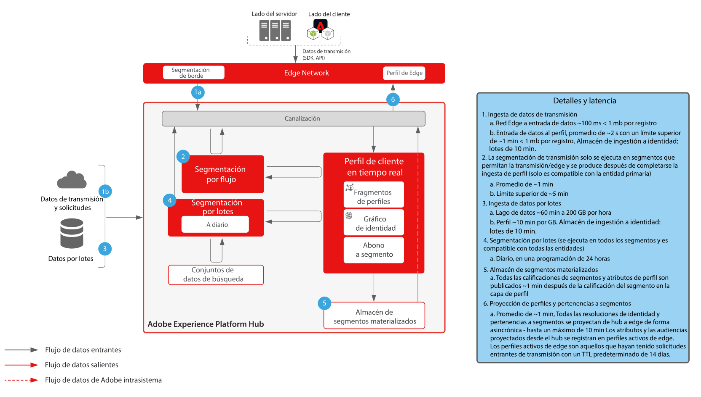
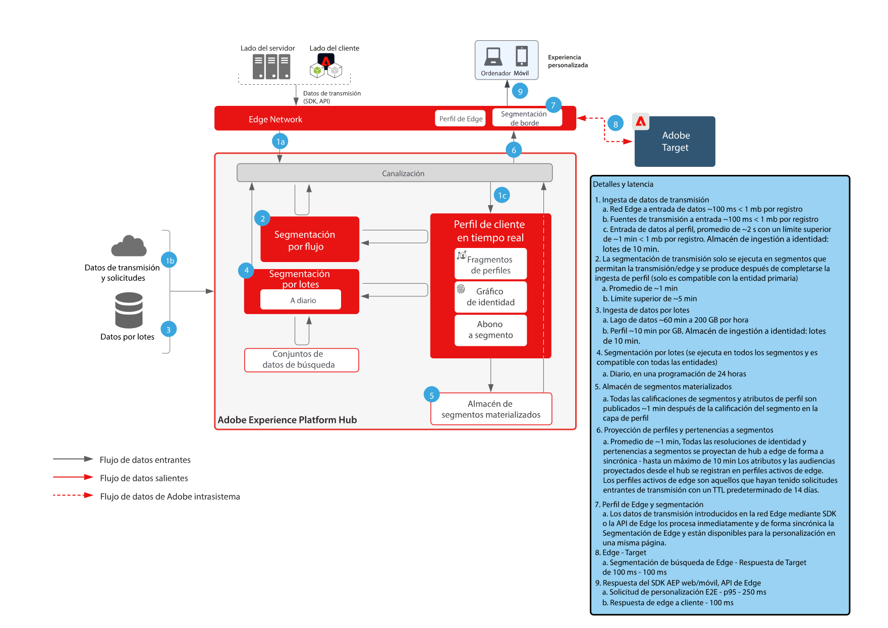
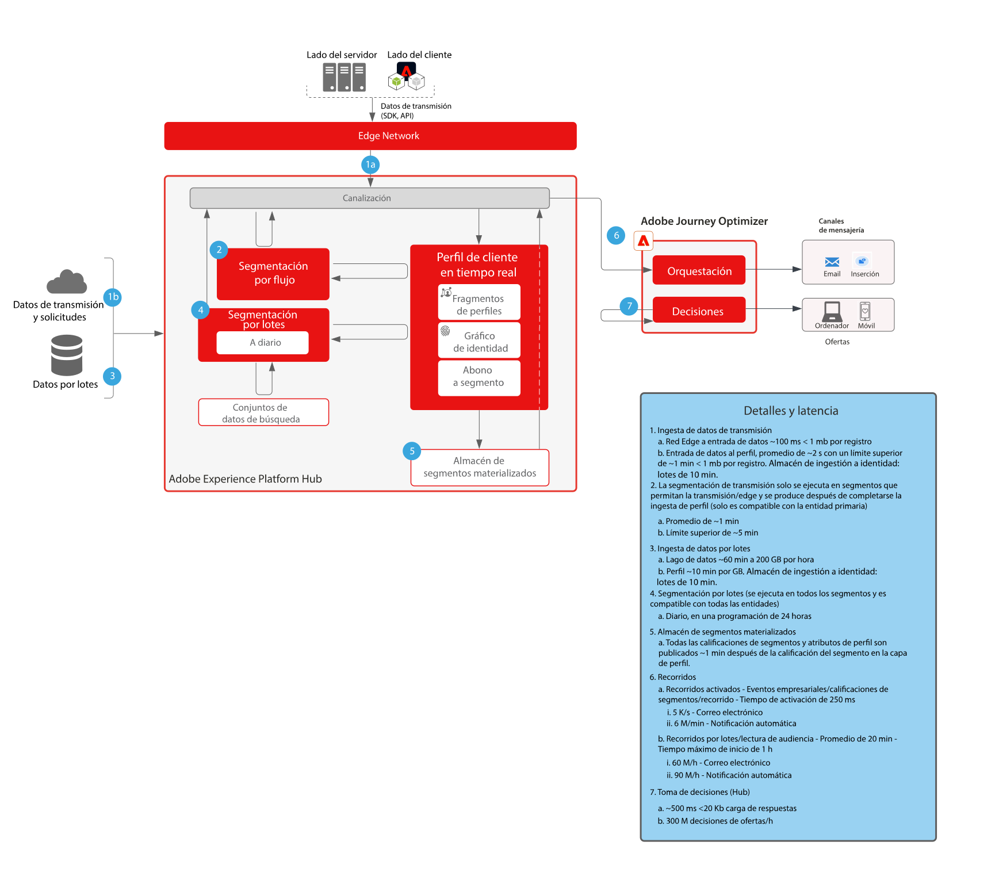

# Guardas

Las protecciones son umbrales recomendados que proporcionan directrices para el uso de datos y sistemas en Adobe Experience Platform y aplicaciones. Las protecciones reflejan las restricciones del sistema y las expectativas de rendimiento para optimizar la arquitectura del cliente y el rendimiento de los casos de uso, y ayudan a evitar errores o resultados inesperados. Las protecciones no están pensadas para ser acuerdos de nivel de servicio.

Para obtener información sobre acuerdos de nivel de servicio específicos para aplicaciones y funciones, consulte &quot;Descripciones de aplicaciones y funciones&quot; en la parte inferior de esta página.

## Documentación de referencia de guardas para Adobe Experience Platform y aplicaciones

Las siguientes páginas proporcionan información sobre las protecciones para las funciones, los servicios y las aplicaciones de Adobe Experience Platform:

[Guardas de ingesta de datos](https://experienceleague.adobe.com/docs/experience-platform/ingestion/guardrails.html?lang=es)

[Protecciones de la API de red Edge](https://experienceleague.adobe.com/docs/experience-platform/edge-network-server-api/guardrails.html?lang=es)

[Guardas de Real-Time Customer Profile](https://experienceleague.adobe.com/docs/experience-platform/profile/guardrails.html?lang=es)

[Guardas de identidad](https://experienceleague.adobe.com/docs/experience-platform/identity/guardrails.html?lang=es)

[Protecciones de uso compartido de audiencias de Customer Journey Analytics](https://experienceleague.adobe.com/docs/analytics-platform/using/cja-components/audiences/publish.html?lang=es-ES#latency)

[Protecciones de ingesta de datos de Customer Journey Analytics](https://experienceleague.adobe.com/docs/experience-platform/sources/connectors/adobe-applications/analytics.html?lang=es-ES#what-is-the-expected-latency-for-analytics-data-on-platform%3F)

[Guardas del servicio de consultas](https://experienceleague.adobe.com/docs/experience-platform/query/guardrails.html?lang=es)

[Guardas de activación de destino](https://experienceleague.adobe.com/docs/experience-platform/destinations/guardrails.html?lang=es)

[Guardas de Journey Optimizer](https://experienceleague.adobe.com/docs/journey-optimizer/using/get-started/guardrails.html?lang=es)

 

## Diagramas de latencia de extremo a extremo

### Ingesta de datos

 

### Segmentación

 

### Real-Time Customer Data Platform y Adobe Target

 

### Customer Journey Analytics

 

### Journey Optimizer

 

## Descripciones de aplicaciones y funciones

Para obtener información sobre los acuerdos de nivel de servicio específicos de las funciones, consulte las siguientes descripciones:

[Experience Platform Collection Enterprise](https://helpx.adobe.com/es/legal/product-descriptions/adobe-experience-platform-collection-enterprise.html)

[Real-Time Customer Data Platform](https://helpx.adobe.com/es/legal/product-descriptions/real-time-customer-data-platform.html)

[B2B Customer Data Platform](https://helpx.adobe.com/es/legal/product-descriptions/adobe-experience-platform-b2b.html)

[Experience Platform Activation](https://helpx.adobe.com/es/legal/product-descriptions/adobe-experience-platform0.html)

[Experience Platform Intelligence](https://helpx.adobe.com/es/legal/product-descriptions/adobe-experience-platform-intelligence---product-description.html)

[Servicios inteligentes](https://helpx.adobe.com/es/legal/product-descriptions/intelligent-services.html)

[Data Distiller](https://helpx.adobe.com/es/legal/product-descriptions/data-distiller.html)

[Customer Journey Analytics](https://helpx.adobe.com/es/legal/product-descriptions/customer-journey-analytics.html)

[Journey Optimizer](https://helpx.adobe.com/es/legal/product-descriptions/adobe-journey-optimizer.html)

[Journey Orchestration](https://helpx.adobe.com/es/legal/product-descriptions/journey-orchestration.html)

[Offer Decisioning](https://helpx.adobe.com/es/legal/product-descriptions/offer-decisioning-app-service.html)
