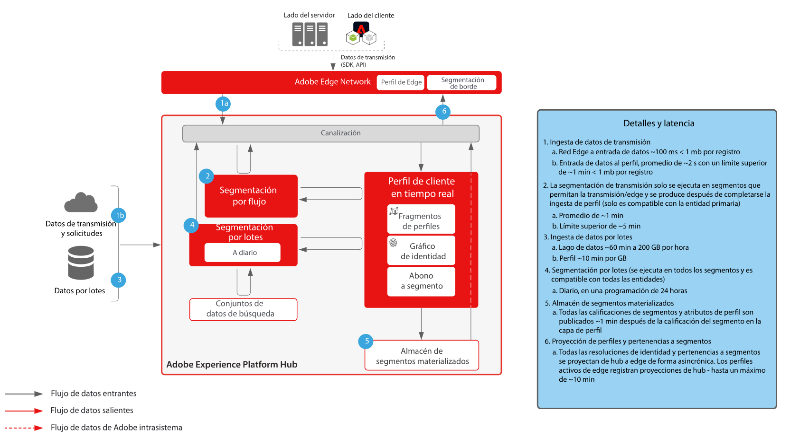
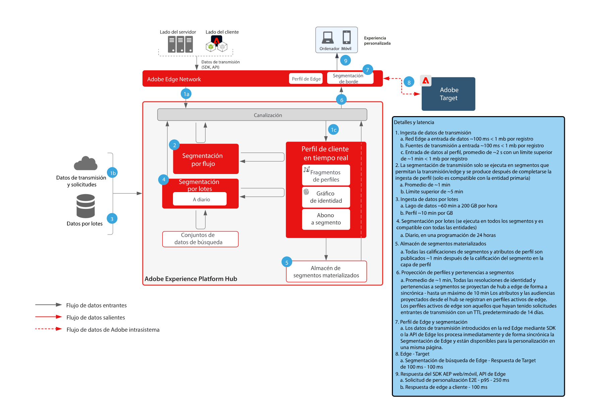
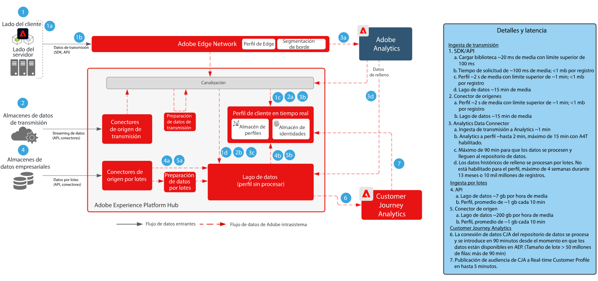

# Guardas

Las guardas son umbrales recomendados que proporcionan directrices para el uso de los datos y del sistema, optimizando el rendimiento y evitando errores o resultados inesperados en Adobe Experience Platform y las aplicaciones. Las guardas están pensadas para reflejar las restricciones del sistema y las expectativas de rendimiento a fin de facilitar la arquitectura del cliente y la optimización del rendimiento de los casos de uso. Las guardas no son acuerdos de nivel de servicio; para obtener información sobre los acuerdos de nivel de servicio específicos del producto, consulte la documentación de Descripciones de productos vinculado a continuación.

## Guardas para Adobe Experience Platform y aplicaciones

[Protecciones de ingesta de datos](https://experienceleague.adobe.com/docs/experience-platform/ingestion/guardrails.html?lang=es)

[Protecciones de la API de red Edge](https://experienceleague.adobe.com/docs/experience-platform/edge-network-server-api/guardrails.html?lang=es)

[Guardas de Real-time Customer Profile](https://experienceleague.adobe.com/docs/experience-platform/profile/guardrails.html?lang=es)

[Guardas de identidad](https://experienceleague.adobe.com/docs/experience-platform/identity/guardrails.html?lang=es)

[Guardas del servicio de consultas](https://experienceleague.adobe.com/docs/experience-platform/query/guardrails.html?lang=es)

[Guardas de activación de destino](https://experienceleague.adobe.com/docs/experience-platform/destinations/guardrails.html?lang=es)

[Guardas de Journey Optimizer](https://experienceleague.adobe.com/docs/journey-optimizer/using/get-started/guardrails.html?lang=es)

 

## Diagramas de latencia end-to-end

### Ingesta de datos

 

### Segmentación

 

### Real-time Customer Data Platform y Adobe Target

 

### Customer Journey Analytics

 

### Journey Optimizer

 

## Descripciones de productos

[Experience Platform Collection Enterprise](https://helpx.adobe.com/es/legal/product-descriptions/adobe-experience-platform-collection-enterprise.html)

[Real-time Customer Data Platform](https://helpx.adobe.com/es/legal/product-descriptions/real-time-customer-data-platform.html)

[B2B Customer Data Platform](https://helpx.adobe.com/es/legal/product-descriptions/adobe-experience-platform-b2b.html)

[Experience Platform Activation](https://helpx.adobe.com/es/legal/product-descriptions/adobe-experience-platform0.html)

[Experience Platform Intelligence](https://helpx.adobe.com/es/legal/product-descriptions/adobe-experience-platform-intelligence---product-description.html)

[Servicios inteligentes](https://helpx.adobe.com/es/legal/product-descriptions/intelligent-services.html)

[Data Distiller](https://helpx.adobe.com/es/legal/product-descriptions/data-distiller.html)

[Customer Journey Analytics](https://helpx.adobe.com/es/legal/product-descriptions/customer-journey-analytics.html)

[Journey Optimizer](https://helpx.adobe.com/es/legal/product-descriptions/adobe-journey-optimizer.html)

[Journey Orchestration](https://helpx.adobe.com/es/legal/product-descriptions/journey-orchestration.html)

[Offer Decisioning](https://helpx.adobe.com/es/legal/product-descriptions/offer-decisioning-app-service.html)
