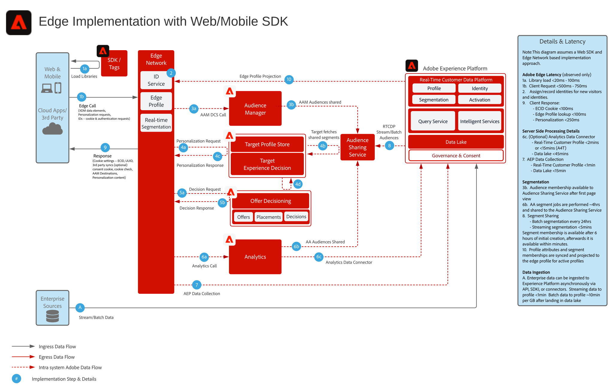

# Diagrama de arquitectura de Experience Platform Web SDK y [!DNL Edge Network]

Para obtener información general y detalles sobre Web y Mobile SDK, así como sobre la API de servidor [!DNL Edge Network], consulte lo siguiente.

* [Información general de Web SDK](https://experienceleague.adobe.com/en/docs/experience-platform/web-sdk/home)
* [Información general de Mobile SDK](https://developer.adobe.com/client-sdks/documentation/)
* [API del servidor [!DNL Edge Network]](https://experienceleague.adobe.com/docs/experience-platform/edge-network-server-api/overview.html?lang=es)

Para obtener una descripción detallada de la funcionalidad de la aplicación que se admite en el SDK web, consulte la siguiente documentación.

* [Compatibilidad con la funcionalidad de aplicación Web SDK](https://github.com/orgs/adobe/projects/18/views/1)

Para obtener más información sobre la migración de SDK específicos de aplicaciones a los SDK web y móviles, consulte la siguiente documentación.

* [Servicios de identidad](https://experienceleague.adobe.com/docs/experience-platform/edge/identity/overview.html?lang=es)
* [Analytics](https://experienceleague.adobe.com/docs/experience-platform/edge/data-collection/adobe-analytics/analytics-overview.html?lang=es)
* [Target](https://experienceleague.adobe.com/docs/experience-platform/edge/personalization/adobe-target/target-overview.html?lang=es)
* [Analytics for Target](https://experienceleague.adobe.com/docs/experience-platform/edge/personalization/adobe-target/a4t/overview.html?lang=es)

## Implementación de Experience Platform Web/Mobile SDK o [!DNL Edge Network] Server API

El diagrama de arquitectura siguiente ilustra el despliegue y la recopilación de datos utilizando el SDK web de Experience Platform.

Diagrama de secuencias de Experience Edge, Experience Platform Services y aplicaciones

## Documentación de referencia

* [Tutorial de implementación de Adobe Experience Cloud con SDK web](https://experienceleague.adobe.com/docs/platform-learn/implement-web-sdk/overview.html?lang=es)
* [Tutorial de implementación de Adobe Experience Cloud en aplicaciones móviles](https://experienceleague.adobe.com/docs/platform-learn/implement-mobile-sdk/overview.html?lang=es)
