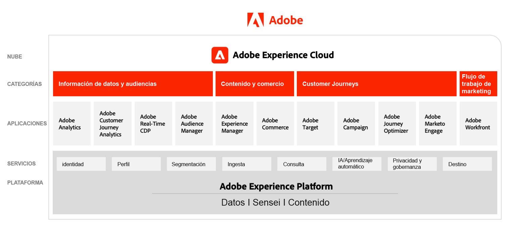

# Diagramas de arquitectura de Adobe Experience Cloud

## Adobe Experience Cloud Marketecture

En el diagrama siguiente se ilustran los distintos componentes de Adobe Experience Cloud en Perspectivas de datos y audiencias, Contenido y comercio, Recorridos del cliente, Flujo de trabajo de marketing, creados e integrados en la base de Adobe Experience Platform.

 

## Arquitectura de integración de datos y perspectivas, contenido y comercio y entrega de experiencias

El diagrama de arquitectura que aparece a continuación ilustra cómo se conectan e integran los distintos componentes de Adobe Experience Cloud para lograr la personalización a escala en la entrega de datos, contenido y experiencia.

 

## Adobe Experience Cloud en el entorno empresarial

El diagrama de arquitectura que aparece a continuación ilustra cómo las aplicaciones de Adobe Experience Cloud y Adobe Experience Platform encajan en una arquitectura de experiencia de cliente empresarial en las cuatro categorías de Datos, Perspectivas, Organización y Participación.

