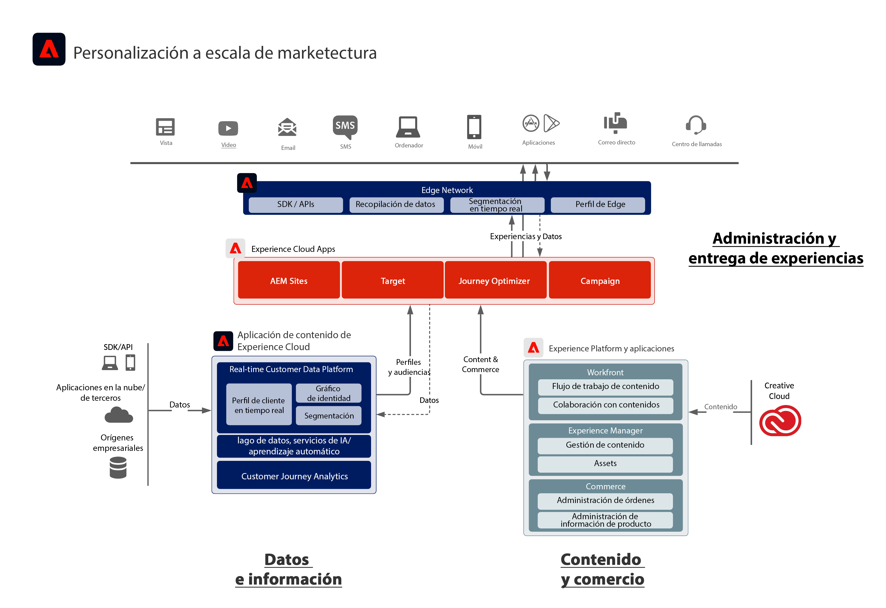

# Diagrama de la arquitectura de Adobe Experience Cloud

El diagrama de la arquitectura siguiente ilustra cómo Adobe Experience Platform se conecta y se integra con las aplicaciones de Adobe Experience Cloud para lograr personalización a escala en la entrega de datos, contenido y experiencia.

 
El siguiente diagrama de arquitectura ilustra cómo las aplicaciones de Adobe Experience Cloud y Adobe Experience Platform se ajustan a una arquitectura de experiencia de cliente empresarial.

